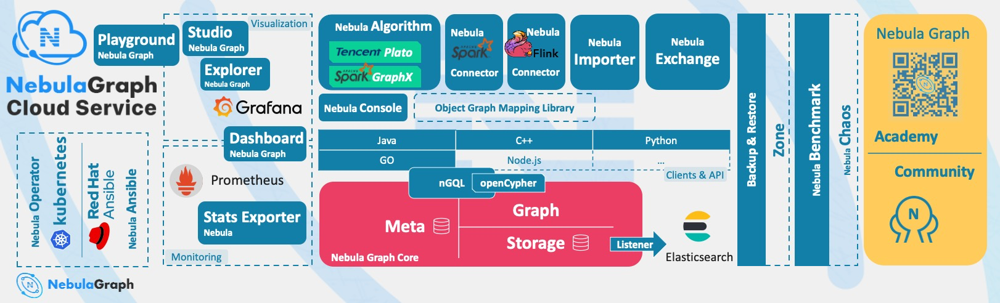

# What is Nebula Graph

Nebula Graph is an open-source, distributed, easily scalable, and native graph database. It is capable of hosting graphs with hundreds of billions of vertices and trillions of edges, and serving queries with millisecond-latency.

## What is a graph database

A graph database, such as Nebula Graph, is a database that specializes in storing vast graph networks and retrieving information from them. It efficiently stores data as vertices (nodes) and edges (relationships) in labeled property graphs. Properties can be attached to both vertices and edges. Each vertex can have one or multiple tags (labels).

Graph databases are well suited for storing most kinds of data models abstracted from reality. Things are connected in almost all fields in the world. Modeling systems like relational databases extract the relationships between entities and squeeze them into table columns alone, with their types and properties stored in other columns or even other tables. This makes the data management time-consuming and cost-ineffective.

Nebula Graph, as a typical native graph database, allows you to store the rich relationships as edges with edge types and properties directly attached to them.

## Benefits of Nebula Graph

### Open-source

Nebula Graph is open under the Apache 2.0 and the Commons Clause 1.0 licenses. More and more people such as database developers, data scientists, security experts, and algorithm engineers are participating in the designing and development of Nebula Graph. To join the opening of source code and ideas, surf the [Nebula Graph GitHub page](https://github.com/vesoft-inc/nebula-graph).

### Outstanding performance

Written in C++ and born for graph, Nebula Graph handles graph queries in milliseconds. Among most databases, Nebula Graph shows superior performance in providing graph data services. The larger the data size, the greater the superiority of Nebula Graph. For more information, see [Nebula Graph benchmarking](https://discuss.nebula-graph.io/t/nebula-graph-1-0-benchmark-report/581).

### High scalability

Nebula Graph is designed in a shared-nothing architecture and supports scaling in and out without interrupting the database service.

### Developer friendly

Nebula Graph supports clients in popular programming languages like Java, Python, C++, and Go, and more are being developed. For more information, see Nebula Graph [clients](../20.appendix/6.eco-tool-version.md).

### Reliable access control

Nebula Graph supports strict role-based access control and external authentication servers such as LDAP (Lightweight Directory Access Protocol) servers to enhance data security. For more information, see [Authentication and authorization](../7.data-security/1.authentication/1.authentication.md).

### Diversified ecosystem

More and more native tools of Nebula Graph have been released, such as [Nebula Graph Studio](https://github.com/vesoft-inc/nebula-web-docker), [Nebula Console](https://github.com/vesoft-inc/nebula-console), and [Nebula Exchange](https://github.com/vesoft-inc/nebula-spark-utils/tree/v2.0.0/nebula-exchange).

Besides, Nebula Graph has the ability to be integrated with many cutting-edge technologies, such as Spark, Flink, and HBase, for the purpose of mutual strengthening in a world of increasing challenges and chances. For more information, see [Ecosystem development](../20.appendix/6.eco-tool-version.md).

### OpenCypher-compatible query language

The native Nebula Graph Query Language, also known as nGQL, is a declarative, openCypher-compatible textual query language. It is easy to understand and easy to use. For more information, see [nGQL guide](../3.ngql-guide/1.nGQL-overview/1.overview.md).

### Future-oriented hardware with balanced reading and writing

Solid-state drives have extremely high performance and [they are getting cheaper](https://blocksandfiles.com/wp-content/uploads/2021/01/Wikibon-SSD-less-than-HDD-in-2026.jpg).
 Nebula Graph is a product based on SSD. Compared with products based on HDD and large memory, it is more suitable for future hardware trends and easier to achieve balanced reading and writing.

### Easy data modeling and high flexibility

You can easily model the connected data into Nebula Graph for your business without forcing them into a structure such as a relational table, and properties can be added, updated, and deleted freely. For more information, see [Data modeling](2.data-model.md).

### High popularity

Nebula Graph is being used by tech leaders such as Tencent, Vivo, Meituan, and JD Digits. For more information, visit the [Nebula Graph official website](https://nebula-graph.io/).

## Use cases

Nebula Graph can be used to support various graph-based scenarios. To spare the time spent on pushing the kinds of data mentioned in this section into relational databases and on bothering with join queries, use Nebula Graph.

### Fraud detection

Financial institutions have to traverse countless transactions to piece together potential crimes and understand how combinations of transactions and devices might be related to a single fraud scheme. This kind of scenario can be modeled in graphs, and with the help of Nebula Graph, fraud rings and other sophisticated scams can be easily detected.

### Real-time recommendation

Nebula Graph offers the ability to instantly process the real-time information produced by a visitor and make accurate recommendations on articles, videos, products, and services.

### Intelligent question-answer system

Natural languages can be transformed into knowledge graphs and stored in Nebula Graph. A question organized in a natural language can be resolved by a semantic parser in an intelligent question-answer system and re-organized. Then, possible answers to the question can be retrieved from the knowledge graph and provided to the one who asked the question.

### Social networking

Information on people and their relationships are typical graph data. Nebula Graph can easily handle the social networking information of billions of people and trillions of relationships, and provide lightning-fast queries for friend recommendations and job promotions in the case of massive concurrency.

## Related links

- [Official website](https://www.vesoft.com/en/)
- [Docs](https://docs.nebula-graph.io/master/)
- [Blog](https://nebula-graph.io/posts/)
- [Forum](https://discuss.nebula-graph.io)
- [GitHub](https://github.com/vesoft-inc)
