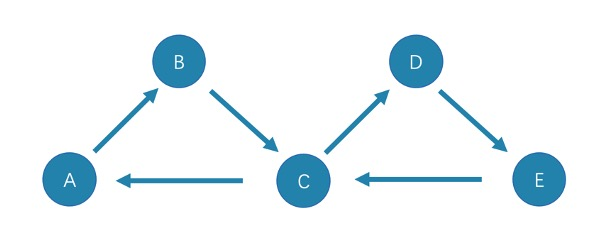

# Path types

In graph theory, a path in a graph is a finite or infinite sequence of edges which joins a sequence of vertices. Paths are fundamental concepts of graph theory.

Paths can be categorized into 3 types: `walk`, `trail`, and `path`. For more information, see [Wikipedia](https://en.wikipedia.org/wiki/Path_(graph_theory)#Walk,_trail,_path).

The following picture is an example for a brief introduction.

## Walk

A `walk` is a finite or infinite sequence of edges. Both vertices and edges can be repeatedly visited in graph traversal.

In the above picture C, D, and E form a cycle. So, this picture contains infinite paths, such as `A->B->C->D->E`, `A->B->C->D->E->C`, and `A->B->C->D->E->C->D`.

!!! note

    `GO` statements use `walk`.

## Trail

A `trail` is a finite sequence of edges. Only vertices can be repeatedly visited in graph traversal. The Seven Bridges of Königsberg is a typical `trail`.

In the above picture, edges cannot be repeatedly visited. So, this picture contains finite paths. The longest path in this picture consists of 5 edges: `A->B->C->D->E->C`.

!!! note

    `MATCH`, `FIND PATH`, and `GET SUBGRAPH` statements use `trail`.

There are two special cases of trail, `cycle`, and `circuit`. The following picture is an example for a brief introduction.

- cycle

   A `cycle` refers to a closed `trail`. Only the terminal vertices can be repeatedly visited. The longest path in this picture consists of 3 edges: `A->B->C->A` or `C->D->E->C`.

- circuit

   A `circuit` refers to a closed `trail`. Edges cannot be repeatedly visited in graph traversal. Apart from the terminal vertices, other vertices can also be repeatedly visited. The longest path in this picture: `A->B->C->D->E->C->A`.

## Path

A `path` is a finite sequence of edges. Neither vertices nor edges can be repeatedly visited in graph traversal.

So, the above picture contains finite paths. The longest path in this picture consists of 4 edges: `A->B->C->D->E`.
