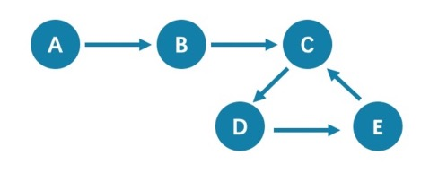

# FAQ

This topic lists the frequently asked questions for using Nebula Graph {{ nebula.release }}. You can use the search box in the help center or the search function of the browser to match the questions you are looking for.

If the solutions described in this topic cannot solve your problems, ask for help on the [Nebula Graph forum](https://discuss.nebula-graph.io/) or submit an issue on [GitHub issue](https://github.com/vesoft-inc/nebula/issues).

## About manual updates

### "Why is the behavior in the manual not consistent with the system?"

Nebula Graph is still under development. Its behavior changes from time to time. Users can submit an [issue](https://github.com/vesoft-inc/nebula/issues/new) to inform the team if the manual and the system are not consistent.

!!! note

    If you find some errors in this topic:

    1. Click the `pencil` button at the top right side of this page.
    2. Use markdown to fix this error. Then click "Commit changes" at the bottom, which will start a Github pull request.
    3. Sign the [CLA](../15.contribution/how-to-contribute.md). This pull request will be merged after the acceptance of at least two reviewers.

## About legacy version compatibility

!!! compatibility "`X` version compatibility"

    Neubla Graph {{ nebula.release }} is **not compatible** with Nebula Graph 1.x nor 2.0-RC in both data formats and RPC-protocols, and **vice versa**. 
    To upgrade data formats, see [Upgrade Nebula Graph to v2.0.0](../4.deployment-and-installation/3.upgrade-nebula-graph/upgrade-nebula-graph-to-250.md).
    Users must upgrade [all clients](../20.appendix/6.eco-tool-version.md).

!!! compatibility "`Y` version compatibility"

    Data formats of Neubla Graph {{ nebula.release }} are compatible with Nebula Graph {{ nebula.base20 }}, while their clients are incompatible.

## About executions

### About dangling edges

A dangling edge is an edge that only connects to a single vertex and only one part of the edge connects to the vertex.

Nebula Graph {{ nebula.release }} allows dangling edges. And there is no `MERGE` statements of openCypher. The guarantee for dangling edges depends entirely on the application level. For more information, see [INSERT VERTEX](../3.ngql-guide/12.vertex-statements/1.insert-vertex.md), [DELETE VERTEX](../3.ngql-guide/12.vertex-statements/4.delete-vertex.md), [INSERT EDGE](../3.ngql-guide/13.edge-statements/1.insert-edge.md), [DELETE EDGE](../3.ngql-guide/13.edge-statements/4.delete-edge.md).


### "How to resolve `[ERROR (-1005)]: Used memory hits the high watermark(0.800000) of total system memory.`?"

The reason for this error may be that `system_memory_high_watermark_ratio` specifies the trigger threshold of the memory high watermark alarm mechanism. The default value is `0.8`. If the system memory usage is higher than this value, an alarm mechanism will be triggered, and Nebula Graph will stop querying.

Possible solutions are as follows:

* Clean the system memory to make it below the threshold.
* [Modify the Graph configuration](../5.configurations-and-logs/1.configurations/1.configurations.md). Add the `system_memory_high_watermark_ratio` parameter to the configuration files of all Graph servers, and set it greater than `0.8`, such as `0.9`.

  !!! note

        Only the Graph service supports `system_memory_high_watermark_ratio`, while the Storage and Meta services do not.

### "How to resolve the error `Storage Error E_RPC_FAILURE`?"

The reason for this error is usually that the storaged process returns too many data back to the graphd process. Possible solutions are as follows:

* [Modify configuration files](../5.configurations-and-logs/1.configurations/3.graph-config.md): Modify the value of `--storage_client_timeout_ms` in the `nebula-graphd.conf` file to extend the connection timeout of the Storage client. This configuration is measured in milliseconds (ms). For example, set `--storage_client_timeout_ms=60000`. If this parameter is not specified in the `nebula-graphd.conf` file, specify it manually. Tip: Add `--local_config=true` at the beginning of the configuration file and restart the service.
* Optimize the query statement: Reduce queries that scan the entire database. No matter whether `LIMIT` is used to limit the number of returned results, use the `GO` statement to rewrite the `MATCH` statement (the former is optimized, while the latter is not).
* Check whether the Storaged process has OOM. (`dmesg |grep nebula`).
* Use better SSD or memory for the Storage Server.
* Retry.

### "How to resolve the error `The leader has changed. Try again later`?"

It is a known issue. Just retry 1 to N times, where N is the partition number. The reason is that the meta client needs some heartbeats to update or errors to trigger the new leader information.

### "How is the `time spent` value at the end of each return message calculated?"

Take the returned message of `SHOW SPACES` as an example:

```nGQL
nebula> SHOW SPACES;
+-------------------+
| Name              |
+-------------------+
| basketballplayer  |
+-------------------+
Got 1 rows (time spent 1235/1934 us)
```

- The first number `1235` shows the time spent by the database itself, that is, the time it takes for the query engine to receive a query from the client, fetch the data from the storage server, and perform a series of calculations.

- The second number `1934` shows the time spent from the client's perspective, that is, the time it takes for the client from sending a request, receiving a response, and displaying the result on the screen.

### "Can I set `replica_factor` as an even number in `CREATE SPACE` statements, e.g., `replica_factor = 2`?"

NO.

The Storage service guarantees its availability based on the Raft consensus protocol. The number of failed replicas must not exceed half of the total replica number.

When the number of machines is 1, `replica_factor` can only be set to`1`.

When there are enough machines and `replica_factor=2`, if one replica fails, the Storage service fails. No matter `replica_factor=3` or `replica_factor=4`, if more than one replica fails, the Storage Service fails. To prevent unnecessary waste of resources, we recommend that you set an odd replica number.

We suggest that you set `replica_factor=3` for a production environment and `replica_factor=1` for a test environment. Do not use an even number.

### "Is stopping or killing slow queries supported?"

Yes. For more information, see [Kill query](../3.ngql-guide/18.operation-and-maintenance-statements/6.kill-query.md).

### "Why are the query results different when using `GO` and `MATCH` to execute the same semantic query?"

Using different types of paths may cause different query results.

- `GO` statements use `walk`. Both vertices and edges can be repeatedly visited in graph traversal.

- `MATCH` statements are compatible with openCypher and use `trail`. Only vertices can be repeatedly visited in graph traversal.
  
The example is as follows.



All queries that start from `A` with 5 hops will end at `C` (`A->B->C->D->E->C`). If it is 6 hops, the `GO` statement will end at `D` (`A->B->C->D->E->C->D`), because the edge `C->D` can be visited repeatedly. However, the `MATCH` statement returns empty, because edges cannot be visited repeatedly.

Therefore, using `GO` and `MATCH` to execute the same semantic query may cause different query results.

For more information, see [Wikipedia](https://en.wikipedia.org/wiki/Path_(graph_theory)#Walk,_trail,_path).

### "How to resolve `[ERROR (-7)]: SyntaxError: syntax error near`?"

In most cases, a query statement requires a `YIELD` or a `RETURN`. Check your query statement to see if `YIELD` or `RETURN` is provided.

### "How to count the vertices/edges number of each tag/edge type?"

See [show-stats](../3.ngql-guide/7.general-query-statements/6.show/14.show-stats.md).

### "How to get all the vertices/edge of each tag/edge type?"

1. Create and rebuild the index.

   ```ngql
   > CREATE TAG INDEX i_player ON player();
   > REBUILD TAG INDEX i_player;
   ```
    
2. Use `LOOKUP` or `MATCH`. For example:

   ```ngql
   > LOOKUP ON player;
   > MATCH (n:player) RETURN n;
   ```

For more information, see [`INDEX`](../3.ngql-guide/14.native-index-statements/1.create-native-index.md), [`LOOKUP`](../3.ngql-guide/7.general-query-statements/5.lookup.md), and [`MATCH`](../3.ngql-guide/7.general-query-statements/2.match.md).

### "How to get all the vertices/edges without specifying the types?"

By nGQL, you CAN NOT directly getting all the vertices without specifying the tags, neither the edges.

E.g., You CAN NOT run `MATCH (n) RETURN (n)`. An error like `can’t solve the start vids from the sentence` will be returned.

You can use [Nebula Algorithm](../nebula-algorithm.md).

Or get vertices by each tag, and then group them by yourself.

### "How to resolve the error `can’t solve the start vids from the sentence`?"

The graphd process requires `start vids` to begin a graph traversal. The `start vids` can be specified by the user. For example:

```ngql
> GO FROM ${vids} ...
> MATCH (src) WHERE id(src) == ${vids}
# The "start vids" are explicitly given by ${vids}.
```

It can also be found from a property index. For example:

```ngql
# CREATE TAG INDEX i_player ON player(name(20));
# REBUILD TAG INDEX i_player;

> LOOKUP ON player WHERE player.name == "abc" | ... YIELD ...
> MATCH (src) WHERE src.name == "abc" ...
# The "start vids" are found from the property index "name".
```

Otherwise, an error like `can’t solve the start vids from the sentence` will be returned.

### "How to resolve the error `Wrong vertex id type: 1001`?"

Check whether the VID is `INT64` or `FIXED_STRING(N)` set by `create space`. For more information, see [create space](../3.ngql-guide/9.space-statements/1.create-space.md).

### "How to resolve the error `The VID must be a 64-bit integer or a string fitting space vertex id length limit.`?"

Check whether the length of the VID exceeds the limitation. For more information, see [create space](../3.ngql-guide/9.space-statements/1.create-space.md).

### "How to resolve the error `edge conflict` or `vertex conflict`?"

Nebula Graph may return such errors when the Storage service receives multiple requests to insert or update the same vertex or edge within milliseconds. Try the failed requests again later.

### "How to resolve the error `RPC failure in MetaClient: Connection refused`?"

The reason for this error is usually that the metad service status is unusual, or the network of the machine where the metad and graphd services are located is disconnected. Possible solutions are as follows:

- Check the metad service status on the server where the metad is located. If the service status is unusual, restart the metad service.

- Use `telnet meta-ip:port` to check the network status under the server that returns an error.

- Check the port information in the configuration file. If the port is different from the one used when connecting, use the port in the configuration file or modify the configuration.

### "How to resolve the error `StorageClientBase.inl:214] Request to "x.x.x.x":9779 failed: N6apache6thrift9transport19TTransportExceptionE: Timed Out` in `nebula-graph.INFO`?"

The reason for this error may be that the amount of data to be queried is too large, and the storaged process has timed out. Possible solutions are as follows:

- When importing data, set [Compaction](../8.service-tuning/compaction.md) manually to make read faster.

- Extend the RPC connection timeout of the Graph service and the Storage service. Modify the value of `--storage_client_timeout_ms` in the `nebula-storaged.conf` file. This configuration is measured in milliseconds (ms). The default value is 60000ms.
<!--Tip: Add `--local_config=true` at the beginning of the configuration file and restart the service.-->

### "How to resolve the error `MetaClient.cpp:65] Heartbeat failed, status:Wrong cluster!` in `nebula-storaged.INFO`, or `HBProcessor.cpp:54] Reject wrong cluster host "x.x.x.x":9771!` in `nebula-metad.INFO`?

The reason for this error may be that the user has modified the IP or the port information of the metad process, or the storage service has joined other clusters before. Possible solutions are as follows:

Delete the `cluster.id` file in the installation directory where the storage machine is deployed (the default installation directory is `/usr/local/nebula`), and restart the storaged service.

### Can non-English characters be used as identifiers, such as the names of graph spaces, tags, edge types, properties, and indexes?

No. 

The names of graph spaces, tags, edge types, properties, and indexes must use English letters, numbers, or underlines. Non-English characters are not currently supported.

Meanwhile, the above identifiers are case-sensitive and cannot use [Keywords and reserved words](../3.ngql-guide/1.nGQL-overview/keywords-and-reserved-words.md).

### "How to get the out-degree/the in-degree of a vertex with a given name"?

The out-degree of a vertex refers to the number of edges starting from that vertex, while the in-degree refers to the number of edges pointing to that vertex.

```ngql
nebula > MATCH (s)-[e]->() WHERE id(s) == "given" RETURN count(e); #Out-degree
nebula > MATCH (s)<-[e]-() WHERE id(s) == "given" RETURN count(e); #In-degree
```

### "How to quickly get the out-degree and in-degree of all vertices?"

There is no such command. 

You can use [Nebula Algorithm](../nebula-algorithm.md).

### "How to resolve `[ERROR (-1005)]: Schema not exist: xxx`?"

If the system returns `Schema not exist` when querying, make sure that:

- Whether there is a tag or an edge type in the Schema.

- -Whether the name of the tag or the edge type is a keyword. If it is a keyword, enclose them with backquotes (\`). For more information, see [Keywords](../3.ngql-guide/1.nGQL-overview/keywords-and-reserved-words.md).

## About operation and maintenance

### "The log files are too large. How to recycle the logs?"

By default, the logs of Nebula Graph are stored in  `/usr/local/nebula/logs/`. The INFO level log files are `nebula-graphd.INFO, nebula-storaged.INFO, nebula-metad.INFO`. If an alarm or error occurs, the suffixes are modified as `.WARNING` or `.ERROR`.

Nebula Graph uses [glog](https://github.com/google/glog) to print logs. `glog` cannot recycle the outdated files. You can use crontab to delete them by yourself. For more information, see [`Glog should delete old log files automatically`](https://github.com/google/glog/issues/423).

### "How to check the Nebula Graph version?"

If the service is running: run command `SHOW HOSTS META` in `nebula-console`. See [SHOW HOSTS](../3.ngql-guide/7.general-query-statements/6.show/6.show-hosts.md).

If the service is not running:

Different installation methods make the method of checking the version different. The instructions are as follows:

If the service is not running, run the command `./<binary_name> --version` to get the version and the Git commit IDs of the Nebula Graph binary files. For example:

```bash
$ ./nebula-graphd --version
nebula-graphd version 2.5.0, Git: c397299c, Build Time: Aug 19 2021 11:20:18
This source code is licensed under Apache 2.0 License, attached with Common Clause Condition 1.0.
```

- If you deploy Nebula Graph with Docker Compose

  Check the version of Nebula Graph deployed by Docker Compose. The method is similar to the previous method, except that you have to enter the container first. The commands are as follows:

  ```bash
  docker exec -it nebula-docker-compose_graphd_1 bash
  cd bin/
  ./nebula-graphd --version
  ```

- If you install Nebula Graph with RPM/DEB package

  Run `rpm -qa |grep nebula` to check the version of Nebula Graph.

### "How to scale out or scale in?"

Nebula Graph {{ nebula.release }} does not provide any commands or tools to support automatic scale out/in. You can refer to the following steps:

1. Scale out and scale in metad: The metad process can not be scaled out or scale in. The process cannot be moved to a new machine. You cannot add a new metad process to the service.

2. Scale in graphd: Remove the IP of the graphd process from the code in the client. Close this graphd process.
    
3. Scale out graphd: Prepare the binary and config files of the graphd process in the new host. Modify the config files and add all existing addresses of the metad processes. Then start the new graphd process.
    
4. Scale in storaged: (The number of replicas must be greater than 1) See [Balance remove command](../8.service-tuning/load-balance.md#storage_1). After the command is finished, stop this storaged process.
    
5. Scale out storaged: (The number of replicas must be greater than 1) Prepare the binary and config files of the storaged process in the new host, Modify the config files and add all existing addresses of the metad processes. Then start the new storaged process.

You also need to run [Balance Data and Balance leader](../8.service-tuning/load-balance) after scaling in/out storaged.

### "After changing the name of the host, the old one keeps displaying `OFFLINE`. What should I do?"

Hosts with the status of `OFFLINE` will be automatically deleted after one day.

## About connections

### "Which ports should be opened on the firewalls?"

If you have not modified the predefined ports in the [Configurations](../5.configurations-and-logs/1.configurations/1.configurations.md), open the following ports for the Nebula Graph services:

|Service|Port|
|-|-|
|Meta|9559, 9560, 19559, 19560|
|Graph|9669, 19669, 19670|
|Storage|9777 ~ 9780, 19779, 19780|

If you have customized the configuration files and changed the predefined ports, find the port numbers in your configuration files and open them on the firewalls.

For those eco-tools, see the corresponding document. 

### "How to test whether a port is open or closed?"

You can use telnet as follows to check for port status.

```bash
telnet <ip> <port>
```

!!! Note

    If you cannot use the telnet command, check if telnet is installed or enabled on your host.

For example:

```bash
// If the port is open:
$ telnet 192.168.1.10 9669
Trying 192.168.1.10...
Connected to 192.168.1.10.
Escape character is '^]'.

// If the port is closed or blocked:
$ telnet 192.168.1.10 9777
Trying 192.168.1.10...
telnet: connect to address 192.168.1.10: Connection refused
```
