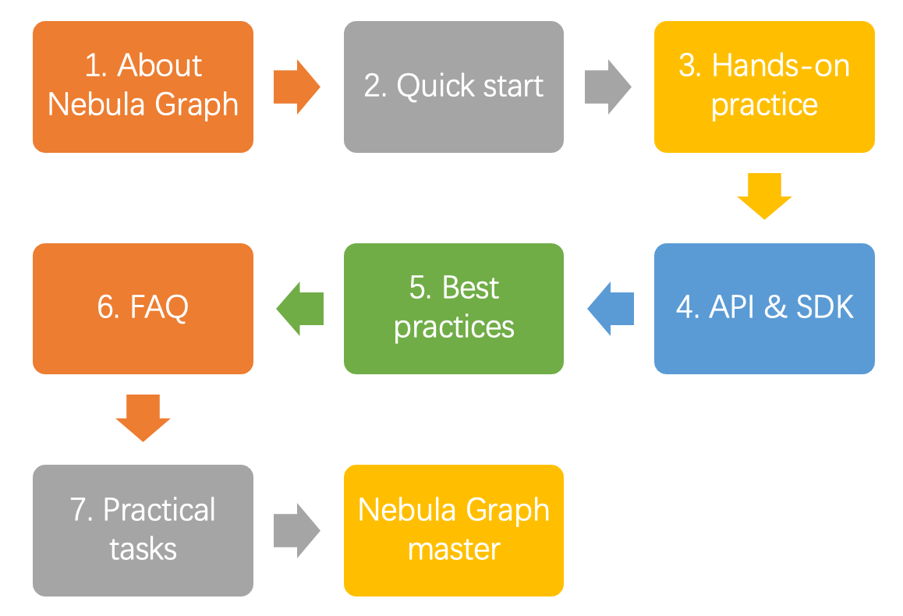

# Nebula Graph learning path

This topic is for anyone interested in learning more about Nebula Graph. You can master Nebula Graph from zero to hero through the documentation and videos in Nebula Graph learning path. 

 

## 1. About Nebula Graph

### 1.1 What is Nebula Graph?

| Document                                                         | Video                                                         |
| ------------------------------------------------------------ | ------------------------------------------------------------ |
| [What is Nebula Graph](../1.introduction/1.what-is-nebula-graph.md) | [Nebula Graph](https://www.youtube.com/watch?v=LNwCzn2xdYI)|

### 1.2 Data models
  
  | Document                                                         |
  | ------------------------------------------------------------ |
  | [Data modeling](../1.introduction/2.data-model.md) |

### 1.3 Path
  
| Document   | 
| ------------ | 
| [Path](../1.introduction/2.1.path.md) | 

### 1.4 Nebula Graph architecture

  | Document                                                         | 
  | ------------------------------------------------------------ | 
  | [Meta service](../1.introduction/3.nebula-graph-architecture/2.meta-service.md) | 
  | [Graph service](../1.introduction/3.nebula-graph-architecture/3.graph-service.md) | 
  | [Storage service](../1.introduction/3.nebula-graph-architecture/4.storage-service.md) | 
  

## 2. Quick start

### 2.1 Install Nebula Graph

  | Document                                                         | Video                                                         |
  | ------------------------------------------------------------ | ------------------------------------------------------------ |
  | [Install with a RPM or DEB package](../4.deployment-and-installation/2.compile-and-install-nebula-graph/2.install-nebula-graph-by-rpm-or-deb.md) | -                                                            |
  | [Install with a TAR package](../4.deployment-and-installation/2.compile-and-install-nebula-graph/4.install-nebula-graph-from-tar.md) | -                                                            |
  | [Install with Docker](../4.deployment-and-installation/2.compile-and-install-nebula-graph/3.deploy-nebula-graph-with-docker-compose.md) | [Install Nebula Graph with Docker and Docker Compose](https://www.youtube.com/watch?v=yM5GDpJedEI) |
  | [Install from source](../4.deployment-and-installation/2.compile-and-install-nebula-graph/1.install-nebula-graph-by-compiling-the-source-code.md) | [Install Nebula Graph with Source Code](https://www.youtube.com/watch?v=x-I835eEBz0)                                                             |
  

### 2.2 Start Nebula Graph

  | Document                                                         |
  | ------------------------------------------------------------ |
  | [Start and stop Nebula Graph](../2.quick-start/5.start-stop-service.md) |

### 2.3 Connect to Nebula Graph

  | Document
  | ------------------------------------------------------------ |
  | [Connect to Nebula Graph](../2.quick-start/3.connect-to-nebula-graph.md) |

### 2.4 Use nGQL statements 

  | Document|
  | ------------------------------------------------------------ |
  | [nGQL cheatsheet](https://docs.nebula-graph.io/{{nebula.release}}/2.quick-start/6.cheatsheet-for-ngql/) |  

## 3. Hands-on practices

### 3.1 Deploy a multi-machine cluster

  | Document |
  | ------------------------------------------------------------ |
  | [Deploy a Nebula Graph cluster with RPM/DEB](../4.deployment-and-installation/2.compile-and-install-nebula-graph/deploy-nebula-graph-cluster.md) |  

### 3.2 Upgrade Nebula Graph

  | Document                                                         |
  | ------------------------------------------------------------ |
  | [Upgrade Nebula Graph to {{nebula.branch}}](../4.deployment-and-installation/3.upgrade-nebula-graph/upgrade-nebula-graph-to-latest.md) |
  | [Upgrade Nebula Graph from v2.0.x to {{nebula.branch}}](../4.deployment-and-installation/3.upgrade-nebula-graph/upgrade-nebula-from-200-to-latest.md) |

### 3.3 Configure Nebula Graph

  | Document                                                         |
  | ------------------------------------------------------------ |
  | [Configure Meta](../5.configurations-and-logs/1.configurations/2.meta-config.md) |
  | [Configure Graph](../5.configurations-and-logs/1.configurations/3.graph-config.md) |
  | [Configure Storage](../5.configurations-and-logs/1.configurations/4.storage-config.md) |
  | [Configure Linux kernel](../5.configurations-and-logs/1.configurations/6.kernel-config.md) |

### 3.4 Configure logs

| Document |
| ------------------------------------------------------------ |
|[Log managements](../5.configurations-and-logs/2.log-management/logs.md) |

### 3.5 O&M and Management

- Account authentication and authorization

  | Document                                                         |
  | ------------------------------------------------------------ |
  | [Local authentication](../7.data-security/1.authentication/1.authentication.md) |
  | [OpenLDAP](../7.data-security/1.authentication/4.ldap.md) |
  | [User management](../7.data-security/1.authentication/2.management-user.md) |
  | [Roles and privileges](../7.data-security/1.authentication/3.role-list.md) |

- Balance the distribution of partitions

  | Document |
  | ------------------------------------------------------------ |
  |[Storage load balancing](../8.service-tuning/load-balance.md)|

- Monitoring

  | Document                                                         |
  | ------------------------------------------------------------ |
  | [Nebula Graph metrics](../6.monitor-and-metrics/1.query-performance-metrics.md) |
  | [RocksDB statistics](../6.monitor-and-metrics/2.rocksdb-statistics.md) |

- Data snapshot

  | Document |
  | ------------------------------------------------------------ |
  |[Create snapshots](../7.data-security/3.manage-snapshot.md)|

- Resource isolation

  | Document |
  | ------------------------------------------------------------ |
  |[Group & Zone](https://docs.nebula-graph.io/{{nebula.release}}/7.data-security/5.zone/)|

- SSL encryption

  | Document|
  | ------------------------------------------------------------ |
  |[SSL](../7.data-security/4.ssl.md)|

### 3.6 Performance tuning

  | Document     |
  | ------------------- |
  | [Graph data modeling suggestions](../8.service-tuning/2.graph-modeling.md) |
  | [System design suggestions](../8.service-tuning/3.system-design.md) |
  | [Compaction](../8.service-tuning/compaction.md) |

 
### 3.7 Derivative software

- Visualization

  | Visualization tools     | Document                                                         | Video                                                         |
  | -------------- | ------------------------------------------------------------ | ------------------------------------------------------------ |
  | Data visualization     | [Nebula Graph Studio](../nebula-studio/about-studio/st-ug-what-is-graph-studio.md) | [Nebula Studio](https://www.youtube.com/watch?v=6V4salpkIbc&list=PL4ArMmsAnb86R2MfUKFjzTQizCZCrhu2p)|
  | Data monitoring and O&M | [Nebula Dashboard Community Edition](https://docs.nebula-graph.io/{{nebula.release}}/nebula-dashboard/1.what-is-dashboard/)和 [Nebula Dashboard Enterprise Edition](https://docs.nebula-graph.io/{{nebula.release}}/nebula-dashboard-ent/1.what-is-dashboard-ent/) | -|
  | Data analysis       | [Nebula Explorer Enterprise Edition](../nebula-explorer/about-explorer/ex-ug-what-is-explorer.md) | -                                                            |

- Data import and export

  | Import and export | Document                                                         | Video                                                         |
  | -------------- | ------------------------------------------------------------ | ------------------------------------------------------------ |
  | Data import       | [Nebula Importer](../nebula-importer/use-importer.md) | [Nebula Importer](https://www.bilibili.com/video/BV1ny4y1u7i4) |
  | Data import       | [Nebula Spark Connector](https://docs.nebula-graph.com.cn/{{nebula.release}}/nebula-spark-connector/) | -                                                            |
  | Data import       | [Nebula Flink Connector](https://docs.nebula-graph.com.cn/{{nebula.release}}/nebula-flink-connector/) | -                                                            |
  | Data import       | [Nebula Exchange Community Edition](../nebula-exchange/about-exchange/ex-ug-what-is-exchange.md) | - |
  | Data export       | [Nebula Exchange Enterprise Edition](../nebula-exchange/about-exchange/ex-ug-what-is-exchange.md) | -                                                            |
  
- Performance test

  | Document                                                         |
  | ------------------------------------------------------------ |
  | [Nebula Bench](../nebula-bench.md) |

- Cluster O&M

  | Document  |
  | -------- |
  | [Nebula Operator](../nebula-operator/1.introduction-to-nebula-operator.md) |

- Graph algorithm

  | Document   |
  | ------- |
  | [Nebula Algorithm](../nebula-algorithm.md) |

- Clients

  | Document                                                         |
  | ------------------------------------------------------------ |
  | [Nebula Console](../2.quick-start/3.connect-to-nebula-graph.md) |
  | [Nebula CPP](../14.client/3.nebula-cpp-client.md) |
  | [Nebula Java](../14.client/4.nebula-java-client.md) |
  | [Nebula Python](../14.client/5.nebula-python-client.md) |
  | [Nebula Go](../14.client/6.nebula-go-client.md) |

## 4. API & SDK

  | Document                                                         |
  | ------------------------------------------------------------ |
  | [API & SDK](https://docs.nebula-graph.io/{{nebula.release}}/20.appendix/6.eco-tool-version/#api_sdk)|

## 5. Best practices

  | Document                                                         |
  | ------------------------------------------------------------ |
  | [Handling Tens of Billions of Threat Intelligence Data with Graph Database at Kuaishou](https://nebula-graph.io/posts/kuaishou-security-intelligence-platform-with-nebula-graph/) |
  | [Import data from Neo4j to Nebula Graph via Nebula Exchange: Best Practices](https://nebula-graph.io/posts/neo4j-nebula-graph-import-best-practice/) |
  | [Hands-On Experience: Import Data to Nebula Graph with Spark](https://nebula-graph.io/posts/best-practices-import-data-spark-nebula-graph/) |
  | [How to Select a Graph Database: Best Practices at RoyalFlush](https://nebula-graph.io/posts/how-to-select-a-graph-database/) |
  | [Practicing Nebula Operator on Cloud](https://nebula-graph.io/posts/nebula-operator-practice/) |
  | [Using Ansible to Automate Deployment of Nebula Graph Cluster](https://nebula-graph.io/posts/deploy-nebula-graph-with-ansible/) |

## 6. FAQ

  | Document                                                         |
  | ------------------------------------------------------------ |
  | [FAQ](../20.appendix/0.FAQ.md) |

## 7. Practical tasks

You can check if you have mastered Nebula Graph by completing the following practical tasks. 

  | Task                                                | Reference                                                         |
  | ------------------------------------------------------- | ------------------------------------------------------------ |
  | Compile the source code of Nebula Graph                                                | [Install Nebula Graph by compiling the source code](../4.deployment-and-installation/2.compile-and-install-nebula-graph/1.install-nebula-graph-by-compiling-the-source-code.md)                                                             |
  | Deploy Studio, Dashboard, and Explorer             | [Deploy Studio](../nebula-studio/deploy-connect/st-ug-deploy.md), [Deploy Dashboard](../nebula-dashboard/2.deploy-dashboard.md), and [Deploy Explorer](../nebula-explorer/deploy-connect/ex-ug-deploy.md)                                                            |
  | Load test Nebula Graph with K6                               | [Nebula Bench](../nebula-bench.md) |
  | Import LDBC data                                          | [Nebula Graph 1.0 Benchmark Report based on the LDBC Dataset](https://nebula-graph.io/posts/nebula-graph-1.0-benchmark-report/)                                                           |
  | Query LDBC data（such as queries for vertices, paths, or subgraphs.） | [LDBC](chrome-extension://gfbliohnnapiefjpjlpjnehglfpaknnc/pages/pdf_viewer.html?r=http://ldbcouncil.org/ldbc_snb_docs/ldbc-snb-specification.pdf) and [interactive-short-1.cypher](https://github.com/ldbc/ldbc_snb_interactive/blob/main/cypher/queries/interactive-short-1.cypher) |

