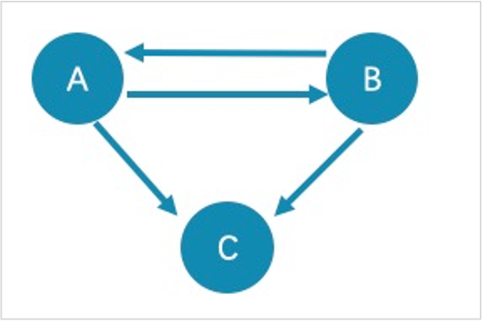

# GET SUBGRAPH

The `GET SUBGRAPH` statement retrieves information of vertices and edges reachable from the source vertices of the specified edge types and returns information of the subgraph.

## Syntax

```ngql
GET SUBGRAPH [WITH PROP] [<step_count> STEPS] FROM {<vid>, <vid>...}
[IN <edge_type>, <edge_type>...]
[OUT <edge_type>, <edge_type>...]
[BOTH <edge_type>, <edge_type>...];
```

- `WITH PROP` shows the properties. If not specified, the properties will be hidden.

- `step_count` specifies the number of hops from the source vertices and returns the subgraph from 0 to `step_count` hops. It must be a non-negative integer. Its default value is 1.

- `vid` specifies the vertex IDs.

- `edge_type` specifies the edge type. You can use `IN`, `OUT`, and `BOTH` to specify the traversal direction of the edge type. The default is `BOTH`.

!!! note

    The path type of `GET SUBGRAPH` is `trail`. Only vertices can be repeatedly visited in graph traversal. For more information, see [Path](../../1.introduction/2.1.path.md).

## Examples

The following graph is used as the sample.


* This example goes one step from the vertex `player100` over all edge types and gets the subgraph.

    ```ngql
    nebula> GET SUBGRAPH 1 STEPS FROM "player100";
    +-------------------------------------------------------------------------+-----------------------------------------------------------------------------------------------------------------------------+
    | _vertices                                                               | _edges                                                                                                                      |
    +-------------------------------------------------------------------------+-----------------------------------------------------------------------------------------------------------------------------+
    | [("player100" :player{})]                                               | [[:serve "player100"->"team200" @0 {}], [:follow "player100"->"player101" @0 {}], [:follow "player100"->"player102" @0 {}]] |
    +-------------------------------------------------------------------------+-----------------------------------------------------------------------------------------------------------------------------+
    | [("team200" :team{}), ("player101" :player{}), ("player102" :player{})] | [[:follow "player102"->"player101" @0 {}]]                                                                                  |
    +-------------------------------------------------------------------------+-----------------------------------------------------------------------------------------------------------------------------+
    ```

    The returned subgraph is as follows.

    

* This example goes one step from the vertex `player100` over incoming `follow` edges and gets the subgraph.

    ```ngql
    nebula> GET SUBGRAPH 1 STEPS FROM "player100" IN follow;
    +---------------------------+--------+
    | _vertices                 | _edges |
    +---------------------------+--------+
    | [("player100" :player{})] | []     |     
    +---------------------------+--------+
    | []                        | []     |
    +---------------------------+--------+
    ```

    There is no incoming `follow` edge to `player100`, so no vertex or edge is returned.

* This example goes one step from the vertex `player100` over outgoing `serve` edges, gets the subgraph, and shows the property of the edge.

    ```ngql
    nebula> GET SUBGRAPH WITH PROP 1 STEPS FROM "player100" OUT serve;
    +------------------------------------------------------+-------------------------------------------------------------------------+
    | _vertices                                            | _edges                                                                  |
    +------------------------------------------------------+-------------------------------------------------------------------------+
    | [("player100" :player{age: 42, name: "Tim Duncan"})] | [[:serve "player100"->"team200" @0 {end_year: 2016, start_year: 1997}]] |
    +------------------------------------------------------+-------------------------------------------------------------------------+
    | [("team200" :team{name: "Warriors"})]                | []                                                                      |
    +------------------------------------------------------+-------------------------------------------------------------------------+
    ```

    The returned subgraph is as follows.


## FAQ

### Why is the number of hops in the returned result greater than `step_count`?

To show the completeness of the subgraph, an additional hop is made on all vertices that meet the conditions. The following graph is used as the sample.



- The returned paths of `GET SUBGRAPH 1 STEPS FROM "A";` are `A->B`, `B->A`, and `A->C`. To show the completeness of the subgraph, an additional hop is made on all vertices that meet the conditions, namely `B->C`.

- The returned path of `GET SUBGRAPH 1 STEPS FROM "A" IN follow;` is `B->A`. To show the completeness of the subgraph, an additional hop is made on all vertices that meet the conditions, namely `A->B`.

If you only query paths or vertices that meet the conditions, we suggest you use [MATCH](../7.general-query-statements/2.match.md) or [GO](../7.general-query-statements/3.go.md). The example is as follows.

```ngql
nebula> match p= (v:player) -- (v2) where id(v)=="A" return p;

nebula> go 1 steps from "A" over follow;
```

### Why is the number of hops in the returned result lower than `step_count`?

The query stops when there is not enough subgraph data and will not return the null value.

```ngql
nebula> GET SUBGRAPH 100 STEPS FROM "player141" OUT follow;
+-------------------------------------------------------+--------------------------------------------+
| _vertices                                             | _edges                                     |
+-------------------------------------------------------+--------------------------------------------+
| [("player141" :player{age: 43, name: "Ray Allen"})]   | [[:follow "player141"->"player124" @0 {}]] |
+-------------------------------------------------------+--------------------------------------------+
| [("player124" :player{age: 33, name: "Rajon Rondo"})] | [[:follow "player124"->"player141" @0 {}]] |
+-------------------------------------------------------+--------------------------------------------+
```
