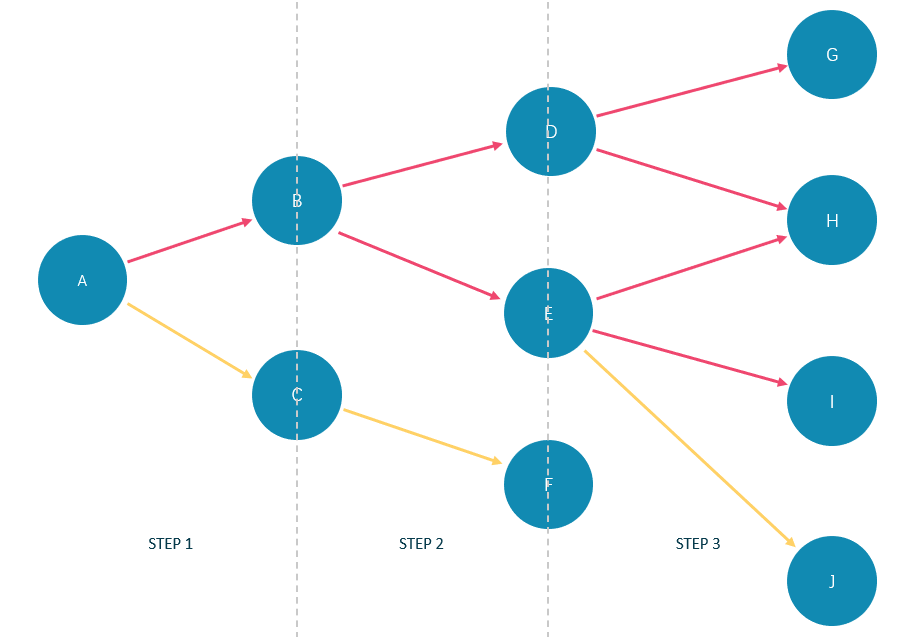

# LIMIT AND SKIP

The `LIMIT` clause constrains the number of rows in the output. The usage of `LIMIT` in native nGQL statements and openCypher compatible statements is different.

- Native nGQL: Generally, a pipe `|` needs to be used before the `LIMIT` clause. The offset parameter can be set or omitted directly after the `LIMIT` statement.

- OpenCypher compatible statements: No pipes are permitted before the `LIMIT` clause. And you can use `SKIP` to indicate an offset.

!!! note

        When using `LIMIT` in either syntax above, it is important to use an `ORDER BY` clause that constrains the output into a unique order. Otherwise, you will get an unpredictable subset of the output.

!!! compatibility "Legacy version compatibility"

    In Nebula Graph 2.6.0, `GO` statements support the new `LIMIT` syntax. Some operators related to `LIMIT` support computing pushdown.

## LIMIT in native nGQL statements

In native nGQL, `LIMIT` has general syntax and exclusive syntax in `GO` statements.

### General LIMIT syntax in native nGQL statements

In native nGQL,  the general `LIMIT` syntax works the same as in `SQL`. The `LIMIT` clause accepts one or two parameters. The values of both parameters must be non-negative integers and be used after a pipe. The syntax and description are as follows:

```ngql
... | LIMIT [<offset>,] <number_rows>;
```

| Parameter     | Description                                                                                                                                                 |
| :--           | :--                                                                                                                                                         |
| `offset`      | The offset value. It defines the row from which to start returning. The offset starts from `0`. The default value is `0`, which returns from the first row. |
| `number_rows` | It constrains the total number of returned rows.                                                                                                            |

For example:

```ngql
# The following example returns the top 3 rows of data from the result.
nebula> LOOKUP ON player YIELD id(vertex)|\
        LIMIT 3;
+-------------+
| id(VERTEX)  |
+-------------+
| "player100" |
| "player101" |
| "player102" |
+-------------+

# The following example returns the 3 rows of data starting from the second row of the sorted output.
nebula> GO FROM "player100" OVER follow REVERSELY \
        YIELD properties($$).name AS Friend, properties($$).age AS Age \
        | ORDER BY $-.Age, $-.Friend \
        | LIMIT 1, 3;
+-------------------+-----+
| Friend            | Age |
+-------------------+-----+
| "Danny Green"     | 31  |
| "Aron Baynes"     | 32  |
| "Marco Belinelli" | 32  |
+-------------------+-----+
```

### LIMIT in GO statements

In addition to the general syntax in the native nGQL, the `LIMIT` in the `GO` statement also supports limiting the number of output results based on edges.

Syntax:

```ngql
<go_statement> LIMIT <limit_list>;
```

`limit_list` is a list. Elements in the list must be natural numbers, and the number of elements must be the same as the maximum number of `STEPS` in the `GO` statement. The following takes `GO 1 TO 3 STEPS FROM "A" OVER * LIMIT <limit_list>` as an example to introduce this usage of `LIMIT` in detail.

* The list `limit_list` must contain 3 natural numbers, such as `GO 1 TO 3 STEPS FROM "A" OVER * LIMIT [1,2,4]`.
* `1` in `LIMIT [1,2,4]` means that the system automatically selects 1 edge to continue traversal in the first step. `2` means to select 2 edges to continue traversal in the second step. `4` indicates that 4 edges are selected to continue traversal in the third step.
* Because `GO 1 TO 3 STEPS` means to return all the traversal results from the first to third steps, all the red edges and their source and destination vertices in the figure below will be matched by this `GO` statement. And the yellow edges represent there is no path selected when the GO statement traverses. If it is not `GO 1 TO 3 STEPS` but `GO 3 STEPS`, it will only match the red edges of the third step and the vertices at both ends.



In the basketballplayer dataset, the example is as follows:

```ngql
nebula> GO 3 STEPS FROM "player100" \
        OVER * \
        YIELD properties($$).name AS NAME, properties($$).age AS Age \
        LIMIT [3,3,3];
+-----------------+--------------+
| NAME            | Age          |
+-----------------+--------------+
| "Spurs"         | UNKNOWN_PROP |
| "Tony Parker"   | 36           |
| "Manu Ginobili" | 41           |
+-----------------+--------------+

nebula> GO 3 STEPS FROM "player102" OVER * \
        YIELD dst(edge) \
        LIMIT [rand32(5),rand32(5),rand32(5)];
+-------------+
| dst(EDGE)   |
+-------------+
| "team204"   |
| "team215"   |
| "player100" |
| "player102" |
+-------------+
```

## LIMIT in openCypher compatible statements

In openCypher compatible statements such as `MATCH`, there is no need to use a pipe when `LIMIT` is used. The syntax and description are as follows:

```ngql
... [SKIP <offset>] [LIMIT <number_rows>];
```

| Parameter     | Description                                                                                                                                                 |
| :--           | :--                                                                                                                                                         |
| `offset`      | The offset value. It defines the row from which to start returning. The offset starts from `0`. The default value is `0`, which returns from the first row. |
| `number_rows` | It constrains the total number of returned rows.                                                                                                            |

Both `offset` and `number_rows` accept expressions, but the result of the expression must be a non-negative integer.

!!! note

    Fraction expressions composed of two integers are automatically floored to integers. For example, `8/6` is floored to 1.

### Examples of LIMIT

`LIMIT` can be used alone to return a specified number of results.

```ngql
nebula> MATCH (v:player) RETURN v.name AS Name, v.age AS Age \
        ORDER BY Age LIMIT 5;
+-------------------------+-----+
| Name                    | Age |
+-------------------------+-----+
| "Luka Doncic"           | 20  |
| "Ben Simmons"           | 22  |
| "Kristaps Porzingis"    | 23  |
| "Giannis Antetokounmpo" | 24  |
| "Kyle Anderson"         | 25  |
+-------------------------+-----+

nebula> MATCH (v:player) RETURN v.name AS Name, v.age AS Age \
        ORDER BY Age LIMIT rand32(5);
+-------------------------+-----+
| Name                    | Age |
+-------------------------+-----+
| "Luka Doncic"           | 20  |
| "Ben Simmons"           | 22  |
| "Kristaps Porzingis"    | 23  |
| "Giannis Antetokounmpo" | 24  |
+-------------------------+-----+
```

### Examples of SKIP

`SKIP` can be used alone to set the offset and return the data after the specified position.

```ngql
nebula> MATCH (v:player{name:"Tim Duncan"}) --> (v2) \
        RETURN v2.name AS Name, v2.age AS Age \
        ORDER BY Age DESC SKIP 1;
+-----------------+-----+
| Name            | Age |
+-----------------+-----+
| "Manu Ginobili" | 41  |
| "Tony Parker"   | 36  |
+-----------------+-----+

nebula> MATCH (v:player{name:"Tim Duncan"}) --> (v2) \
        RETURN v2.name AS Name, v2.age AS Age \
        ORDER BY Age DESC SKIP 1+1;
+---------------+-----+
| Name          | Age |
+---------------+-----+
| "Tony Parker" | 36  |
+---------------+-----+
```

### Example of SKIP and LIMIT

`SKIP` and `LIMIT` can be used together to return the specified amount of data starting from the specified position.

```ngql
nebula> MATCH (v:player{name:"Tim Duncan"}) --> (v2) \
        RETURN v2.name AS Name, v2.age AS Age \
        ORDER BY Age DESC SKIP 1 LIMIT 1;
+-----------------+-----+
| Name            | Age |
+-----------------+-----+
| "Manu Ginobili" | 41  |
+-----------------+-----+
```

<!--
## Performance tip

Nebula Graph {{ nebula.release }} does not implement the pushdown optimization of the storage layer of the `LIMIT` statement. Statements similar to `MATCH (n:T) RETURN n LIMIT 10` or `LOOKUP on i_T | LIMIT 10` will generate excessive resource occupancies in the graphd process. A graphd process will retrieve all T-type vertices from all storaged processes and then return 10 vertices. If the total amount of data is large, the graphd process will consume a lot of memory at this time and even cause OOM.
-->
