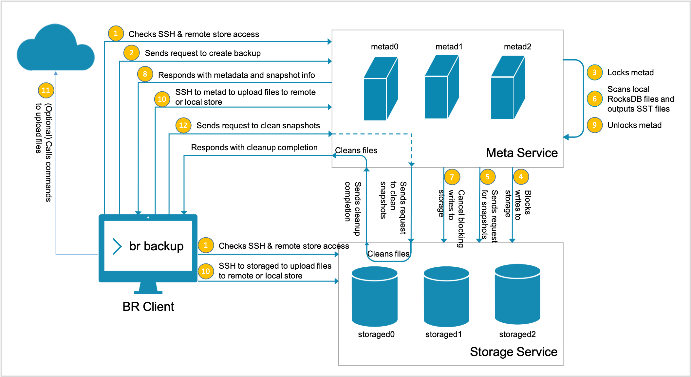
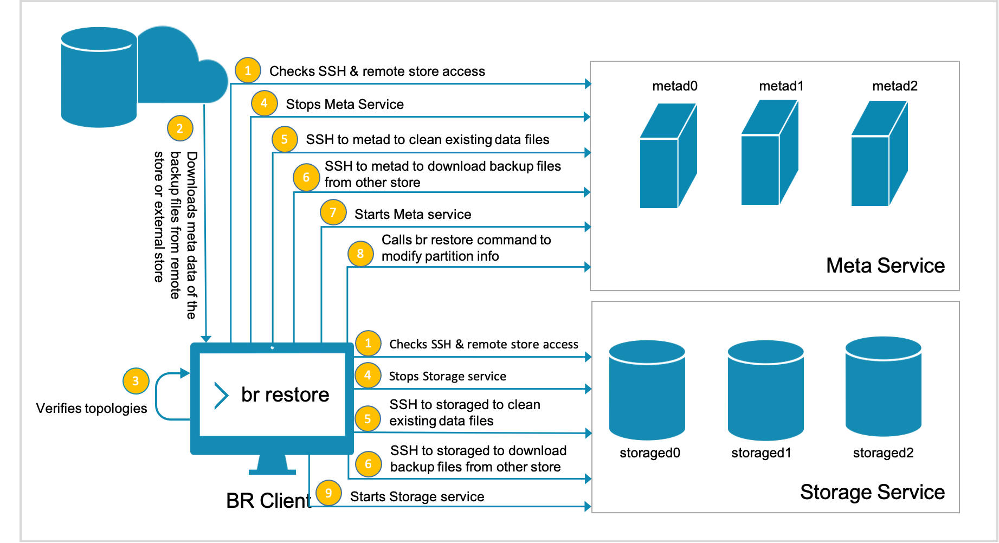

# What is Backup & Restore

Backup & Restore (BR for short) is a Command-Line Interface (CLI) tool to back up data of graph spaces of Nebula Graph and to restore data from the backup files.

## Features

The BR has the following features. It supports:

- Backing up and restoring data in a one-click operation.
- Restoring data in the following backup file types:
  - Local Disk (SSD or HDD)
  - Hadoop Distributed File System (HDFS)
  - Alibaba Cloud OSS
  - Amazon S3 (TODO: coding)
- Backing up the entire Nebula Graph cluster. Currently, backing up data of specified graph spaces is not supported.

## Limitations

- Supports Nebula Graph v{{ nebula.release }} only.
- Supports full backup, but not incremental backup.
- Currently, Nebula Listener and full-text indexes do not support backup.
- If you back up data to the local disk, the backup files will be saved in the local path of each server. You can also mount the NFS on your host to restore the backup data to a different host.
- The backup graph space can be restored to the original cluster only. Cross clusters restoration is not supported.
- During the backup process, both DDL and DML statements in the specified graph spaces are blocked. We recommend that you do the operation within the low peak period of the business, for example, from 2:00 AM to 5:00 AM.
- Supports restoration of data on clusters of the same topologies only, which means both clusters must have exactly the same number of hosts.
- We recommend that you restore the data OFFLINE because it requires removing the data and restart the service.
<!---When backing up or restoring the data deployed in Docker, network configuration should be done, such as IP and port mapping. -->

## Implementation

You can use the BR to do these:

- Backing up a cluster and storing its data in a local or cloud storage system.

- Restoring data to a cluster from a local or cloud storage system.

This section introduces how backup and restoration are implemented in the BR.

### Backup

To back up data, the BR sends a backup request to the leader metad process to trigger the backup process as follows:

1. The SSH login from the BR machine to the meta and the storage servers is verified.

  !!! Note

        Besides, if a remote storage system such as Amazon S3 or Alibaba Cloud OSS is necessary, their client installation and configuration are verified.

2. The BR sends a request to create backup files.

3. The leader metad process is locked.

  !!! note

        From now on, you cannot run any DDL statement of nGQL until Step 9.

4. The leader metad process blocks writing to the specified graph spaces.

  !!! note

        From now on, you cannot run any DML statement of nGQL in the specified graph spaces until Step 7. But this process does not affect the DQL statements in these graph spaces, and you can do whatever you want in other graph spaces.

5. The leader metad process sends a request to the storaged processes for the snapshot file names.

6. The leader metad process scans local RocksDB files and output SST files.

7. The leader metad process unblocks writing to the specified graph spaces.

  !!! note

        From now on, you can run DML statements of nGQL in the specified graph spaces.

8. The leader metad process sends responses to the BR with the metadata and snapshots including:
   - the thrift format,
   - partition information of the graph spaces,
   - the Raft log commit ID of each partition,
   - the snapshot information including the catalog of the snapshots of each storaged process,
   - their SST file names of the meta server, and
   - the backup file names.

9.  The leader metad process is unlocked.

  !!! note

        From now on, you can run any DDL statement of nGQL in the specified graph spaces.

10. The account on the BR machine logs on via SSH to the meta server where the leader locates and to all the storage servers and backs up files.

11. If Amazon S3 or Alibaba Cloud OSS is used, the BR uses commands to upload the files to the cloud storage system.

  !!! note

        This step causes massive disk reads. We recommend that a 10 Gigabit Network is applied. If a networking error occurs during this step, the backup process fails and you must do the backup operation again. For now, the backup process cannot be resumed from the broken point.

12. The BR sends a request to clean the snapshots from storage servers, and the backup process is done.
  
This figure shows how the backup is implemented.

When backup files are generated, the file names are generated automatically. A folder name is in the format of `BACKUP_YY_MM_DD_HH_mm_SS`, of which,

- `BACKUP` indicates the files are backup files.
- `YY_MM_DD_HH_mm_SS` indicates the timestamp when the files are generated.

### Restore

!!! danger

    During the restoration process, the data on the target cluster is removed and then is replaced with the data from the backup files. If necessary, back up the data on the target cluster.

The restoration process is implemented as follows:

1. The SSH login from the BR to the meta and the storage servers is verified.

  !!! Note

        Besides, if a cloud storage system such as Amazon S3 or Alibaba Cloud OSS is necessary, their client installation and configuration are verified.

2. The BR downloads the metadata (but not data) of the backup files from the remote storage system or other external storage systems.

3. The BR verifies the topology of the clusters to make sure both clusters must have exactly the same number of hosts.

4. The BR stops the Meta Service and the Storage Service remotely.

5. The account on the BR machine logs on via SSH to the meta and storage servers to remove the existing data files.

6. When data files are removed, the account on the BR machine logs on via SSH to the meta and storage servers and downloads the backup files from the cloud storage system or other external storage systems.

7. When the backup files are downloaded, the BR starts the Meta Service.

8. The BR uses the `br restore` command to change the partition information of the specified metad processes.

9.  The BR starts the Storage Service, and the restoration process is done.

This figure shows how the restoration process is implemented.

## How to use BR

To use the BR, follow these steps:

1. [Compile BR](2.compile-br.md).
2. [Use BR to back up data](3.br-backup-data.md).
3. [Use BR to restore data from backup files](4.br-restore-data.md).
