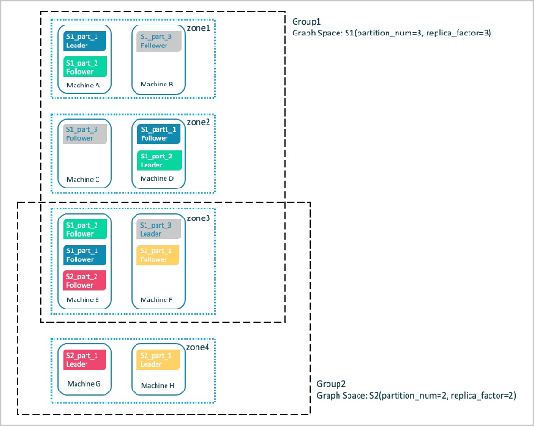

# Group&Zone

The Group&Zone feature groups the nodes where Storage services are located (also called Storage nodes) to isolate resources.

## Background

Storage nodes can be added into a Zone, and multiple Zones form a Group. If you specify a Group when creating a space, the space will be created and stored on the Storage nodes within the Group. Data partitions and replicas are stored evenly in each Zone as shown below.



Suppose that 8 Storage nodes are divided into 4 Zones, with each one having 2 Storage nodes, and then add Zone1, Zone2, and Zone3 into Group1, add Zone3 and Zone4 into Group2.

After specifying Group1 when you create a space called S1, data partitions and replicas will be stored evenly on the nodes in Zone1, Zone2, and Zone3, and will not be stored on the node in Zone4.

After specifying Group2 when you create another space called S2, data partitions and replicas will be stored evenly on the nodes in Zone3 and Zone4, and will not be stored on the nodes in Zone1 and Zone2.

The above example briefly introduces the zone feature. Users can isolate resources by balanced planning of Zones and Groups.

## Scenarios

- Create a space on specified Storage nodes to isolate resources.

- Perform rolling upgrade of a cluster which requires stopping one or more nodes before the cluster is upgraded, and then restart the nodes until all services on the nodes in the cluster are updated to the latest version.

## Precautions

- A Zone is a collection of Storage nodes, and each Storage node can only be added into one Zone.

- Replicas can be restored in a Zone, and only one replica of the same partition can exist in a Zone.

- Many Zones can form a Group for easy management and resource isolation.

- A Zone can be added into multiple Groups.

- If you specify a Group when creating a space, replicas in the space will be distributed evenly in each Zone within the Group.

- You can create multiple spaces using a Group，but note that the number of Zones in the Group needs to be greater than or equal to the number of replicas (`replica_factor`) specified when creating a space.

## Syntax

### ADD ZONE

Create a Zone and add Storage nodes into the Zone.

```ngql
ADD ZONE <zone_name> <host1>:<port1> [,<host2>:<port2>...];
```

For example:

```ngql
nebula> ADD ZONE zone1 192.168.8.111:9779, 192.168.8.129:9779;
```

### ADD HOST...INTO ZONE

Add a Storage node into a created Zone.

!!! note

    Use the [BALANCE](../3.ngql-guide/18.operation-and-maintenance-statements/2.balance-syntax.md) command to implement load balance after the Storage node is added into a created Zone.

```ngql
ADD HOST <host1>:<port1> INTO ZONE <zone_name>;
```

### DROP HOST...FROM ZONE

Delete a Storage node from a Zone.

!!! note

    You cannot delete a Storage node that is being used in a Group directly until the related space is deleted.

```ngql
DROP HOST <host1>:<port1> FROM ZONE <zone_name>;
```

### SHOW ZONES

View all Zones.

```ngql
SHOW ZONES;
```

### DESCRIBE ZONE

View a specified Zone.

```ngql
DESCRIBE ZONE <zone_name>;
DESC ZONE <zone_name>;
```

### DROP ZONE

Delete a Zone.

!!! note

    You cannot delete a Zone that has been added into a Group until the Zone is removed from the Group or the Group to which the Zone belongs is deleted.

```ngql
DROP ZONE <zone_name>;
```

### ADD GROUP

Create a Group and add one or more Zones into the Group.

```ngql
ADD GROUP <group_name> <zone_name> [,<zone_name>...];
```

For example:

```ngql
nebula> ADD GROUP group1 zone1,zone2;
```

### ADD ZONE...INTO GROUP

Add a Zone into a created Group.

!!! note

    Use the [BALANCE](../3.ngql-guide/18.operation-and-maintenance-statements/2.balance-syntax.md) command to implement load balance after the Zone is added into a created Group.

```ngql
ADD ZONE <zone_name> INTO GROUP <group_name>;
```

### DROP ZONE...FROM GROUP

Delete a Zone from a GROUP.

!!! note

    You cannot delete a Zone that is being used in a Group directly until the related space is deleted.

```ngql
DROP ZONE <zone_name> FROM GROUP <group_name>;
```

### SHOW GROUPS

View all Groups.

```ngql
SHOW GROUPS;
```

### DESCRIBE GROUP

View a specified Group.

```ngql
DESCRIBE GROUP <group_name>;
DESC GROUP <group_name>;
```

### DROP GROUP

Delete a Group.

!!! note

    You cannot delete a Group that is being used directly until the related space is deleted.

```ngql
DROP GROUP <group_name>;
```
