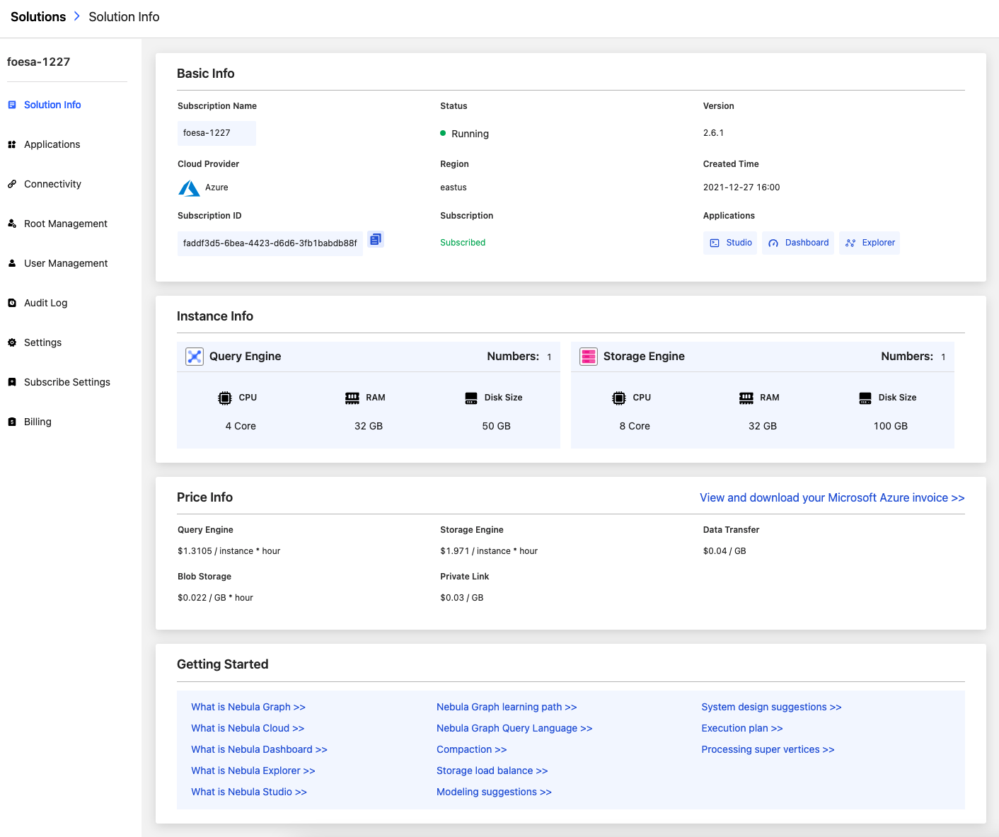
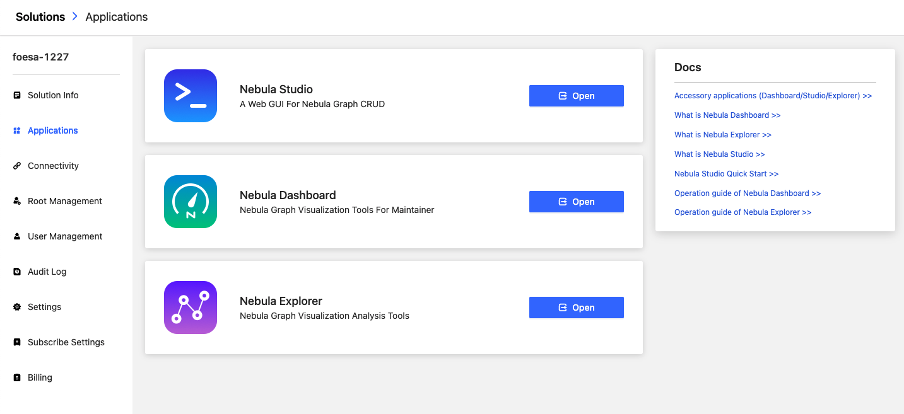
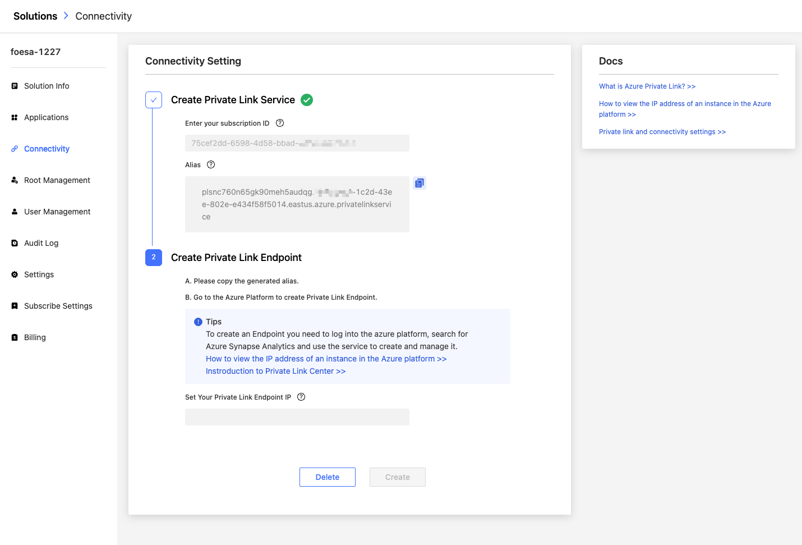
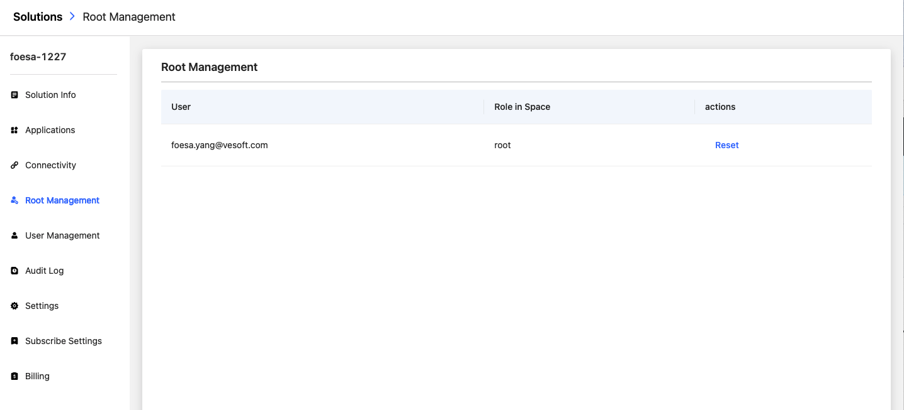
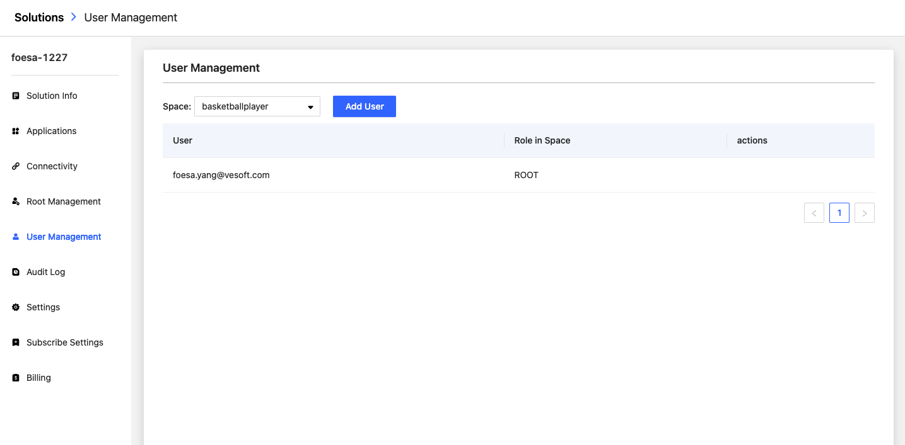
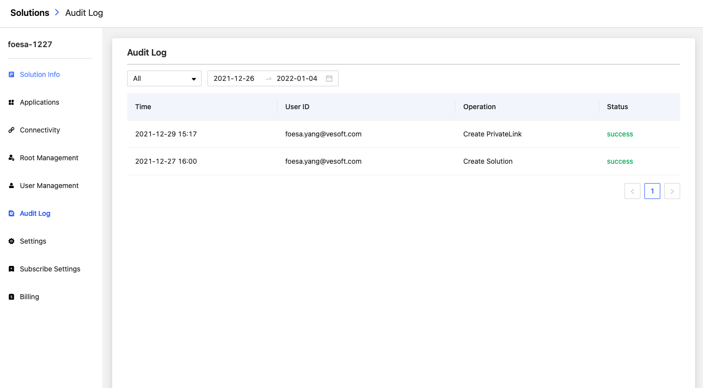
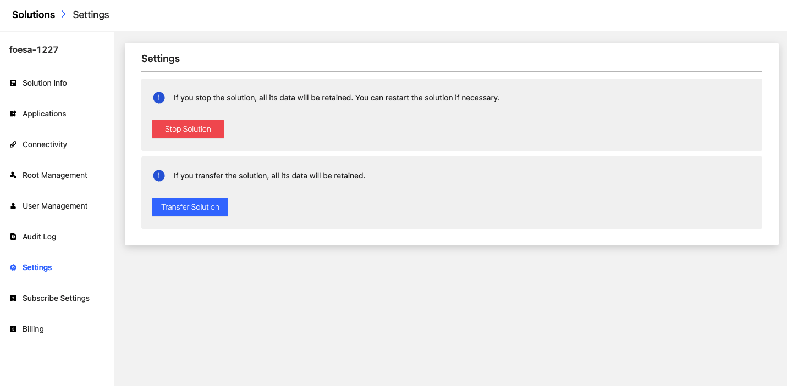

# Solution

On the **Solution** page, the sidebars are different based on roles and privileges. For more information, see [Roles and privileges in Cloud](../4.user-role-description.md).

## Solution Info

On the homepage of Cloud, click on the Solution's name to enter the **Solution Info** page. The Solution Info page consists of the following parts: Basic Info, Instance Info, Price Info, Getting Started. You can view the information on this page in detail.

## Applications

In the sidebar, click **Applications** to enter the page of ecosystem tools(Dashboard/Studio/Explorer). Different roles see different ecosystem tools. For more information, see [Accessory applications](../5.solution/5.1.supporting-application.md).

## Connectivity

In the sidebar, click **Connectivity** to enter Private Link page. On this page, you can create a Private Link endpoint that enables you to access NebulaGraph databases through a private IP address in a virtual network. For more information, see [Private Link](../5.solution/5.2.connection-configuration-and-use.md).

## Root Management

In the sidebar, click **Root Management** to enter the root account management page. For more information, see [Role and User Management](../5.solution/5.3.role-and-authority-management.md).

## User Management

In the sidebar, click **User Management** to enter the user account management page. For more information, see [Role and User Management](../5.solution/5.3.role-and-authority-management.md).

## Audit Log

In the sidebar, click **Audit Log** to enter the operation history page. You can select the time period according to the operation information such as `Create Solution`, `Start Solution`, `Stop Solution`, and filter results by operator and operation record.

## Settings

In the sidebar, click **Settings** to enter the settings page, and you can `Stop Solution` or `Transfer Solution` in this page.

