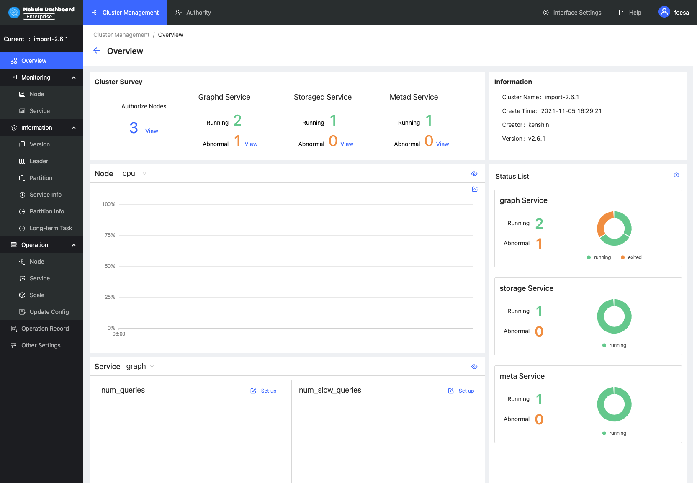

# Cluster overview

This topic introduces the **Overview** page of Dashboard. You can click **Detail** on the right of the cluster management page to check the overview of a specified cluster.

## Overview

The **Overview** page has five parts:

- Cluster survey
- Information
- Node
- Status list
- Service

### Cluster survey

In this part, you can view the number of nodes as well as the number of running and abnormal services of Graphd, Storaged, and Metad. In this example, there is **1** abnormal service in the Graphd service. You can click the **View** button to quickly check the abnormal service.

### Information

In this part, you can view the information of **Cluster name**, **Creation time**, **Creator**, and **Version**.

!!! note

    The version here is the Nebula Graph version installed by the user, not the Dashboard version.

!!! caution

    If the version of Nebula Graph imported by the user is before v2.5.0 or the version is unknown, v2.0.1 will be shown by default.

### Node

- You can view the information of node monitoring quickly and change the displayed information. By default, the CPU information will be shown.
- You can click  on the page to insert a base line.
- You can click  to jump to the detailed node monitoring page.

### Status list

This part uses pie charts to visually display the running status of nodes.

### Service

- By default, the information of `query_latency_us` and `slow_query_latency_us` will be shown.

- You can click  **Set up** to insert a base line.

- You can click  **View** to jump to the detailed service monitoring page.