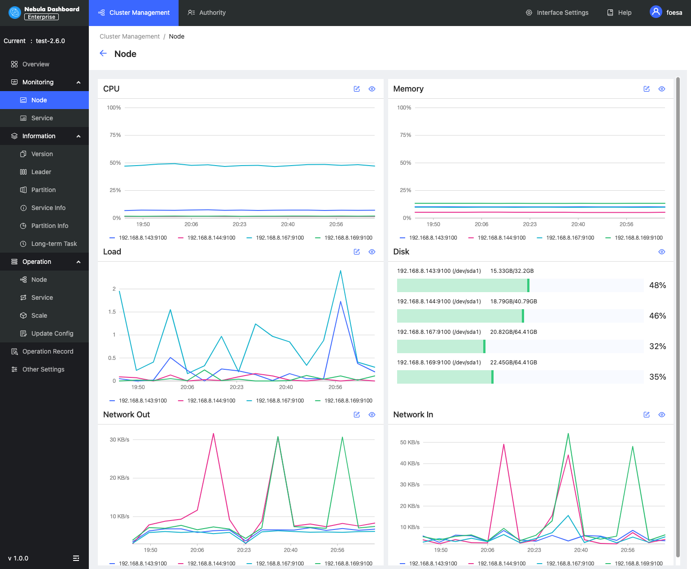
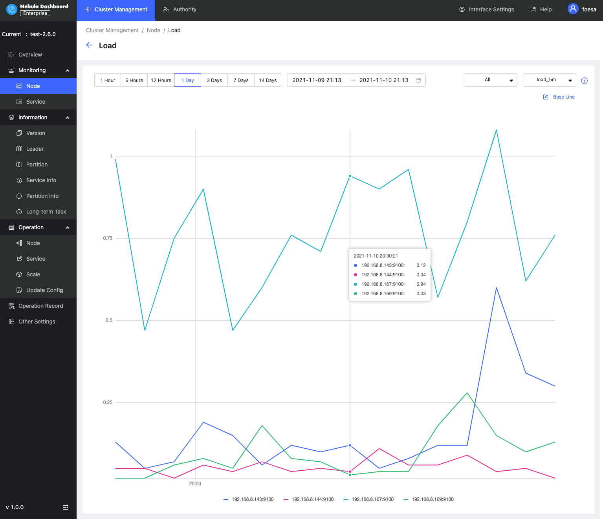
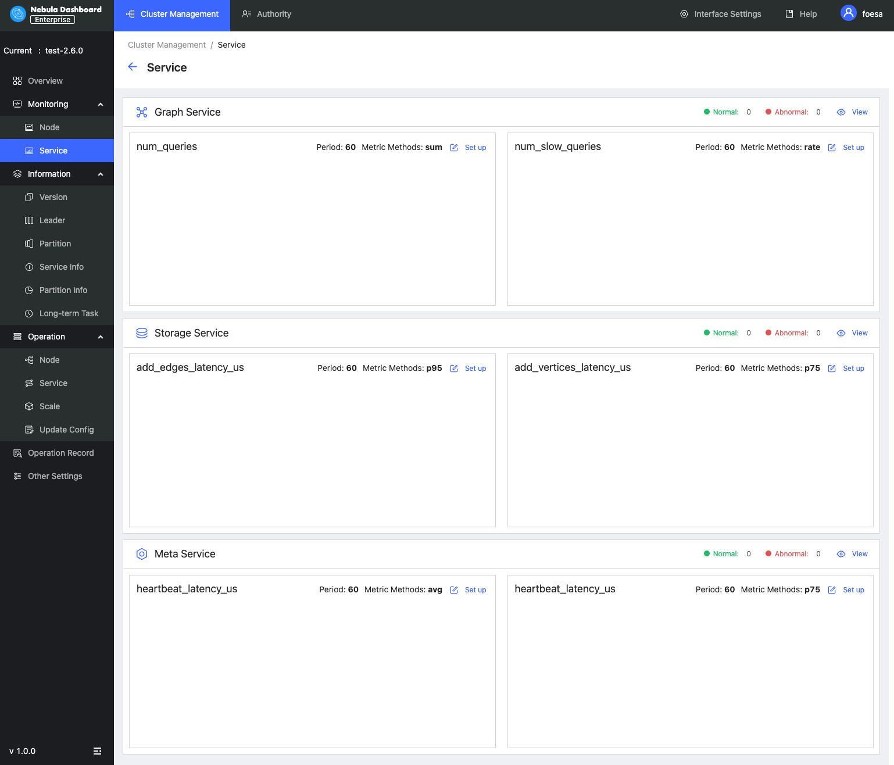

# Cluster monitoring

This topic introduces node monitoring and service monitoring of Dashboard.

## Node

On this page, you can view the variation of CPU, Memory, Load, Disk, and Network In/Out quickly.

- To set a base line, click the  button.
- To view the detailed monitoring information, click the  button. In this example, select `Load` for details. The figure is as follows.
    
  - By default, you can view the monitoring data of the latest 1 hour, 6 hours, 12 hours, 1 day, 3 days, 7days, or 14 days.
  - You can select the machine and monitoring metrics that you want to view. For details of monitoring metrics, see [Monitor parameter](../7.monitor-parameter.md).
  - You can set a base line as a reference standard.

## Service

On this page, you can view the information of Graph, Meta, and Storage services quickly. In the upper right corner, the number of normal services and abnormal services will be displayed.

!!! note

    In the current **Service** page of the Enterprise Edition, only two monitoring metrics can be set for each service, which can be adjusted by clicking the **Set up** button.

- To view the detailed monitoring information, click the  button. In this example, select `Graph` for details. The figure is as follows.
   
  - By default, you can view the monitoring data of the latest 1 hour, 6 hours, 12 hours, 1 day, 3 days, 7days, or 14 days.
  - You can select the machine and monitoring metrics that you want to view. For details of monitoring metrics, see [Monitor parameter](../7.monitor-parameter.md).
  - You can set a base line as a reference standard.
  - You can view the status of the current service.
