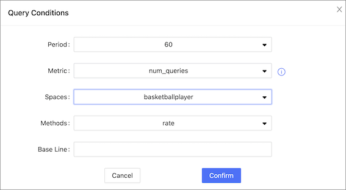

# Cluster monitoring

This topic introduces node monitoring, service monitoring, and graph space monitoring of Dashboard.

## Node

At the top navigation bar of the Dashboard Enterprise Edition page, click **Cluster Management**, and click **Monitoring**->**Node** to enter the node monitoring page.

On this page, you can view the variation of CPU, Memory, Load, Disk, and Network In/Out quickly.

- To set a base line, click the  button.
- To view the detailed monitoring information, click the  button. In this example, select `Load` for details. The figure is as follows.
    
  - By default, you can view the monitoring data of the latest 1 hour, 6 hours, 12 hours, 1 day, 3 days, 7days, or 14 days.
  - You can select the machine and monitoring metrics that you want to view. For details of monitoring metrics, see [Monitor parameter](../7.monitor-parameter.md).
  - You can set a base line as a reference standard.

## Service

At the top navigation bar of the Dashboard Enterprise Edition page, click **Cluster Management**, and click **Monitoring**->**Service** to enter the service monitoring page.

On this page, you can view the information of Graph, Meta, and Storage services quickly. In the upper right corner, the number of normal services and abnormal services will be displayed.

!!! note

    In the current **Service** page of the Enterprise Edition, only two monitoring metrics can be set for each service, which can be adjusted by clicking the **Set up** button.

- To view the detailed monitoring information, click the  button. In this example, select `Graph` for details. The figure is as follows.
   
  - By default, you can view the monitoring data of the latest 1 hour, 6 hours, 12 hours, 1 day, 3 days, 7days, or 14 days.
  - You can select the machine and monitoring metrics that you want to view. For details of monitoring metrics, see [Monitor parameter](../7.monitor-parameter.md).
  - The Graph service supports a set of space-level metrics. For more information, see the following section **Graph space**.
  - You can set a base line as a reference standard.
  - You can view the status of the current service.

## Graph space

!!! note

    Before using graph space metrics, you need to set `enable_space_level_metrics` to `true` in the Graph service. For details, see [Update config](4.manage.md).

 Space graph metrics record the information of different graph spaces separately. Currently, only the Graph service supports a set of space-level metrics.

Only when the behavior of a graph space metric is triggered, you can specify the graph space to view information about the corresponding graph space metric. For information about the space graph metrics, see [Space graph](../7.monitor-parameter.md).

