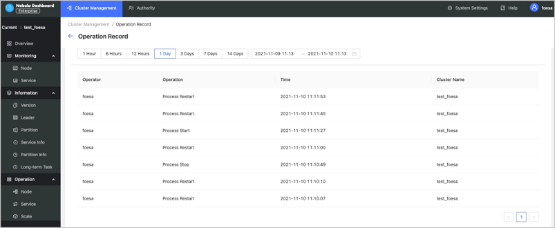

# Operation record

This topic shows how to use the operation record feature in Nebula Dashboard.

On the **Operation record** page, you can check the operation records of the latest 1 hour, 6 hours, 1 day, 3 days, 7days, or 14 days. You can also view who runs what operation on which cluster at what time.
