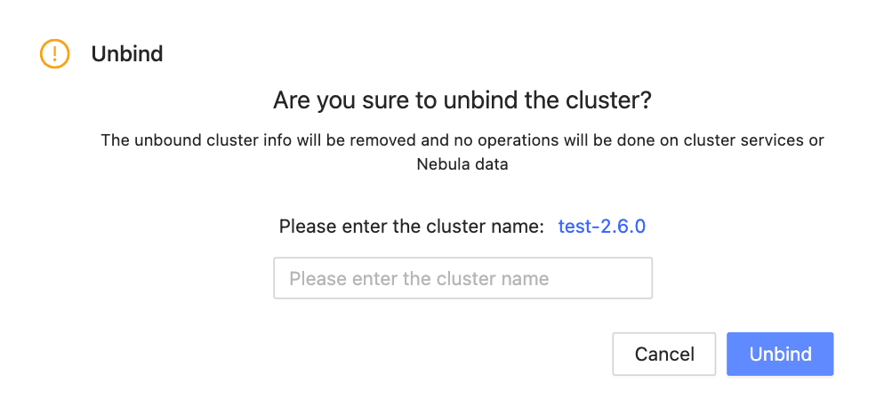
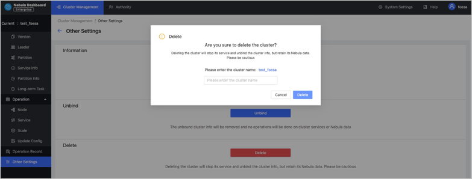

# Other settings

This topic will describe other settings in Nebula Dashboard.

- Information: It shows cluster name, creates time, and creator.

- Unbind: Unbind a cluster and remove its information from the platform, doing nothing to the cluster's services and data.

  !!! note

        When unbinding a cluster, you need to enter the cluster name to unbind.

  

- Delete: Delete a cluster and remove its information from the platform, stop the cluster's services and retain the data.

  !!! note

        When deleting a cluster, you need to enter the cluster name to delete.

  
