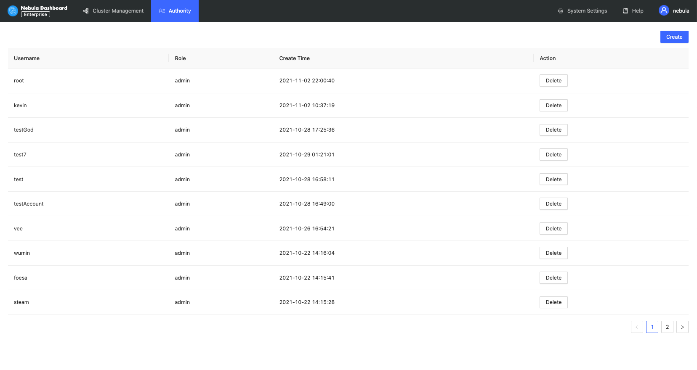
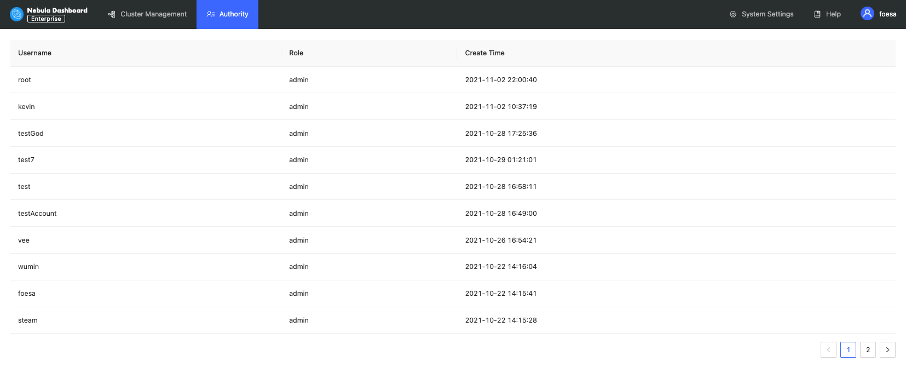

# Authority management

By default, you can log in with the GOD role (`nebula` as the default username and `nebula` as the default password). And the ADMIN account can be created or deleted on the authority management page.

You cannot perform operations on other accounts using the ADMIN account you created except for viewing the user name, the role, and the creation time.

