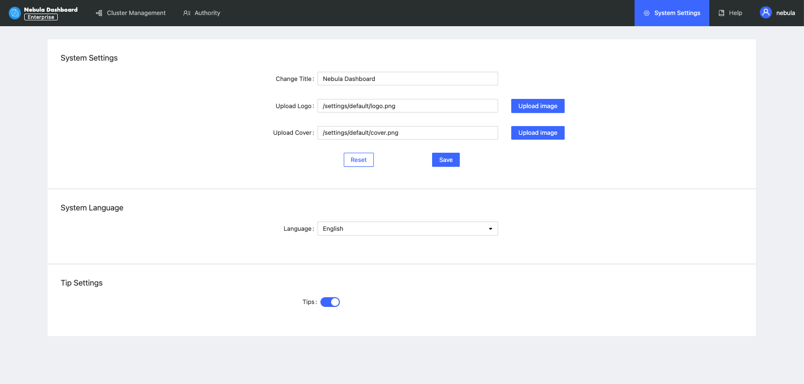
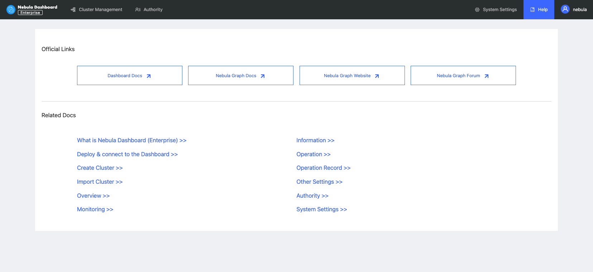

# System settings

This topic introduces the system settings that may be applied when using Dashboard.

## Interface settings

On the **Interface settings** page, you can:

- Change the title, upload the logo, and upload the cover.
- Switch the interface language, which supports English and Chinese for now.
- Enable or disable the tip settings.

## Help

On the **Help** page, you can jump to Dashboard Docs, Nebula Graph Docs, Nebula Graph Website, or Nebula Graph Forum.

## User information

On the **User information** page, you can change your password or log out.

