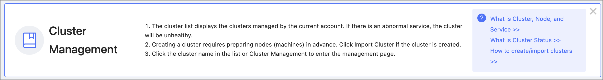

# Global settings

This article describes the global settings of using Dashboard Enterprise Edition, including interface settings, help center, and user information.  

## Interface settings

At the top navigation bar of the Dashboard Enterprise Edition, click **Interface settings** to set system, notification, and other settings.

### System settings

On the left-side navigation bar of the **Interface Settings**, click **System Settings** to modify the page title, logo image, and cover image.

### Notification Endpoints

- **Mail**：Dashboard Enterprise Edition supports sending and receiving alert messages for all clusters via E-mail.
  
  On the left-side navigation bar of the **Interface Settings** page, click **Notification Endpoints**->**Mail**:

  - You need to set the following parameters to send alert messages.

    | Parameter           | Description                                                         |
    | -------------- | ------------------------------------------------------------ |
    | SMTP Server Address| The SMTP server address corresponding to your mailbox.                               |
    | Port         | The port number of the SMTP server corresponding to your mailbox.                                |
    | Use SSL        | Check the box to enable SSL for encrypted data transmission.                              |
    | SMTP User Name     | The SMTP server account name.                                         |
    | SMTP Password       | The SMTP server password.                                           |
    | Sender Email     | The email address of the one who sent you the email.                                    |

  - You need to set a receiver to receive alert messages.

    | Parameter           | Description                                                         |
    | -------------- | ------------------------------------------------------------ |
    | Receiver         | Set the email address to receive alert messages. This email address will receive alert messages for all clusters created on Dashboard. |

- **Webhook**：Supports configuring Webhook to bring all cluster alert messages into third-party projects.
  
  On the left-side navigation bar of the **Interface Settings** page, click **Notification Endpoints**->**Webhook** to input the **Webhook URL** used to receive alert messages. You can turn on or off the Webhook feature at the top right of the page.

### Other settings

On the left-side navigation bar of the **Interface Settings** page, click **Other Settings** to have the following operations:

- Change the display language. Currently, only Chinese and English are supported.
- Turn on or off help tips. An example of tips is as follows.
  
  

## Help center

At the top navigation bar of the Dashboard Enterprise Edition, click **Help**. On the Help page, you can jump to Dashboard Docs, NebulaGraph Docs, NebulaGraph Website, or NebulaGraph Forum.

## User information

At the top right of the Dashboard Enterprise Edition page, hover mouse to your account name, such as **nebula**:

- Click **Profile** to view your account information and modify the account login password.

  !!! note

        For an LDAP account, the login password cannot be modified. For more information about accounts, see [Authority management](5.account-management.md).

- Click **Logout** to log out of the current account.
  
