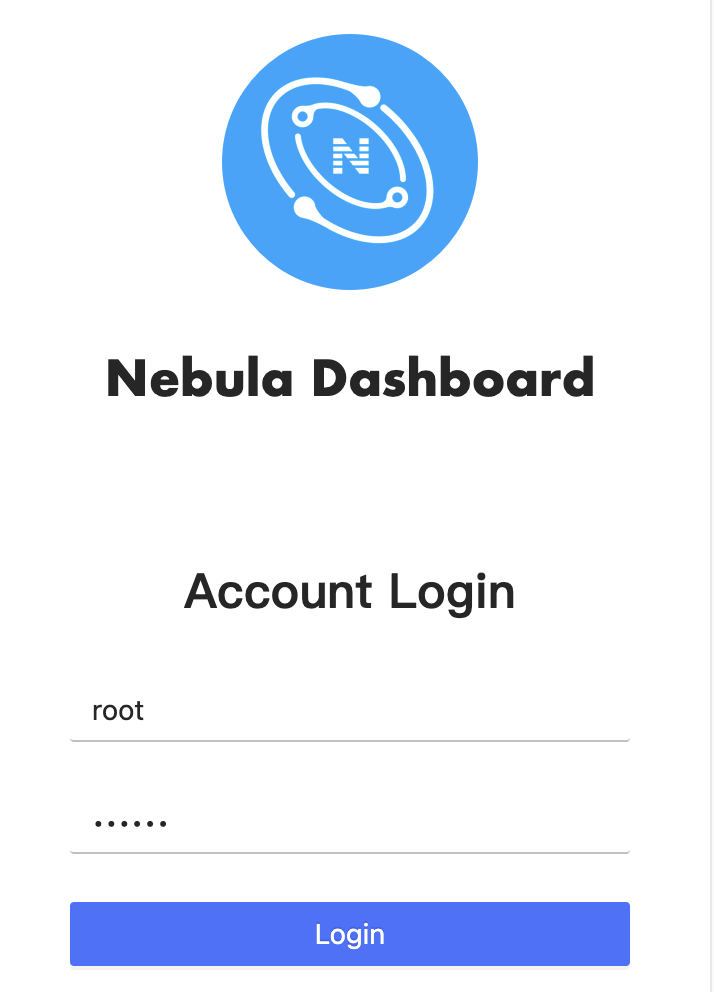

# Connect Dashboard

After Dashboard is deployed, you can log in and use Dashboard on the browser.

## Prerequisites

- The Dashboard services are started. For more information, see [Deploy Dashboard](2.deploy-dashboard.md).

- We recommend you to use the Chrome browser of the version above 58. Otherwise, there may be compatibility issues.

## Procedures

1. Confirm the IP address of the machine where the `nebula-graph-dashboard` service is installed. Enter `<IP>:7003` in the browser to open the login page.

2. Enter the username and the passwords of the Nebula Graph database and click the login button.

  - If authentication is enabled, you can log in with the created accounts.

  - If authentication is not enabled, you can only log in using `root` as the username and random characters as the password.

  To enable authentication, see [Authentication](../7.data-security/1.authentication/1.authentication.md).

  
