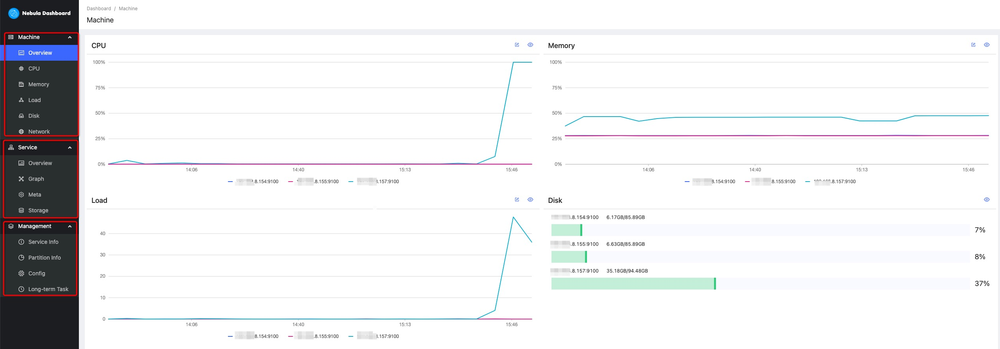
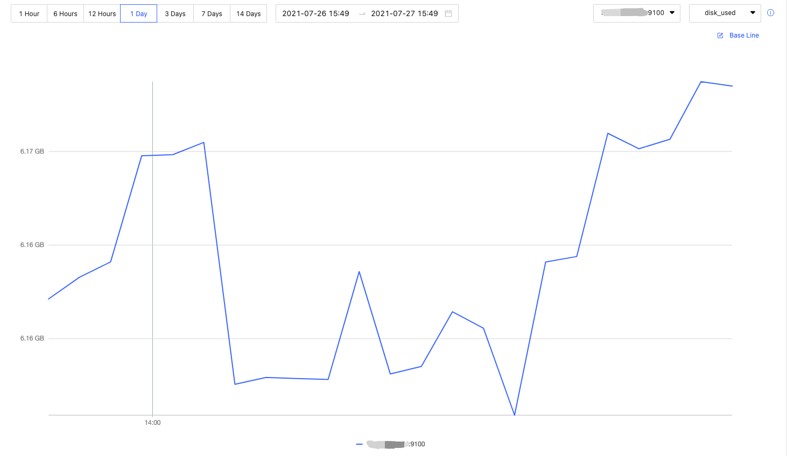
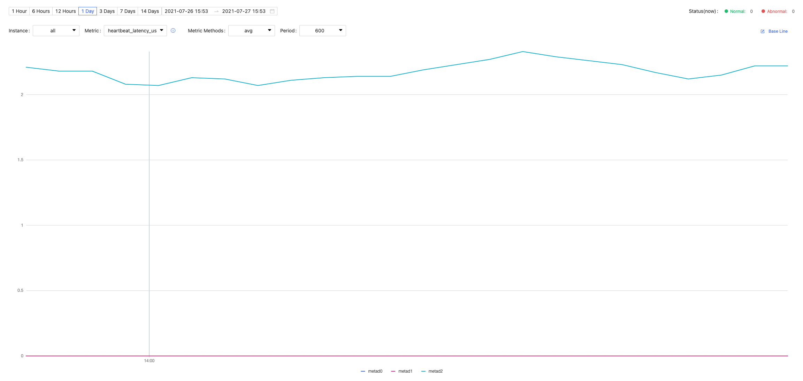

# Dashboard

Nebula Dashboard consists of three parts: Machine, Service, and Management. This topic will describe them in detail.

## Overview

## Machine

Machine consists of the following parts:

- Overview
  
  You can check the fluctuations of CPU, Memory, Load, Disk, Network In, and Network Out in the past 24 hours.

  For details of certain monitoring metrics, you can click the  symbol in the upper right corner, or click the monitoring metrics on the left.

- CPU, Memory, Load, Disk, Network
  
  It shows the detailed monitoring data of the machine from the above dimensions.
  
  - By default, you can check the monitoring data up to 14 days before. The alternative can be 1 hour, 6 hours, 12 hours, 1 day, 3 days, 7 days, or 14 days in the past.

  - You can choose the machine and monitoring metrics that you want to check. For more information, see [monitor parameter](6.monitor-parameter.md).

  - You can set a base line as a reference.

  

## Service

Service consists of the following parts:

- Overview

  You can check the fluctuations of monitoring metrics of various services in the past 24 hours. You can also switch to the **Version** page to view the IP addresses and versions of all services.
  
  For details of certain monitoring metrics, you can click the  symbol in the upper right corner, or click the services on the left.

  !!! note

        The overview page of the current open source edition only supports setting two monitoring metrics for each service. You can adjust it by clicking the **Set up** button.

- Graph, Meta, Storage

  It shows the detailed monitoring data of the above services.

  - By default, you can check the monitoring data up to 14 days before. The alternative can be 1 hour, 6 hours, 12 hours, 1 day, 3 days, 7 days, or 14 days in the past.

  - You can choose the machine that you want to check the monitoring data, monitoring metrics, metric methods, and period. For more information, see [monitor parameter](6.monitor-parameter.md)。

  - You can set a base line as a reference.

  - You can check the status of the current service.

  

## Management

!!! note

    Non-root users can view the service information and the partition information with spatial permissions, but cannot view the configuration and long-term tasks.

Management consists of the following parts:

- Service Info

  It shows the basic information of the Storage Service, including the information of the host, the number of leaders, the distribution of partitions, and the distribution of leaders.

- Partition Info

  You can check the information of partitions in different graph spaces. The descriptions are as follows.

  |Parameter|Description|
  |:---|:---|
  |`Partition ID`|The ID of the partition.|
  |`Leader`|The IP address and the port of the leader.|
  |`Peers`|The IP addresses and the ports of all the replicas.|
  |`Losts`|The IP addresses and the ports of replicas at fault.|

- Config
  
  It shows the configuration of each service. Dashboard does not support online modification of configurations for now. For details, see [configurations](../5.configurations-and-logs/1.configurations/1.configurations.md).

- Long-term Task

  It shows the information of all jobs. Dashboard does not support online management of jobs for now. For details, see [job statements](../3.ngql-guide/18.operation-and-maintenance-statements/4.job-statements.md).

## Others

In the lower left corner of the page, you can:

- Sign out

- Switch between Chinese and English

- View the current Dashboard release

- View the user manual and forum

- Fold the sidebar
