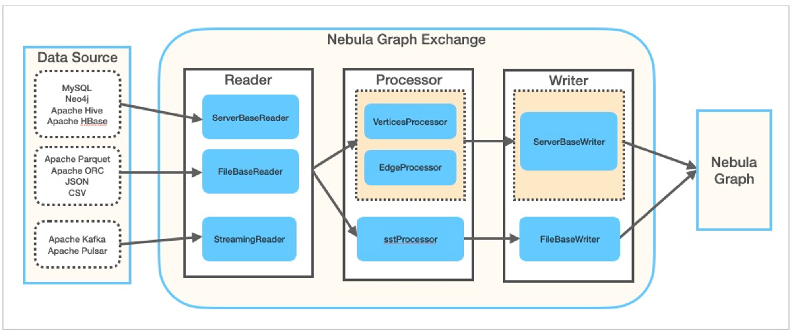

# What is Nebula Exchange

[Nebula Exchange](https://github.com/vesoft-inc/nebula-spark-utils/tree/{{exchange.branch}}/nebula-exchange) (Exchange) is an Apache Spark&trade; application for bulk migration of cluster data to Nebula Graph in a distributed environment, supporting batch and streaming data migration in a variety of formats.

Exchange consists of Reader, Processor, and Writer. After Reader reads data from different sources and returns a DataFrame, the Processor iterates through each row of the DataFrame and obtains the corresponding value based on the mapping between `fields` in the configuration file. After iterating through the number of rows in the specified batch, Writer writes the captured data to the Nebula Graph at once. The following figure illustrates the process by which Exchange completes the data conversion and migration.

## Scenario

Exchange is applicable to the following scenarios:

- Need to streaming data from Kafka, Pulsar platform, such as log files, online data, game players activities, social networking information and financial transactions within the hall or geospatial services, as well as from within the data center of the connected device or instrument into properties such as telemetry data diagram of data vertex or edge, and import the Nebula Graph database.

- Batch data, such as data from a time period, needs to be read from a relational database (such as MySQL) or a distributed file system (such as HDFS), converted into vertex or edge data for a property Graph, and imported into the Nebula Graph database.

- A large volume of data needs to be generated into SST files that Nebula Graph can recognize and then imported into the Nebula Graph database.

## Advantage

Exchange has the following advantages:

- Adaptable: Support for importing data into the Nebula Graph database in a variety of formats or from a variety of sources, making it easy to migrate data.

- SST import: Converts data from different sources into SST files for data import.

- Resumable data import: Resumable data import saves time and improves data import efficiency.

  !!! note

        Breakpoint continuation is currently supported only when Neo4j data is migrated.

- Asynchronous operation: An insert statement is generated in the source data, sent to the Graph service, and then the insert operation is performed.

- Flexibility: support to import multiple Tags and Edge types at the same time. Different tag and Edge type can be different data sources or formats.

- Statistics: Use the accumulator in Apache Spark&trade; to count the number of successful and failed insert operations.

- Easy to use: It adopts the Human-Optimized Config Object Notation (HOCON) configuration file format and has an object-oriented style, which is easy to understand and operate.

## Data source

Exchange {{exchange.release}} supports converting data from the following formats or sources into vertexes and edges that Nebula Graph can recognize, and then importing them into Nebula Graph in the form of **nGQL** statements:

- Data stored in HDFS or locally:
  - [Apache Parquet](../use-exchange/ex-ug-import-from-parquet.md)
  - [Apache ORC](../use-exchange/ex-ug-import-from-orc.md)
  - [JSON](../use-exchange/ex-ug-import-from-json.md)
  - [CSV](../use-exchange/ex-ug-import-from-csv.md)

- [Apache HBase&trade;](../use-exchange/ex-ug-import-from-hbase.md)

- Data repository:

  - [Hive](../use-exchange/ex-ug-import-from-hive.md)
  - [MaxCompute](../use-exchange/ex-ug-import-from-maxcompute.md)

- Graph database: [Neo4j](../use-exchange/ex-ug-import-from-neo4j.md) (Client version 2.4.5-M1)

- Relational database: [MySQL](../use-exchange/ex-ug-import-from-mysql.md)

- Column database: [ClickHouse](../use-exchange/ex-ug-import-from-clickhouse.md)

- Stream processing software platform: [Apache Kafka&reg;](../use-exchange/ex-ug-import-from-kafka.md)

- Publish/Subscribe messaging platform: [Apache Pulsar 2.4.5](../use-exchange/ex-ug-import-from-pulsar.md)

In addition to importing data as nGQL statements, Exchange supports generating **SST** files for data sources and then [importing SST](../use-exchange/ex-ug-import-from-sst.md) files via Console.
