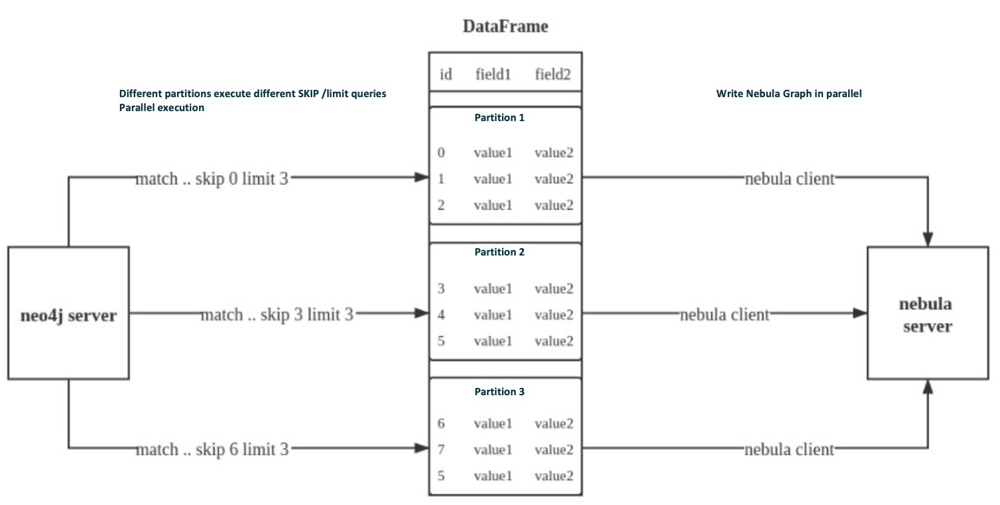

# Import data from Neo4j

This topic provides an example of how to use Exchange to import Nebula Graph data stored in Neo4j.

## Implementation method

Exchange uses **Neo4j Driver 4.0.1** to read Neo4j data. Before batch export, you need to write Cypher statements that are automatically executed based on labels and relationship types and the number of Spark partitions in the configuration file to improve data export performance.

When Exchange reads Neo4j data, it needs to do the following:

1. The Reader in Exchange replaces the statement following the Cypher `RETURN` statement in the `exec` part of the configuration file with `COUNT(*)`, and executes this statement to get the total amount of data, then calculates the starting offset and size of each partition based on the number of Spark partitions.

2. (Optional) If the user has configured the `check_point_path` directory, Reader reads the files in the directory. In the transferring state, Reader calculates the offset and size that each Spark partition should have.

3. In each Spark partition, the Reader in Exchange adds different `SKIP` and `LIMIT` statements to the Cypher statement and calls the Neo4j Driver for parallel execution to distribute data to different Spark partitions.

4. The Reader finally processes the returned data into a DataFrame.

At this point, Exchange has finished exporting the Neo4j data. The data is then written in parallel to the Nebula Graph database.

The whole process is illustrated below.



## Data set

This topic takes the [basketballplayer dataset](https://docs-cdn.nebula-graph.com.cn/dataset/dataset.zip) as an example.

## Environment

This example is done on MacOS. Here is the environment configuration information:

- Hardware specifications:
  - CPU：Intel(R) Xeon(R) CPU E5-2697 v3 @ 2.60GHz

  - CPU cores: 14

  - Memory: 251 GB

- Spark: Stand-alone, 2.4.6 pre-build for Hadoop 2.7

- Neo4j: 3.5.20 Community Edition

- Nebula Graph: {{nebula.release}}. [Deploy Nebula Graph with Docker Compose](../../4.deployment-and-installation/2.compile-and-install-nebula-graph/3.deploy-nebula-graph-with-docker-compose.md).

## Prerequisites

Before importing data, you need to confirm the following information:

- Nebula Graph has been [installed](../../4.deployment-and-installation/2.compile-and-install-nebula-graph/2.install-nebula-graph-by-rpm-or-deb.md) and deployed with the following information:

  - IP addresses and ports of Graph and Meta services.

  - The user name and password with Nebula Graph write permission.

- Exchange has been [compiled](../ex-ug-compile.md), or [download](https://repo1.maven.org/maven2/com/vesoft/nebula-exchange/) the compiled `.jar` file directly.

- Spark has been installed.

- Learn about the Schema created in Nebula Graph, including names and properties of Tags and Edge types, and more.

## Steps

### Step 1: Create the Schema in Nebula Graph

Analyze the data to create a Schema in Nebula Graph by following these steps:

1. Identify the Schema elements. The Schema elements in the Nebula Graph are shown in the following table.

    | Element  | Name | Property |
    | :--- | :--- | :--- |
    | Tag | `player` | `name string, age int` |
    | Tag | `team` | `name string` |
    | Edge Type | `follow` | `degree int` |
    | Edge Type | `serve` | `start_year int, end_year int` |

2. Create a graph space **basketballplayer** in the Nebula Graph and create a Schema as shown below.

    ```ngql
    ## Create a graph space
    nebula> CREATE SPACE basketballplayer \
            (partition_num = 10, \
            replica_factor = 1, \
            vid_type = FIXED_STRING(30));
    
    ## Use the graph space basketballplayer
    nebula> USE basketballplayer;
    
    ## Create the Tag player
    nebula> CREATE TAG player(name string, age int);
    
    ## Create the Tag team
    nebula> CREATE TAG team(name string);
    
    ## Create the Edge type follow
    nebula> CREATE EDGE follow(degree int);

    ## Create the Edge type serve
    nebula> CREATE EDGE serve(start_year int, end_year int);
    ```

For more information, see [Quick start workflow](../../2.quick-start/1.quick-start-workflow.md).

### Step 2: Configuring source data

To speed up the export of Neo4j data, create indexes for the corresponding properties in the Neo4j database. For more information, refer to the [Neo4j manual](https://neo4j.com/docs/cypher-manual/current/query-tuning/indexes/).

### Step 3: Modify configuration files

After Exchange is compiled, copy the conf file `target/classes/application.conf` to set Neo4j data source configuration. In this example, the copied file is called `neo4j_application.conf`. For details on each configuration item, see [Parameters in the configuration file](../parameter-reference/ex-ug-parameter.md).

```conf
{
  # Spark configuration
  spark: {
    app: {
      name: Nebula Exchange {{exchange.release}}
    }

    driver: {
      cores: 1
      maxResultSize: 1G
    }

    executor: {
        memory:1G
    }

    cores:{
      max: 16
    }
  }


  # Nebula Graph configuration
  nebula: {
    address:{
      graph:["127.0.0.1:9669"]
      meta:["127.0.0.1:9559"]
    }
    user: root
    pswd: nebula
    space: basketballplayer

    connection {
      timeout: 3000
      retry: 3
    }

    execution {
      retry: 3
    }

    error: {
      max: 32
      output: /tmp/errors
    }

    rate: {
      limit: 1024
      timeout: 1000
    }
  }

  # Processing vertexes
  tags: [


    # Set the information about the Tag player
    {
      name: player
      type: {
        source: neo4j
        sink: client
      }
      server: "bolt://192.168.*.*:7687"
      user: neo4j
      password:neo4j
      database:neo4j
      exec: "match (n:player) return n.id as id, n.age as age, n.name as name"
      fields: [age,name]
      nebula.fields: [age,name]
      vertex: {
        field:id
      }
      partition: 10
      batch: 1000
      check_point_path: /tmp/test
   }
  # Set the information about the Tag Team
  {
      name: team
      type: {
        source: neo4j
        sink: client
      }
      server: "bolt://192.168.*.*:7687"
      user: neo4j
      password:neo4j
      database:neo4j
      exec: "match (n:team) return n.id as id,n.name as name"
      fields: [name]
      nebula.fields: [name]
      vertex: {
        field:id
      }
      partition: 10
      batch: 1000
      check_point_path: /tmp/test
   }
  ]

  # Processing edges
  edges: [
    # Set the information about the Edge Type follow
    {
      name: follow
      type: {
        source: neo4j
        sink: client
      }
      server: "bolt://192.168.*.*:7687"
      user: neo4j
      password:neo4j
      database:neo4j
      exec: "match (a:player)-[r:follow]->(b:player) return a.id as src, b.id as dst, r.degree as degree  order by id(r)"
      fields: [degree]
      nebula.fields: [degree]
      source: {
        field: src
      }
      target: {
        field: dst
      }
      #ranking: rank
      partition: 10
      batch: 1000
      check_point_path: /tmp/test
    }
   # Set the information about the Edge Type serve
   {
      name: serve
      type: {
        source: neo4j
        sink: client
      }
      server: "bolt://192.168.*.*:7687"
      user: neo4j
      password:neo4j
      database:neo4j
      exec: "match (a:player)-[r:serve]->(b:team) return a.id as src, b.id as dst, r.start_year as start_year, r.end_year as end_year  order by id(r)"
      fields: [start_year,end_year]
      nebula.fields: [start_year,end_year]
      source: {
        field: src
      }
      target: {
        field: dst
      }
      #ranking: rank
      partition: 10
      batch: 1000
      check_point_path: /tmp/test
    }
   ]
}
```

#### Exec configuration

When configuring either the `tags.exec` or `edges.exec` parameters, you need to fill in the Cypher query. To prevent loss of data during import, it is strongly recommended to include `ORDER BY` clause in Cypher queries. Meanwhile, in order to improve data import efficiency, it is better to select indexed properties for ordering. If there is no index, users can also observe the default order and select the appropriate properties for ordering to improve efficiency. If the pattern of the default order cannot be found, users can order them by the ID of the vertex or relationship and set the `partition` to a small value to reduce the ordering pressure of Neo4j.

!!! note

    Using the `ORDER BY` clause lengthens the data import time.

Exchange needs to execute different `SKIP` and `LIMIT` Cypher statements on different Spark partitions, so `SKIP` and `LIMIT` clauses cannot be included in the Cypher statements corresponding to `tags.exec` and `edges.exec`.

#### tags.vertex or edges.vertex configuration

Nebula Graph uses ID as the unique primary key when creating vertexes and edges, overwriting the data in that primary key if it already exists. So, if a Neo4j property value is given as the Nebula Graph'S ID and the value is duplicated in Neo4j, duplicate IDs will be generated. One and only one of their corresponding data will be stored in the Nebula Graph, and the others will be overwritten. Because the data import process is concurrently writing data to Nebula Graph, the final saved data is not guaranteed to be the latest data in Neo4j.

#### check_point_path configuration

If breakpoint transfers are enabled, to avoid data loss, the state of the database should not change between the breakpoint and the transfer. For example, data cannot be added or deleted, and the `partition` quantity configuration should not be changed.

### Step 4: Import data into Nebula Graph

Run the following command to import Neo4j data into Nebula Graph. For a description of the parameters, see [Options for import](../parameter-reference/ex-ug-para-import-command.md).

```bash
${SPARK_HOME}/bin/spark-submit --master "local" --class com.vesoft.nebula.exchange.Exchange <nebula-exchange-{{exchange.release}}.jar_path> -c <neo4j_application.conf_path> 
```

!!! note

    JAR packages are available in two ways: [compiled them yourself](../ex-ug-compile.md), or [download](https://repo1.maven.org/maven2/com/vesoft/nebula-exchange/) the compiled `.jar` file directly.

For example:

```bash
${SPARK_HOME}/bin/spark-submit  --master "local" --class com.vesoft.nebula.exchange.Exchange  /root/nebula-spark-utils/nebula-exchange/target/nebula-exchange-{{exchange.release}}.jar  -c /root/nebula-spark-utils/nebula-exchange/target/classes/neo4j_application.conf
```

You can search for `batchSuccess.<tag_name/edge_name>` in the command output to check the number of successes. For example, `batchSuccess.follow: 300`.

### Step 5: (optional) Validate data

Users can verify that data has been imported by executing a query in the Nebula Graph client (for example, Nebula Graph Studio). For example:

```ngql
GO FROM "player100" OVER follow;
```

Users can also run the [`SHOW STATS`](../../3.ngql-guide/7.general-query-statements/6.show/14.show-stats.md) command to view statistics.

### Step 6: (optional) Rebuild indexes in Nebula Graph

With the data imported, users can recreate and rebuild indexes in Nebula Graph. For details, see [Index overview](../../3.ngql-guide/14.native-index-statements/README.md).
