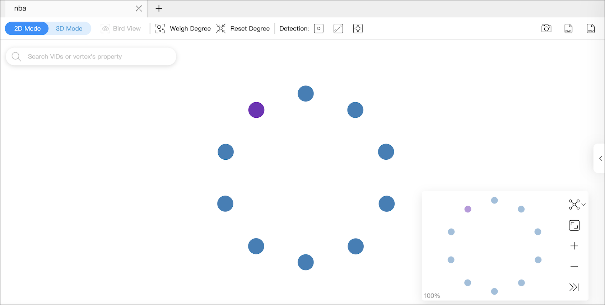
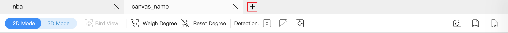
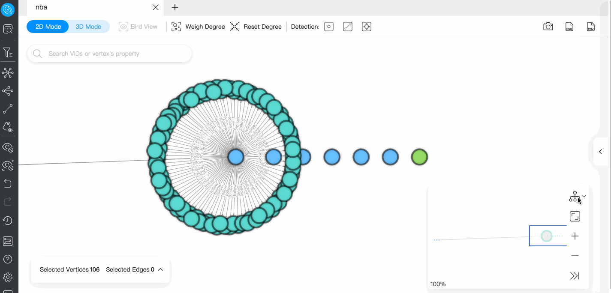
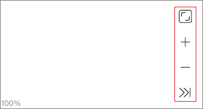
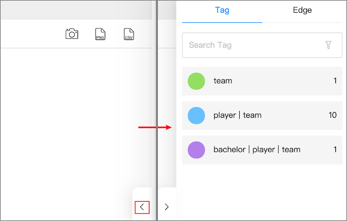
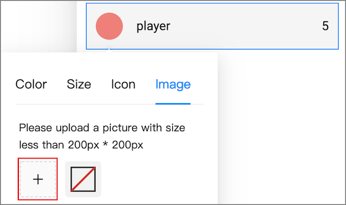

# Canvas overview

You can visually explore data on a canvas. This topic introduces the composition of a canvas and its related functions.

Canvas overview diagram:

## Tabs on the Top

Click the plus sign  to add a new canvas. You can have operations on multiple canvases simultaneously.

- Canvas data on different canvases can come from the same graph space or from different graph spaces.
- You can customize the name of a canvas except for the canvas in the left-most tab.

## Visualization modes

Graph data can be visually explored in **2D mode** and **3D mode**. For more information, [Visualization modes](visualization-mode.md).

## Data storage

Graph data on the current canvas can be stored by creating snapshots or exporting canvas data as images or CSV files.

At the top right of the page, you can:

- Click  to create a snapshot. For more information, see [Canvas snapshots](canvas-snapshot.md).
- Click  to store canvas data as images.
- Click  to store canvas data as CSV files.

## Search box

In the search box at the top left of the page, enter a VID  or the property values of tags to locate target vertices.

## Layouts

Explorer provides 6 layouts to show the relationship between the data on a canvas.

| Force | Dagre | Circular | Grid  | Neural Network | Radial  |
| -------- | ------ | ------ | ----- | -------- | ----- |
|     |   |   |  |     |  |

## Minimap

You can display the vertices on a canvas on full screen. You can also collapse the minimap, zoom in or zoom out the canvass, etc. The percentage of a canvas graph to the total is displayed in the lower-left corner of the minimap.

## Data overview

On the right side of the page, click  to expand the data overview panel.

On the data overview panel, you are enabled to:

- See the number of tags and edge types, and the number of the corresponding vertices and edges on a canvas.  
- Click the tag color icon to customize the color, size, and icon of the vertices with the same tag.

  !!! note
        Vertices with the same tag have the same color. Right-click on a single vertex on a canvas to manually modify the style of the vertex.

- Upload images to personalize the style of the vertices in the canvas, and the uploaded images are stored in the browser. To store uploaded images permanently, save the canvas data as a snapshot. For details, see [Manage snapshots](canvas-snapshot.md).

  