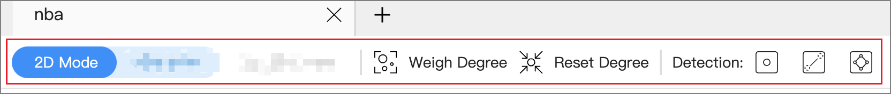
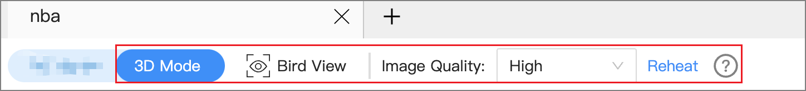

# Visualization modes

Explorer provides **2D** and **3D** visualization modes for you to explore data. 2D enables you to operate on graph data and view data information. 3D lets you explore graph data from a different perspective. The 3D is suitable for cases with a large amount of data or situations requiring presentations.

!!! note
 
    In 3D mode, operations on graph data are unavailable. 

## 2D mode

Exploration of the data on a canvas is possible in 2D mode.

| Parameter       | Description                                                         |
| ---------- | ------------------------------------------------------------ |
| Weight Degree | Automatically resizes vertices according to the number of outgoing and incoming edges of all the vertices on the canvas.      |
| Reset Degree | Resets the vertices on the canvas to their original size.                                   |
| Detection   | Outlier: Detects the vertices that connect no edges on a canvas. Hanging Edges: Detects the vertices with only one undirected edge on a canvas. Loop Detection: Detects the paths that connect a vertex to itself. |

For more information about the operations available in 2D mode, see [Canvas](canvas-overview.md).

## 3D mode

At the top left of the page, toggle the view button to switch to 3D mode. 3D mode allows you to switch back to 2D mode and does not influence operations in 2D.

| Parameter     | Description                                                         |
| -------- | ------------------------------------------------------------ |
| Bird View     | Shows a bird view of all the data in the current graph space (sampled with a minimum of 20,000 vertices and 2,000 edges).                         |
| Image Quality     | High: Vertices are displayed in the form of balls with better light and shadow effects. Normal: Vertices are represented in a circle format and support a large amount of data.  |
| Reheat | Disperses the distance between vertices when the vertices overlap. |

!!! compatibility "Legacy version compatibility"

    For versions of Nebula Graph below 3.0.0, you need to create an index before using the Bird View feature. For more information, see [Create an index](../../3.ngql-guide/14.native-index-statements/1.create-native-index.md).
