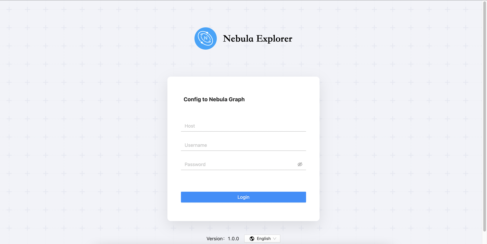

# Deploy Explorer

This topic describes how to deploy Explorer locally by RPM, and tar package.

## RPM-based Explorer

### Prerequisites

Before you deploy Explorer, you must do a check of these:

- The Nebula Graph services are deployed and started. For more information, see [Nebula Graph Database Manual](../../2.quick-start/1.quick-start-workflow.md).

- Before the installation starts, the following ports are not occupied.

   | Port | Description |
   | ---- | ---- |
   | 7002 | Web service provided by Explorer |
   | 8070 | Nebula-http-gateway service |

- The Linux distribution is CentOS, installed `lsof` and [Node.js](https://nodejs.org/en/) of version above v10.16.0+.

### Install

1. Select and download the RPM package according to your needs. It is recommended to select the latest version. Common links are as follows:

  !!! enterpriseonly

        Explorer is only available in the enterprise version. Click [Pricing](https://nebula-graph.io/pricing/) to see more.

2. Use `sudo rpm -i <rpm>` to install RPM package.

   For example, install Explorer, use the following command:
   ```bash
   $ sudo rpm -i nebula-graph-explorer-<version>.x86_64.rpm
   ```
### Uninstall

Users can uninstall Explorer using the following command:

```bash
$ sudo rpm -e nebula-graph-explorer-<version>.x86_64
```

### Exception handling

If the automatic start fails during the installation process or you want to manually start or stop the service, use the following command:

- Start the service manually.

   ```bash
   $ sudo sh ./scripts/start.sh
   ```

- Stop the service manually

   ```bash
   $ sudo sh ./scripts/stop.sh
   ```

## tar-based Explorer

### Prerequisites

Before you deploy Explorer, you must do a check of these:

- The Nebula Graph services are deployed and started. For more information, see [Nebula Graph Database Manual](../../2.quick-start/1.quick-start-workflow.md).

- Before the installation starts, the following ports are not occupied.

   | Port | Description |
   | ---- | ---- |
   | 7002 | Web service provided by Explorer |
   | 8070 | Nebula-http-gateway service |

- The Linux distribution is CentOS, installed `lsof` and [Node.js](https://nodejs.org/en/) of version above v10.16.0+.

### Install

1. Select and download the tar package according to your needs. It is recommended to select the latest version. Common links are as follows:

  !!! enterpriseonly

        Explorer is only available in the enterprise version. Click [Pricing](https://nebula-graph.io/pricing/) to see more.

2. Use `tar -xvf` to decompress the tar package.

   ```bash
   tar -xvf nebula-graph-explorer-<version>.tar.gz
   ```

### Procedure

!!! Note

    The root directory `nebula-graph-explorer` has two installation packages: nebula-graph-explorer and nebula-http-gateway. You need to deploy and start the services separately on the same machine to complete the deployment of Explorer.'

1. Deploy and start nebula-http-gateway.

   ```bash
   $ cd nebula-http-gateway
   $ nohup ./nebula-httpd &
   ```

2. Deploy and start nebula-graph-explorer.

   ```bash
   $ cd nebula-graph-explorer
   $ npm run start
   ```

### Stop Service

You can use `kill pid` to stop the service:
```bash
$ kill $(lsof -t -i :8070) # stop nebula-http-gateway
$ cd nebula-graph-explorer
$ npm run stop # stop nebula-graph-explorer
```

## Next to do

When Explorer is started, use `http://ip address:7002` to get access to Explorer.

Seeing the following login interface, Explorer is successfully connected to Nebula Graph.



After entering the Explorer login interface, you need to connect to Nebula Graph. For more information, refer to [Connecting to the Nebula Graph](../deploy-connect/ex-ug-connect.md).
