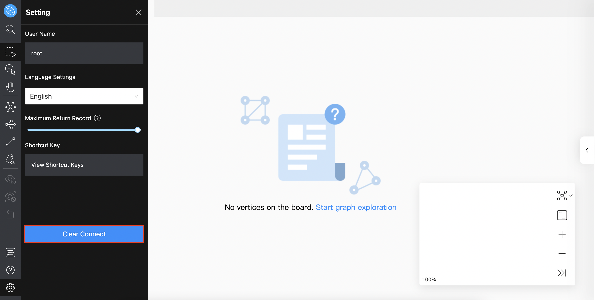

# Reset connection

When Explorer is still connected to a Nebula Graph database, in the toolbar, select Settings  > clear connect, as shown in the below:

After that, if the **configuration database** page is displayed on the browser, it means that Explorer has successfully disconnected from the Nebula Graph.