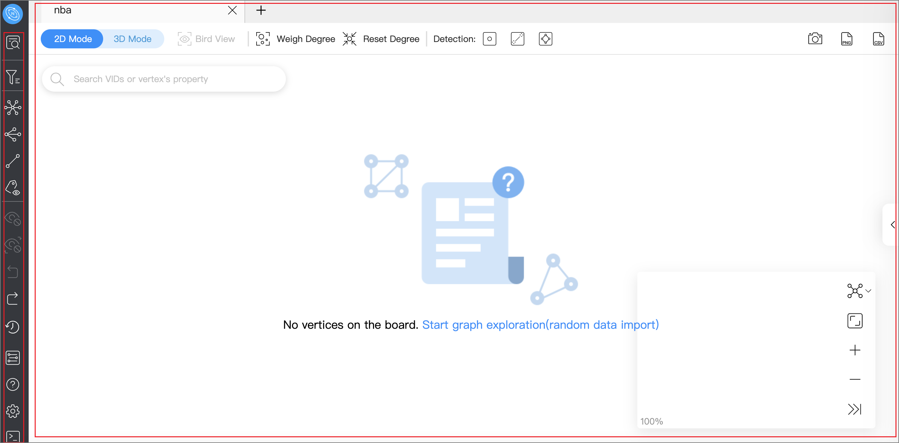
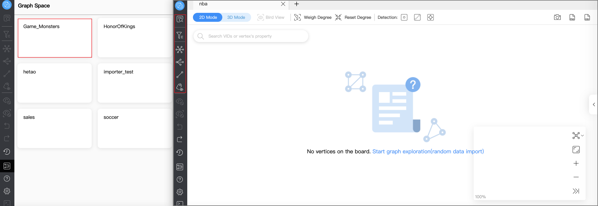

# Page overview

This topic introduces the Explorer page to help you learn more about Explorer's functions.

The Explorer page consists of two modules navigation bar and canvas. 

!!! note

    After logging into Explorer, select a graph space and click on it to unlock query and exploration functions in the left-side navigation bar. 
    

## Navigation bar

Click the icons in the left-side navigation bar to import, analyze, and explore graph data. The descriptions of the icons are as follows:

| Icon  | Description |
| ----- | ---- |
|  | Enter VIDs or tags to query data. For more information, see [Ways to query data](ex-ug-query-exploration.md).     |
|  | Search for target vertexes displayed on the canvas. For more information, see [Filter vertices](node-filtering.md).     |
|  | Perform explorations on the vertices on the canvas by setting edge directions, steps, and filtering conditions.    |
|  | Select at least two vertices on the canvas to search for their common neighbors.     |
|  | Find all paths, the shortest path, and the non-loop paths from the source to the destination vertex.     |
|  | Choose whether to display the properties of vertices or edges on the canvas.     |
|  | Hide the selected vertices and edges on the canvas.     |
|  | Hide the unselected vertices and edges on the canvas.     |
|  | Undo the action in the previous step.     |
|  | Restores the action that was previously undone.     |
|  | View historical snapshots. For more information, see [Canvas snapshots](canvas-operations/canvas-snapshot.md).     |
|  | View all graph spaces. Click a graph space to create a canvas corresponding to it.     |
|  | View Explorer documents and NebulaGraph forum.     |
|  | View your account and shortcuts, edit languages, limit returned results, and clear connection.|
|  | Query data by entering nGQL statements. Querying results are imported on canvas. For more information, see [Explorer console](explorer-console.md).   |

## Canvas

Graph data can be displayed visually on a canvas. The canvas consists of the following parts:

- Tabs on the Top
- Visualization modes
- Data storage
- Search box
- Layouts
- Minimap
- Data overview

For more information, see [Canvas overview](canvas-operations/canvas-overview.md).