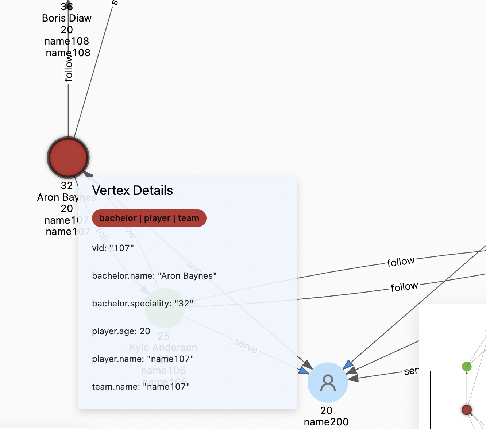
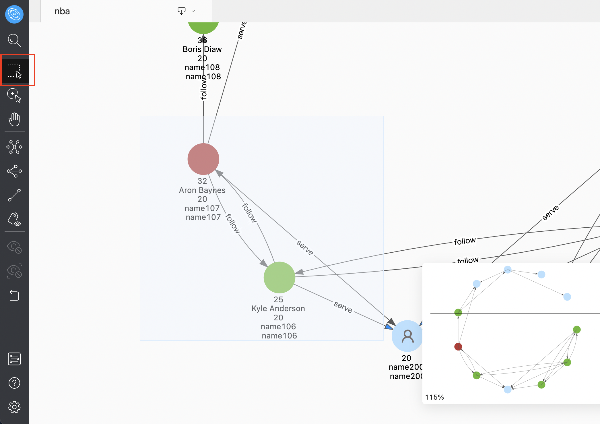
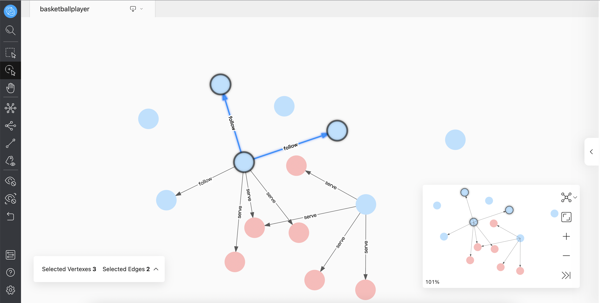
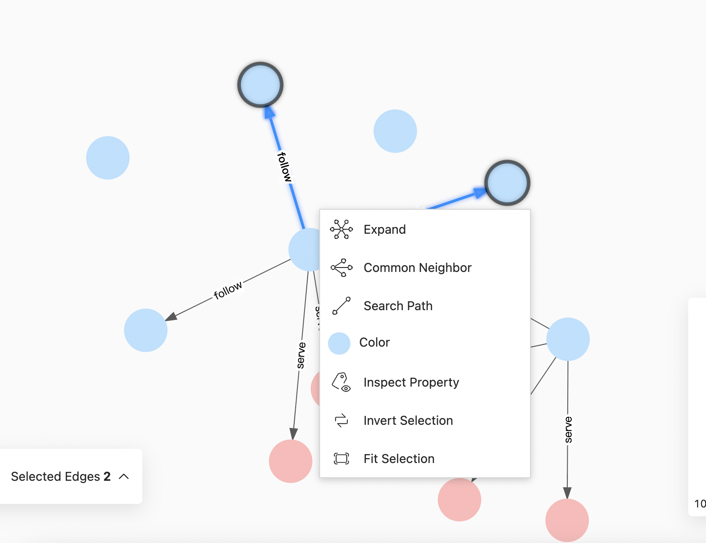

# Canvas operation

This topic describes operation in canvas.

## Display vertexes and edges

Move the mouse to the vertex or edge to view in detail. The following shows the detailed information of the vertex with `VID 107`:

## Batch selection

Explorer supports batch selection and views the data of multiple vertexes and edges. The detailed data can be opened and viewed in the vertexes and edges overview at the lower-left corner of the canvas. It also supports exporting CSV files of selected vertexes or edges.

### Frame selection

After clicking the  icon, hold down the left button to drag and select multiple vertexes and edges. Examples are as follows:

### Click to select multiple vertexes and edges

Click the  icon or hold down Shift, click and select multiple vertexes and edges with the mouse, and click the blank space to cancel the selection. Examples are as follows:

## Quick operation

You can select one or more vertexes and edges, and right-click in the blank area to expand the vertexes, search the path between two vertexes, and show or hide their property on the canvas. The number of vertexes and edges you choose will affect the operations that can be performed. For more information, see [Graph Exploration Expansion](../operation-guide/ex-ug-graph-exploration.md).

Click **Fit Selection** to move the selected data to the center of the canvas for users to view.