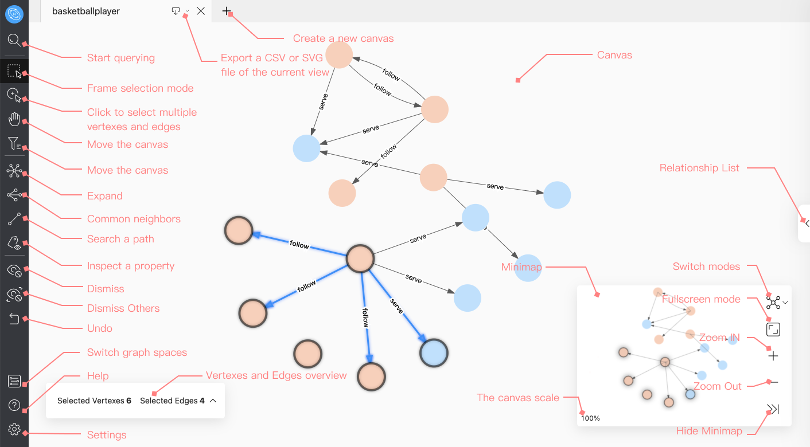
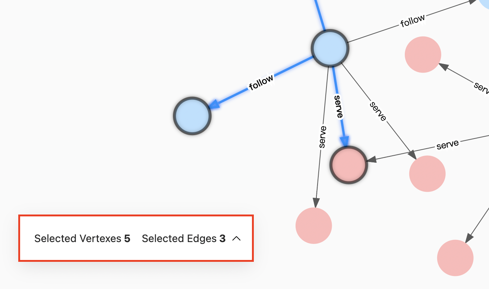

# Page Overview

This topic describes Explorer main page.

## Overview

The main page of Explorer is divided into five parts:

- Tab bar
- Sidebar
- Canvas
- Minimap
- Relationship list

## Tab bar

- Export: Export a CSV or PNG file of the current view.

- Create: Support creating multiple canvases. Only up to 10 canvases can be opened.

## Sidebar

The sidebar consists of five parts. You can click the buttons to explore the graph, modify the content of the vertexes on the canvas, etc.

- Start query: Before exploring, the user needs to query the vertexes and display them in the canvas.

- Canvas operation: Including frame selection of vertexes in the canvas, dragging the canvas, and selecting multiple vertexes and edges.

- Graph exploration and expansion: Including functions such as vertexes expansion, finding common neighbors of multiple vertexes, finding the path of two vertexes, and inspecting the property.

- Hide and undo: Hide the data displayed in the canvas and undo the previous operation.

- Settings and help: Switch graph space, find help, modify settings, etc.

### Start query

- Start: Click the  icon to query the data and display it on the page through VID, Tag and sub-graph.

### Canvas operation

- Frame selection mode: Click the  icon to support frame selection of vertexes and edges in the canvas.
- Click to select multiple vertexes and edges: Click the  icon, you can easily click the vertexes and edges in the canvas, and click the blank space to cancel the selection.
- Move the canvas: Click the  icon to drag the position of the canvas.
- Vertex Filter: Click the  icon to filter the vertexes displayed on the canvas.

For more information, see [Canvas Operation](../operation-guide/ex-ug-canvas.md).

### Graph exploration and expansion

- Expand: Click the  icon, select the vertexes on the page and perform custom expansion, including direction, steps, filter conditions, etc.
- Common neighbor: Click the  icon, select at least two vertexes on the page and view their common neighbors.
- Search path: Click the  icon to query the path of `all paths`, `Shortest path` or `Noloop path` between the start vertex and the end vertex.
- Inspect property: Click the  icon to choose whether to display the property values of vertexes or edges in the canvas.

For more information, see [Graph exploration and expansion](../operation-guide/ex-ug-graph-exploration.md).

### Hide and undo

- Dismiss: Click the  icon to hide the selected vertexes and edges in the canvas.
- Dismiss others: Click the  icon to hide all unselected vertexes and edges in the canvas.
- Undo: Click the  icon to undo the operation in the previous step.

### Settings and help

- Switch graph space: Click the  icon to switch the current graph space.
- Help: Click the  icon to see more information.
- Setting: Click the  icon to view usernames and shortcut keys, modify language settings, clear Explorer connect, etc.

## Canvas

The canvas is mainly divided into:

- Canvas: Display the data queried by VID, Tag or subgraph.

- Vertexes and Edges overview: It is hidden by default and only displayed when the vertex and edge are selected on the current canvas. Click on the icon in the following, and the user can open the menu to view the detailed data of the selected vertexes and edges in the current canvas.

  

For more information, see [canvas operation](../operation-guide/ex-ug-canvas.md).

## Minimap

You can use the button on the minimap to switch the graph mode, display the vertexes in the canvas in full screen, collapse the minimap, zoom in or zoom out the canvass, etc. At the same time, the percentage of the graph in the canvas to the total graph is displayed in the lower-left corner of the minimap.

- Switch mode: You can switch the display mode of the graph in the canvas.
  
  | icon |  |  |  | 
  | ---- | ---- |----| ----|
  | mode | force | dagre | circular |

## Relationship list

Click the  icon on the right, you can open the menu, view the number of tags and edges in the canvas, search for tags and edges, and also support modifying the color and icon of the vertex.
