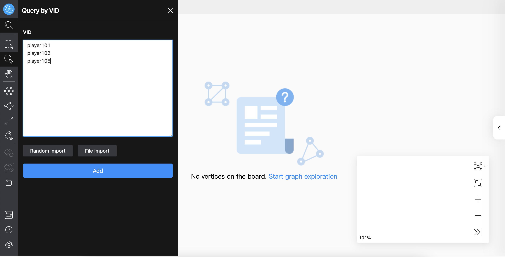
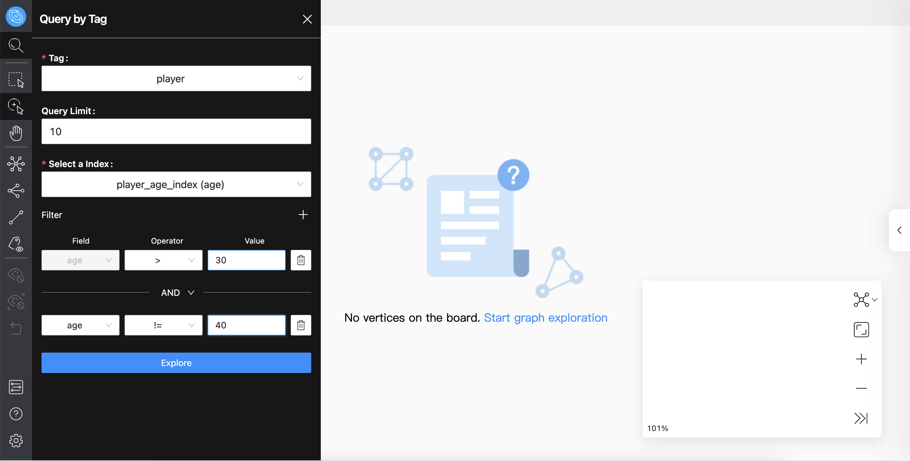
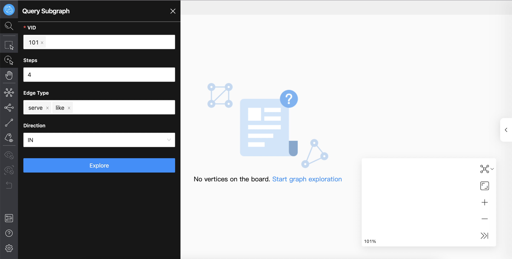

# Start query

In Explorer, you can choose the following query methods to display data:

- VID
- Tag
- Subgraph

## Query by VID

You can query data by entering the VIDs or other data for VID generation, and a row only supports one data. It also supports random import of data and file import of data. After confirming the addition, the data will be displayed in the canvas. An example is given below:

## Query by Tag

The required values are Tag and Index. You can limit the number of output results and filter the results. The following query 10 players whose age is greater than 30 years old and not equal to 40 years old, examples are as follows:

## Query by Subgraph

The required value is VID. You can view the subgraph of one or more vertexes, and you can specify the number of steps, edge types, and the direction of inflow and outflow of the subgraph. The following is an example of an incoming edge with a VID value of 101, the number of steps of 4, and edge types of `server` and `like`:

