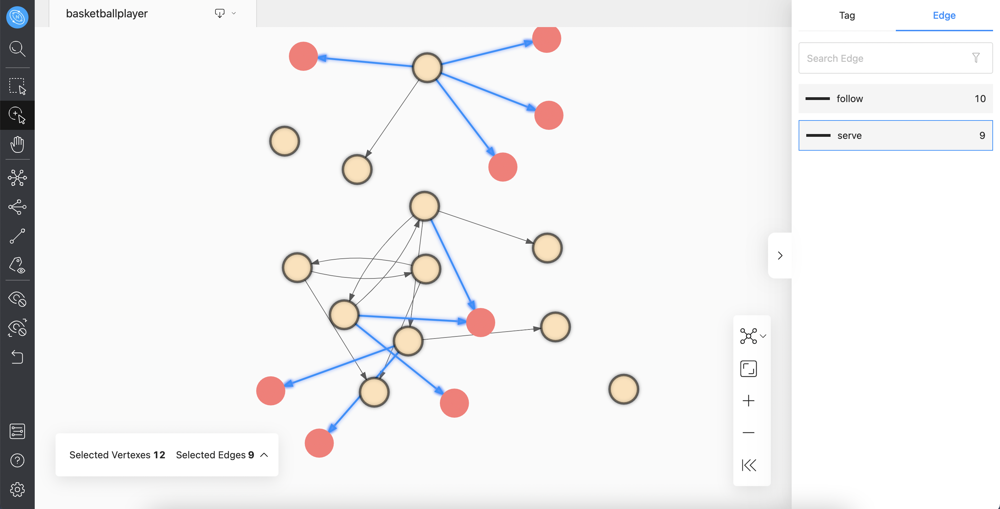
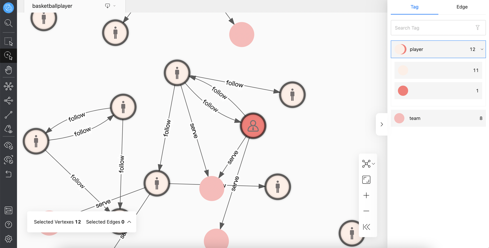

# Relationship list

You can select vertexes and edges in the relationship list. Select 12 points where Tag is `player`, and select 9 edges where Edge is `serve`. An example is as follows:

At the same time, you can modify the color and icon of the Tag to make the key nodes more prominent.

By default, VID with identical tags have the same color, and it is also allowed to manually modify the color of a vertex or a group of vertexes with identical tags. For example, if the vertex label is `player`, modify the color of one of the vertexes, and you can click to view it in the relationship list. The example is as follows:

