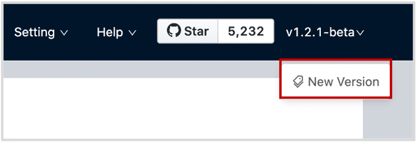

# Check updates

Studio v2.x is in development. To get updated with its development, visit GitHub and read its [Changelog](https://github.com/vesoft-inc/nebula-web-docker/blob/master/docs/CHANGELOG-en.md "Click to go to GitHub").

For Docker-based Studio v2.x, when you get access to Studio, on the upper-right corner of the page, click the version number and then `New version`, and you will be directed to the Changelog.



When new version is released, under the `nebula-web-docker` directory, run these commands one by one to update the Docker image and start the services:

```bash
$ git pull origin master
$ cd v2
$ docker-compose pull && docker-compose up -d
```
