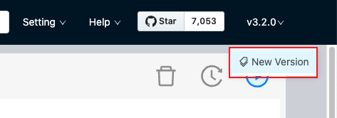

# Check updates

Studio is in development. To get updated with its development, visit GitHub and read its [Changelog](https://github.com/vesoft-inc/nebula-web-docker/blob/master/docs/CHANGELOG-en.md "Click to go to GitHub").

## Studio on Cloud

Studio on Cloud is deployed automatically when you create a Nebula Graph instance on Nebula Graph Cloud Service. You cannot update its version. During the public beta, v1.1.1-beta is deployed.

## Docker-based and RPM-based 

For Docker-based and RPM-based Studio, we recommend that you run this command in the nebula-web-docker directory to update the Docker image and start the service:

``` bash
docker-compose pull && docker-compose up -d
```

To view the changelog, on the upper-right corner of the page, click the version and then `New version`.

