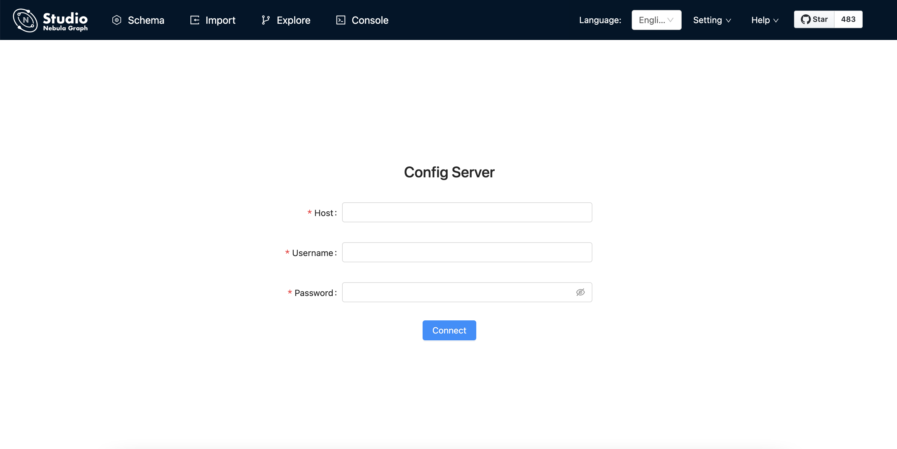

# Deploy Studio
<!--
Studio on Cloud can be used on Nebula Graph Cloud Service. When you create a Nebula Graph instance on Nebula Graph Cloud Service, Studio on Cloud is deployed automatically. For more information, see [Nebula Graph Cloud Service User Guide](https://cloud-docs.nebula-graph.com.cn/en/posts/manage-instances/dbaas-ug-connect-nebulastudio/). For Docker-based and PRM-based Studio, you must deploy it. This article introduces how to deploy Docker-based and RPM-based Studio.
-->

This topic describes how to deploy Studio locally by Docker, RPM, and tar package.

!!! Note

    You can also try some functions online in [Studio](https://playground.nebula-graph.io/explorer).
## Docker-based Studio

### Prerequisites

Before you deploy Studio, you must do a check of these:

- The Nebula Graph services are deployed and started. For more information, see [Nebula Graph Database Manual](../../2.quick-start/1.quick-start-workflow.md).

- On the machine where Studio will run, Docker Compose is installed and started. For more information, see [Docker Compose Documentation](https://docs.docker.com/compose/install/ "Click to go to Docker Documentation").

- Before the installation starts, the following ports are not occupied.

   | Port | Description |
   | ---- | ---- |
   | 7001 | Web service provided by Studio |
   | 8080 | Nebula-http-gateway, Client's HTTP service |
   | 5699 | Nebula importer file import tool, provide data import service |


### Procedure

To deploy and start Docker-based Studio, run the following commands. Here we use Nebula Graph v{{nebula.release}} for demonstration:

1. Download the configuration files for the deployment.
   
   | Installation package | Nebula Graph version |
   | ----- | ----- |
   | [nebula-graph-studio-v3.tar.gz](https://oss-cdn.nebula-graph.io/nebula-graph-studio/nebula-graph-studio-v3.tar.gz) | v{{nebula.release}} |

2. Create the `nebula-graph-studio-v3` directory and decompress the installation package to the directory.

    ```bash
    mkdir nebula-graph-studio-v3 && tar -zxvf nebula-graph-studio-v3.gz -C nebula-graph-studio-v3
    ```

3. Change to the `nebula-graph-studio-v3` directory.
   ```bash
   cd nebula-graph-studio-v3
   ```

4. Pull the Docker image of Studio.

    ```bash
    docker-compose pull
    ```

5. Build and start Docker-based Studio. In this command, `-d` is to run the containers in the background.

   ```bash
   docker-compose up -d
   ```

    If these lines are returned, Docker-based Studio v3.x is deployed and started.

    ```bash
    Creating docker_importer_1 ... done
    Creating docker_client_1   ... done
    Creating docker_web_1      ... done
    Creating docker_nginx_1    ... done
    ```

6. When Docker-based Studio is started, use `http://ip address:7001` to get access to Studio.
  
  !!! note

        Run `ifconfig` or `ipconfig` to get the IP address of the machine where Docker-based Studio is running. On the machine running Docker-based Studio, you can use `http://localhost:7001` to get access to Studio.

   If you can see the **Config Server** page on the browser, Docker-based Studio is started successfully.

   

## RPM-based Studio

### Prerequisites

Before you deploy Docker-based Studio, you must confirm that:

- The Nebula Graph services are deployed and started. For more information, see [Nebula Graph Database Manual](../../2.quick-start/1.quick-start-workflow.md).

- If your Linux distribution is CentOS, install `lsof` and [Node.js](https://nodejs.org/en/) of versions above v10.16.0+.
  
  !!! note

        `node` and `npm` should be installed in `/usr/bin/` directory. Avoid the situation that the node command cannot be found during RPM installation.
        For example, the default directory of nodejs12 is in `/opt/rh/rh-nodejs12`, you can use following commands to build soft link:

        ```bash
        $ sudo ln -s /opt/rh/rh-nodejs12/root/usr/bin/node /usr/bin/node
        $ sudo ln -s /opt/rh/rh-nodejs12/root/usr/bin/npm /usr/bin/npm
        ```

- Before the installation starts, the following ports are not occupied.

   | Port | Description |
   | ---- | ---- |
   | 7001 | Web service provided by Studio. |
   | 8080 | HTTP service provided by Nebula HTTP Gateway. |
   | 5699 | Data import service provided by Nebula Importer. |

### Install

1. Select and download the RPM package according to your needs. It is recommended to select the latest version. Common links are as follows:

   | Installation package | Checksum | Nebula version |
   | ----- | ----- | ----- |
   | [nebula-graph-studio-3.0.0-1.x86_64.rpm](https://oss-cdn.nebula-graph.io/nebula-graph-studio/3.0.0/nebula-graph-studio-3.0.0-1.x86_64.rpm) |  [nebula-graph-studio-3.0.0-1.x86_64.rpm.sha256](https://oss-cdn.nebula-graph.io/nebula-graph-studio/3.0.0/nebula-graph-studio-3.0.0-1.x86_64.rpm.sha256) | v{{nebula.release}} |


2. Use `sudo rpm -i <rpm>` to install RPM package.
   
   For example, install Studio 3.0.0, use the following command:
   ```bash
   sudo rpm -i nebula-graph-studio-3.0.0-1.x86_64.rpm
   ```

   When the screen returns the following message, it means that the PRM-based Studio has been successfully started.

   ```bash
   egg started on http://0.0.0.0:7001
   nohup: Add the output to "nohup.out"
   --- START OF NEBULA IMPORTER ---
   [INFO] httpserver.go:80: Starting http server on 5699
   ```

3. When Docker-based Studio is started, use `http://ip address:7001` to get access to Studio.

  !!! note

        Run `ifconfig` or `ipconfig` to get the IP address of the machine where Docker-based Studio is running. On the machine running Docker-based Studio, you can use `http://localhost:7001` to get access to Studio.

   If you can see the **Config Server** page on the browser, Docker-based Studio is started successfully.

   

### Uninstall

Users can uninstall Studio using the following command:

```bash
sudo rpm -e nebula-graph-studio-3.0.0-1.x86_64
```

### Exception handling

If the automatic start fails during the installation process or you want to manually start or stop the service, use the following command:

- Start the service manually
```bash
bash /usr/local/nebula-graph-studio/scripts/start.sh
```

- Stop the service manually
```bash
bash /usr/local/nebula-graph-studio/scripts/stop.sh
```

If you encounter an error `bind EADDRINUSE 0.0.0.0:7001` when starting the service, you can use the following command to check port 7001 usage.
```bash
lsof -i:7001
```

If the port is occupied and the process on that port cannot be terminated, you can use the following command to change Studio service port and restart the service.

```bash
 //Open the configuration file
 $ vi config/config.default.js

 //Change the port number
 ...
     config.cluster = {
         listen: {
             port: 7001, // Modify this port number and change it to any one currently available
             hostname: '0.0.0.0',
         },
     };
 ...

 //Restart npm
 $ npm run start
```

## tar-based Studio

### Prerequisites

Before you deploy Docker-based Studio , you must do a check of these:

- The Nebula Graph services are deployed and started. For more information, see [Nebula Graph Database Manual](../../2.quick-start/1.quick-start-workflow.md).

- The Linux distribution is CentOS, installed `lsof` and [Node.js](https://nodejs.org/en/) of version above v10.16.0+.
  
  !!! note

        `node` and `npm` should be installed in `/usr/bin/` directory. Avoid the situation that the node command cannot be found during RPM installation.
        For example, the default directory of nodejs12 is in `/opt/rh/rh-nodejs12`, you can use following commands to build soft link:

   ```bash
   $ sudo ln -s /opt/rh/rh-nodejs12/root/usr/bin/node /usr/bin/node
   $ sudo ln -s /opt/rh/rh-nodejs12/root/usr/bin/npm /usr/bin/npm
   ```

- Before the installation starts, the following ports are not occupied.

   | Port | Description |
   | ---- | ---- |
   | 7001 | Web service provided by Studio |
   | 8080 | Nebula-http-gateway, Client's HTTP service |
   | 5699 | Nebula importer, provide data import service |

### Install

1. Select and download the tar package according to your needs. It is recommended to select the latest version. Common links are as follows:

   | Installation package | Studio version |
   | --- | --- |
   | [nebula-graph-studio-3.0.0-1.x86_64.tar.gz](https://oss-cdn.nebula-graph.io/nebula-graph-studio/3.0.0/nebula-graph-studio-3.0.0-1.x86_64.tar.gz) | 3.0.0 |

2. Use `tar -xvf` to decompress the tar package.

   ```bash
   tar -xvf nebula-graph-studio-3.0.0-1.x86_64.tar.gz
   ```

### Procedure
 
!!! Note

    The root directory `nebula-graph-studio` has three installation packages: nebula-graph-studio, nebula-importer and nebula-http-gateway. You need to deploy and start the services separately on the same machine to complete the deployment of Studio.

1. Deploy and start nebula-importer.

   ```bash
   $ cd nebula-importer
   $ ./nebula-importer --port 5699 --callback "http://0.0.0.0:7001/api/import/finish" &
   ```

2. Deploy and start nebula-http-gateway.

   ```bash
   $ cd nebula-http-gateway
   $ nohup ./nebula-httpd &
   ```

3. Deploy and start nebula-graph-studio.
   
   ```bash
   $ cd nebula-graph-studio
   $ npm run start
   ```

4. When tar-based Studio is started, use `http://ip address:7001` to get access to Studio.

  !!! note

        Run `ifconfig` or `ipconfig` to get the IP address of the machine where Docker-based Studio is running. On the machine running Docker-based Studio, you can use `http://localhost:7001` to get access to Studio.

   If you can see the **Config Server** page on the browser, Docker-based Studio is started successfully.

   

### Stop Service

You can use `kill pid` to stop the service:
```bash
$ kill $(lsof -t -i :5699) # stop nebula-importer
$ kill $(lsof -t -i :8080) # stop nebula-http-gateway
$ cd nebula-graph-studio
$ npm run stop # stop nebula-graph-studio
```

## Next to do

On the **Config Server** page, connect Docker-based Studio to Nebula Graph. For more information, see [Connect to Nebula Graph](st-ug-connect.md).
