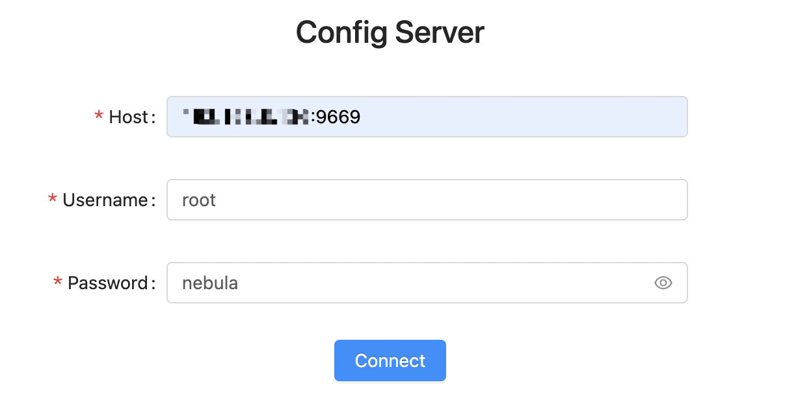
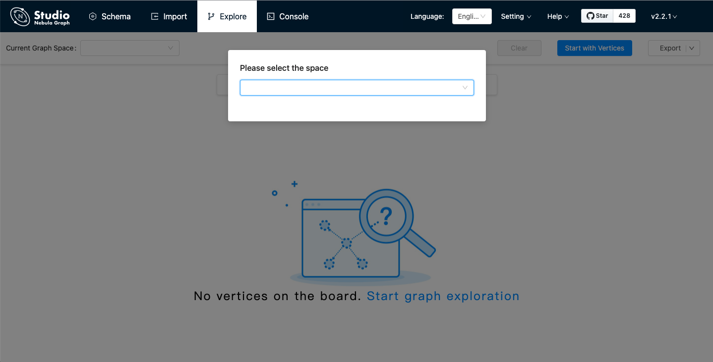

# Connect to Nebula Graph

On Nebula Graph Cloud Service, you can connect to Studio with one click. For more information, see [Connect to Nebula Graph Studio](https://cloud-docs.nebula-graph.com.cn/en/posts/manage-instances/dbaas-ug-connect-nebulastudio/). For Docker-based and RPM-based Studio v2.x, when it is started, you must configure it to connect to Nebula Graph v2.x. This article introduces how to connect Docker-based and PRM-based Studio v2.x to Nebula Graph v2.x.

## Prerequisites

Before you connect Docker-based or RPM-based Studio v2.x to Nebula Graph v2.x, you must do a check of these:

- The Nebula Graph v2.x services and Studio v2.x are started. For more information, see [Deploy Studio](st-ug-deploy.md).

- You have the IP address and the port used by the Graph service of Nebula Graph v2.x. The default port is `9669`.  
  !!! note

        Run `ifconfig` or `ipconfig` on the machine to get the IP address.

- You have a Nebula Graph account and its password.

  !!! note

        If authentication is enabled in Nebula Graph and different role-based accounts are created, you must use the assigned account to connect to Nebula Graph. If authentication is disabled, you can use the default username (user) and the default password (password) to connect to Nebula Graph. For more information, see [Nebula Graph Database Manual](https://docs.nebula-graph.io/2.0.1/).

## Procedure

To connect Docker-based and RPM-based Studio to Nebula Graph, follow these steps:

1. On the **Config Server** page of Studio, configure these fields:

    - **Host**: Enter the IP address and the port of the Graph service of Nebula Graph. The valid format is `IP:port`. The default port is `9669`.  

    !!! note

          When Nebula Graph and Studio are deployed on the same machine, you must enter the IP address of the machine, but not `127.0.0.1` or `localhost`, in the **Host** field.

   - **Username** and **Password**: Fill in the log in account according to the authentication settings of Nebula Graph
      - If authentication is not enabled, you can use `user` and `password` as the username and its password.
      - If authentication is enabled and no account information has been created, you can only log in as GOD role and use `root` and `nebula` as the username and its password.
      - If authentication is enabled and different users are created and assigned roles, users in different roles log in with their accounts and passwords.

   

2. After the configuration, click the **Connect** button.

   If you can see the **Console** page, Docker-based and RPM-based Studio is successfully connected to Nebula Graph.

   

One session continues for up to 30 minutes. If you do not operate Studio within 30 minutes, the active session will time out and you must connect to Nebula Graph again.

## Next to do

When Studio is successfully connected to Nebula Graph, you can do these operations:

- If your account has GOD or ADMIN privilege, you can create a schema on the **[Console](../quick-start/st-ug-create-schema.md)** page or on the **[Schema](../manage-schema/st-ug-crud-space.md)** page.

- If your account has GOD, ADMIN, DBA, or USER privilege, you can batch import data on the **[Import](../quick-start/st-ug-import-data.md)** page or insert data with nGQL statements on the **Console** page.

- If your account has GOD, ADMIN, DBA, USER, or GUEST privilege, you can retrieve data with nGQL statements on the **Console** page or explore and analyze data on the **Explore** page.
