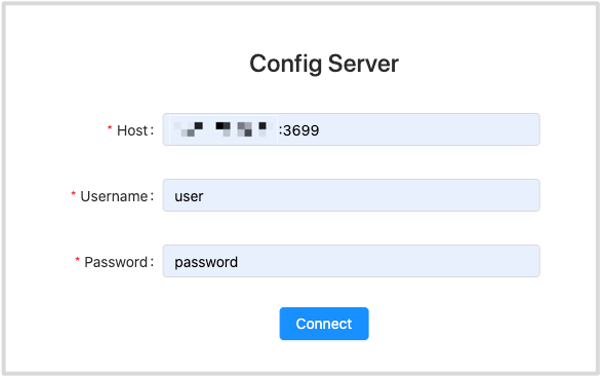
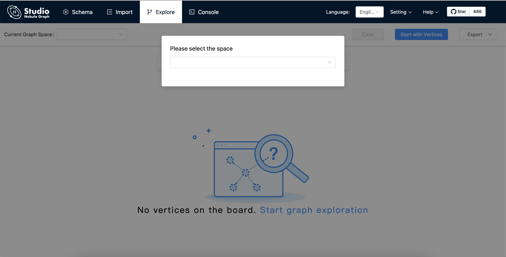

# Connect to NebulaGraph

For Docker-based Studio v2.x, when it is started, you must configure it to connect to NebulaGraph v2.x. This article introduces how to connect Docker-based Studio v2.x to NebulaGraph v2.x.

## Prerequisites

Before you connect Docker-based Studio v2.x to NebulaGraph v2.x, you must do a check of these:

- The NebulaGraph v2.x services and Studio v2.x are started. For more information, see [Deploy Studio](st-ug-deploy.md).

- You have the IP address and the port used by the Graph service of NebulaGraph v2.x. The default port is `9669`.  
  > **NOTE**: Run `ifconfig` or `ipconfig` on the machine to get the IP address.

## Procedure

To connect Docker-based Studio to NebulaGraph, follow these steps:

1. On the **Config Server** page of Studio, configure these fields:
   - **Host**: Enter the IP address and the port of the Graph service of NebulaGraph. The valid format is `IP:port`. The default port is `9669`.  
     > **NOTE**: When NebulaGraph and Studio are deployed on the same machine, you must enter the IP address of the machine, but not `127.0.0.1` or `localhost`, in the **Host** field.
   - **Username** and **Password**: You can use `user` and `password` as the username and its password.

   

2. After the configuration, click the **Connect** button.  
   If you can see the **Console** page, Docker-based Studio is successfully connected to NebulaGraph.

   

One session continues up to 30 minutes. If you do not operate Studio within 30 minutes, the active session will time out and you must connect to NebulaGraph again.

## Next to do

When Studio v2.x is successfully connected to NebulaGraph v2.x, you can learn [nGQL v2.x](https://docs.nebula-graph.io/2.0/2.quick-start/4.nebula-graph-crud/) on the **Console** page or explore and analyze data on the **Explore** page.
