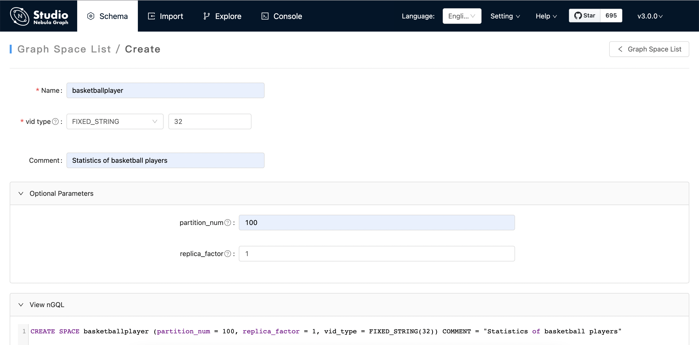
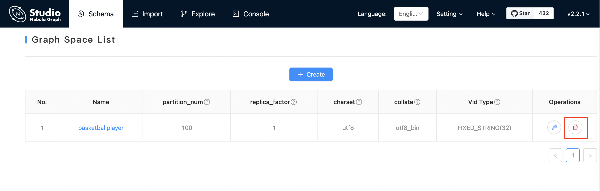

# Operate graph spaces

When Studio is connected to Nebula Graph, you can create or delete a graph space. You can use the **Console** page or the **Schema** page to do these operations. This article only introduces how to use the **Schema** page to operate graph spaces in Nebula Graph.

## Studio version

Studio of v{{ studio.release }} or later versions supports this function. For more information, see [check updates](../about-studio/st-ug-check-updates.md).

## Prerequisites

To operate a graph space on the **Schema** page of Studio, you must do a check of these:

- Studio is connected to Nebula Graph.
- Your account has the authority of GOD. It means that:
  - If the authentication is enabled in Nebula Graph, you can use `root` and any password to sign in to Studio.
  - If the authentication is disabled in Nebula Graph, you must use `root` and its password to sign in to Studio.

## Create a graph space

To create a graph space on the **Schema** page, follow these steps:

1. In the toolbar, click the **Schema** tab.
2. On the **Graph Space List** page, click the **+ Create** button.
3. On the **Create** page, do these settings:

  - **Name**: Specify a name to the new graph space. In this example, `basketballplayer` is used. The name must be distinct in the database. The name cannot be used keywords or reserved keywords as identifiers. For more information, see [keywords](../../3.ngql-guide/1.nGQL-overview/keywords-and-reserved-words.md).

  - **Vid type**: The data types of VIDs are restricted to `FIXED_STRING(<N>)` or `INT64`. A graph space can only select one VID type. In this example, `FIXED_STRING(32)` is used. For more information, see [VID](../../1.introduction/3.vid.md).

  - **Comment**: The remarks of a certain property or the space itself. The maximum length is 256 bytes. By default, there will be no comments on a space. But in this example, `Statistics of basketball players` is used.

  - **Optional Parameters**: Set the values of `partition_num` and `replica_factor` respectively. In this example, these parameters are set to `100` and `1` respectively. For more information, see [`CREATE SPACE` syntax](../../3.ngql-guide/9.space-statements/1.create-space.md "Click to go to the Nebula Graph website").

  In the **Equivalent to the following nGQL statement** panel, you can see the statement equivalent to the preceding settings.
   
   ```bash
   CREATE SPACE basketballplayer (partition_num = 100, replica_factor = 1, vid_type = FIXED_STRING(32)) COMMENT = "Statistics of basketball players"
   ```

4. Confirm the settings and then click the **+ Create** button. If the graph space is created successfully, you can see it on the graph space list.



## Delete a graph space

!!! danger

    Deleting the space will delete all the data in it, and the deleted data cannot be restored if it is not [backed up](../../7.data-security/3.manage-snapshot.md).

To delete a graph space on the **Schema** page, follow these steps:

1. In the toolbar, click the **Schema** tab.
2. In the graph space list, find a graph space and then the button  in the **Operations** column.

   
3. On the dialog box, confirm the information and then click the **OK** button. When the graph space is deleted successfully, it is removed from the **graph space list**.

## Next to do

After a graph space is created, you can create or edit a schema, including:

- [Operate tags](st-ug-crud-tag.md)
- [Operate edge types](st-ug-crud-edge-type.md)
- [Operate indexes](st-ug-crud-index.md)
