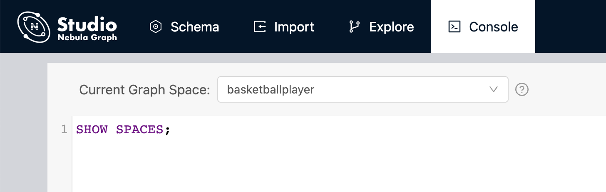

# Create a schema

To batch import data into Nebula Graph, you must have a graph schema. You can create a schema on the **Console** page or on the **Schema** page of Studio.

!!! note

    You can use nebula-console to create a schema. For more information, see [Nebula Graph Manual](../../README.md) and [Get started with Nebula Graph](../../2.quick-start/1.quick-start-workflow.md).

## Prerequisites

To create a graph schema on Studio, you must do a check of these:

- Studio is connected to Nebula Graph.

- Your account has the privilege of GOD, ADMIN, or DBA.

- The schema is designed.

- A graph space is created.
  
  !!! note

        If no graph space exists and your account has the GOD privilege, you can create a graph space on the **Console** page. For more information, see [CREATE SPACE](../../3.ngql-guide/9.space-statements/1.create-space.md).

## Create a schema with Schema

To create a schema on the **Schema** page, follow these steps:

1. Create tags. For more information, see [Operate tags](../manage-schema/st-ug-crud-tag.md).

2. Create edge types. For more information, see [Operate edge types](../manage-schema/st-ug-crud-edge-type.md).

## Create a schema with Console

To create a schema on the **Console** page, follow these steps:

1. In the toolbar, click the **Console** tab.

2. In the **Current Graph Space** field, choose a graph space name. In this example, **basketballplayer** is used.

   

3. In the input box, enter these statements one by one and click the button .

   ```ngql
   // To create a tag named "player", with two property
   nebula> CREATE TAG player(name string, age int);
   
   // To create a tag named "team", with one property
   nebula> CREATE TAG team(name string);

   // To create an edge type named "follow", with one properties
   nebula> CREATE EDGE follow(degree int);

   // To create an edge type named "serve", with two properties
   nebula> CREATE EDGE serve(start_year int, end_year int);
   ```

If the preceding statements are executed successfully, the schema is created. You can run the statements as follows to view the schema.

```ngql
// To list all the tags in the current graph space
nebula> SHOW TAGS;

// To list all the edge types in the current graph space
nebula> SHOW EDGES;

// To view the definition of the tags and edge types
DESCRIBE TAG player;
DESCRIBE TAG team;
DESCRIBE EDGE follow;
DESCRIBE EDGE serve;
```

If the schema is created successfully, in the result window, you can see the definition of the tags and edge types.

## Next to do

When a schema is created, you can [import data](st-ug-import-data.md).
