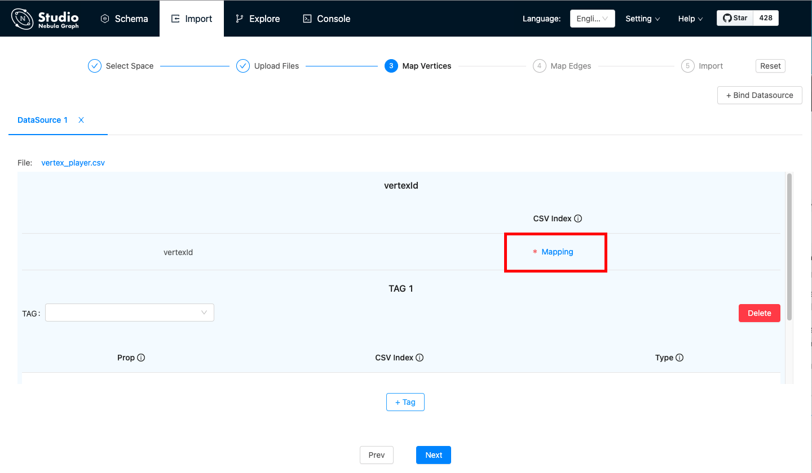
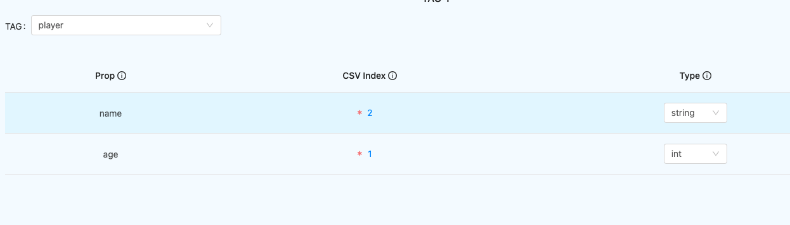
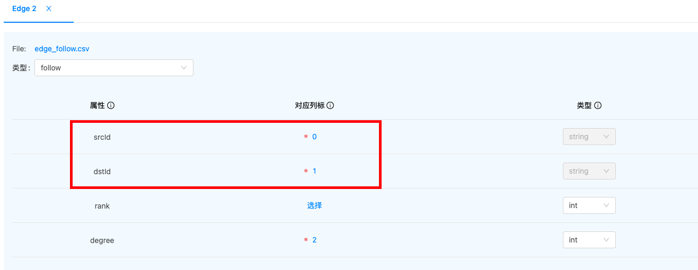
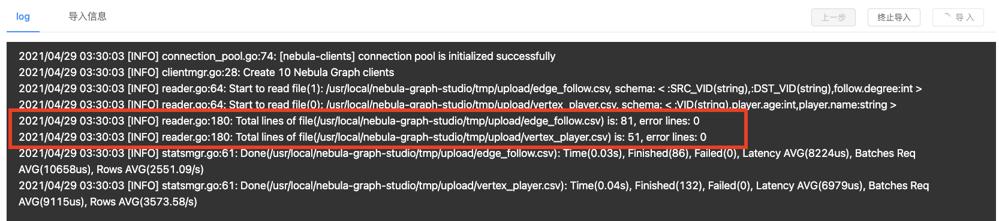

# Import data

After CSV files of data and a schema are created, you can use the **Import** page to batch import vertex and edge data into Nebula Graph for graph exploration and data analysis.

## Prerequisites

To batch import data, do a check of these:

- Studio is connected to Nebula Graph.

- A schema is created.

- CSV files meet the demands of the Schema.

- Your account has privilege of GOD, ADMIN, DBA, or USER.

## Procedure

To batch import data, follow these steps:

1. In the toolbar, click the **Import** tab.

2. On the **Select Space** page, choose a graph space name. In this example, **basketballplayer** is used. And then click the **Next** button.

3. On the **Upload Files** page, click the **Upload Files** button and then choose CSV files. In this example, `edge_serve.csv`, `edge_follow.csv`, `vertex_player.csv`, and `vertex_team.csv` are chosen.

  !!! note

        You can choose multiple CSV files at the same time. The CSV file used in this article can be downloaded in the [Design a schema](/docs-2.0/nebula-studio/quick-start/st-ug-plan-schema.md).

4. On the **Select Files** page, do a check of the file size and click **Preview** or **Delete** in the **Operations** column to make sure that all source data is correct. And then click the **Next** button.

5. On the **Map Vertices** page, click the **+ Bind Datasource** button, and in the dialog box, choose a CSV file. In this example, `vertex_player.csv` or `vertex_team.csv` is chosen.

6. In the **DataSource X** tab, click the **+ Tag** button.

7. In the **vertexId** section, do these operations:

   a. In the **CSV Index** column, click **Mapping**.  
     

   b. In the dialog box, choose a column from the CSV file. In this example, the only one cloumn of `vertex_player.csv` is chosen to generate VIDs representing players and the `playerID` column of `vertex_player.csv` is chosen to generate VIDs representing players.

    !!! Note

        In the same graph space, the VID is always unique and cannot be repeated. For VID information, see [VID](../../1.introduction/3.vid.md) "Click to enter the Nebula Graph Manual". 

8. In the **TAG 1** section, do these operations:  
   a. In the **TAG** drop-down list, choose a tag name. In this example, **player** is used for the `vertex_player.csv` file, and **team** is used for the `vertex_team.csv` file.  

   b. In the property list, click **Mapping** to choose a data column from the CSV file as the value of a property. In this example, for the **player** tag, choose **Column 1** for the `age` property and set its type to **int**. And choose **Column 2** for the `name` property and set its type to **string**.

     

9.  (Optional) If necessary, repeat Step 5 through Step 8 for more tags.  

10. When the configuration is done, click the **Next** button.  
   When **Config validation was successful** prompts, data mapping for the vertices is successful.  

11. On the **Map Edges** page, click the **+ Bind Datasource** button, and in the dialog box, choose a CSV file. In this example, the `edge_follow.csv` file is chosen.

12. In the **Type** drop-down list, choose an edge type name. In this example, **follow** is chosen.

13. In the property list, click **Mapping** to choose a column from the `edge_follow.csv` file as values of a property for the edges. **srcId** and **dstId** are the VIDs of the source vertex and destination vertex of an edge. In this example, **srcId** must be set to the VIDs of the player and **dstId** must be set to the VIDs of another player. **Rank** is optional.

    

14. When the configuration is done, click the **Next** button.

15. On the **Import** page, click the **Start Import** button. On the **log** window, you can see the import progress. The consumed time depends on the data volume. During data import, you can click the **Stop Import** button to stop data import. When the **log** window shows information as follows, the data import is done.

## Next to do

When the data are imported to v{{nebula.release}}, you can [query graph data](st-ug-explore.md).
