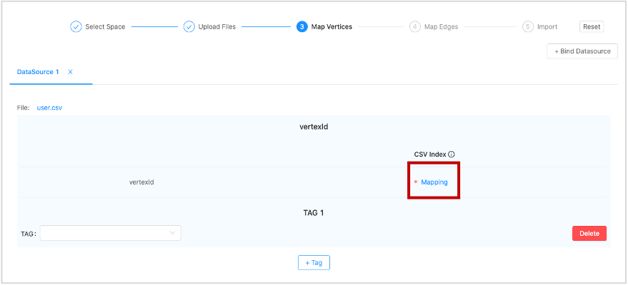
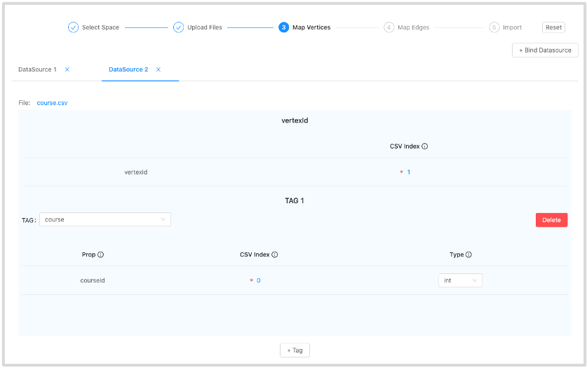
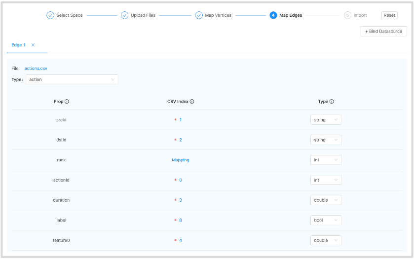
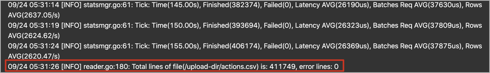

# Import data

After CSV files of data and a schema are created, you can use the **Import** page to batch import vertex and edge data into NebulaGraph for graph exploration and data analysis.

## Prerequisites

To batch import data, do a check of these:

- Studio v2.x is connected to NebulaGraph v2.x.

- A schema is created.

- CSV files for vertex and edge data separately are created.

- Your account has privilege of GOD, ADMIN, DBA, or USER.

## Procedure

To batch import data, follow these steps:

1. In the toolbar, click the **Import** tab.

2. On the **Select Space** page, choose a graph space name. In this example, **mooc_actions** is used. And then click the **Next** button.

3. On the **Upload Files** page, click the **Upload Files** button and then choose CSV files. In this example, `user.csv`, `course.csv`, and `actions.csv` are chosen.
   > **NOTE**: You can choose multiple CSV files at the same time.

4. On the **Select Files** page, do a check of the file size and click **Preview** or **Delete** in the **Operations** column to make sure that all source data is correct. And then click the **Next** button.

5. On the **Map Vertices** page, click the **+ Bind Datasource** button, and in the dialog box, choose a CSV file. In this example, `user.csv` or `course.csv` is chosen.

6. In the **DataSource X** tab, click the **+ Tag** button.

7. In the **vertexId** section, do these operations:
   a. In the **CSV Index** column, click **Mapping**.  
     

   b. In the dialog box, choose a column from the CSV file. In this example, the only one cloumn of `user.csv` is chosen to generate VIDs representing users and the `courseName` column of `course.csv` is chosen to generate VIDs representing courses.

8. In the **TAG 1** section, do these operations:  
   a. In the **TAG** drop-down list, choose a tag name. In this example, **user** is used for the `user.csv` file, and **course** is used for the `course.csv` file.  

   b. In the property list, click **Mapping** to choose a data column from the CSV file as the value of a property. In this example, no data is chosen for `user`. For the **course** tag, choose **Column 0** for the `courseId` property and set its type to **int**.  
     

9. (Optional) If necessary, repeat Step 5 through Step 8 for more tags.  

10. When the configuration is done, click the **Next** button.  
   When **Config validation was successful** prompts, data mapping for the vertices is successful.  

11. On the **Map Edges** page, click the **+ Bind Datasource** button, and in the dialog box, choose a CSV file. In this example, the `actions.csv` file is chosen.

12. In the **Type** drop-down list, choose an edge type name. In this example, **action** is chosen.

13. In the property list, click **Mapping** to choose a column from the `actions.csv` file as values of a property for the edges. **srcId** and **dstId** are the VIDs of the source vertex and destination vertex of an edge. In this example, **srcId** must be set to the VIDs of the users and **dstId** must be set to the VIDs of the courses. **rank** is optional.

    

14. When the configuration is done, click the **Next** button.

15. On the **Import** page, click the **Start Import** button. On the **log** window, you can see the import progress. The consumed time depends on the data volume. During data import, you can click the **Stop Import** button to stop data import. When the **log** window shows information as follows, the data import is done.

## Next to do

When the data are imported to NebulaGraph v2.x, you can [query graph data](st-ug-explore.md).
