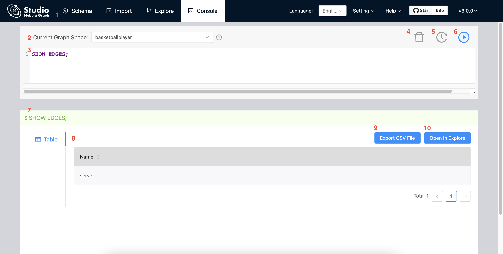

# Console

Studio console interface as shown in following.

The following table lists various functions on the console interface.

| number | function        | descriptions                                                                                                                                                                                                                                                                   |
| :----- | :-------------- | :----------------------------------------------------------------------------------------------------------------------------------------------------------------------------------------------------------------------------------------------------------------------------- |
| 1      | toolbar         | Click the **Console** tab to enter the console page.                                                                                                                                                                                                                           |
| 2      | select a space  | Select a space in the Current Graph Space list.   **descriptions**：Studio does not support running the `USE <space_name>` statements directly in the input box.                                                                                                           |
| 3      | input box       | After inputting the nGQL statements, click the  button to run the statement. You can input multiple statements and run them at the same time, separated by `;`.                                                                                   |
| 4      | clean input box | Click  button to clear the content entered in the input box.                                                                                                                                                                                    |
| 5      | history list    | Click  button representing the statement record. In the statement running record list, click one of the statements, and the statement will be automatically entered in the input box. The list provides the record of the last 15 statements. |
| 6      | run             | After inputting the nGQL statement in the input box, click  button to indicate the operation to start running the statement.                                                                                                                                                 |
| 7      | statement running status    | After running the nGQL statement, the statement running status is displayed. If the statement runs successfully, the statement is displayed in green. If the statement fails, the statement is displayed in red.                                                                                                                                                                   |
| 8      | result window       | Display the results of the statement execution. If the statement returns results, the results window will display the returned results in tabular form.                                                                                                                                                                                                     |
| 9      | export CSV file    | After running the nGQL statement and return the result, click the **Export CSV File** button to export the result as a CSV file.                                                                                                                                                                                         |
| 10     | open in explore    | According to the running nGQL statement, the user can click the graph exploration function key to import the returned results into graph exploration for visual display, such as [open in explore](../use-console/st-ug-open-in-explore.md) and [view subgraphs](../use-console/st-ug-visualize-subgraph.md).                                                                |
