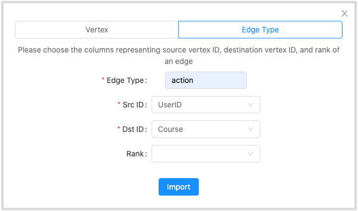
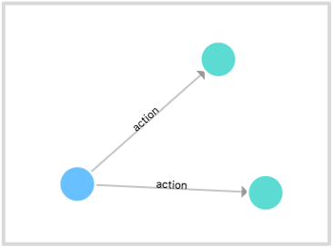
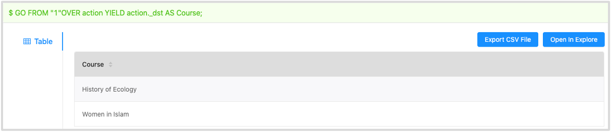
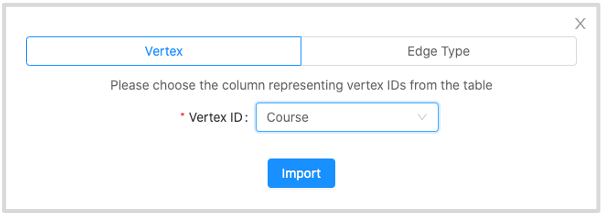

# Open in Explore

With the **Open in Explore** function, you can run nGQL statements on the **Console** page to query vertex or edge data and then view the result on the **Explore** page in a visualized way.

## Prerequisites

To use the **Open in Explore** function, you must do a check of these:

- The version of Studio is v2.0.0 or later.

- Studio is connected to Nebula Graph v2.x.

- A dataset exists in the database.

## Query and visualize edge data

To query edge data on the **Console** page and then view the result on the **Explore** page, follow these steps:

1. In the toolbar, click the **Console** tab.

2. In the **Current Graph Space** field, choose a graph space name. In this example, **mooc_actions** is chosen.

3. In the input box, enter an nGQL statement and click the button .  

  !!! note

        The query result must contain the VIDs of the source vertex and the destination vertex of an edge.

   Here is an nGQL statement example.

    ```ngql
    nebula> MATCH (u:user {userId: 1}) - [:action] -> (c) RETURN u.userId AS UserID, c.courseName AS Course;
    ```

  !!! note

        For more information about the `MATCH` syntax, see [MATCH in nGQL User Guide](../../3.ngql-guide/7.general-query-statements/2.match.md).

   The query result gives the edges between User 1 and the courses that he/she takes on the MOOC platform, as shown in this figure.

   

4. Click the **Open in Explore** button.

5. In the dialog box, configure as follows:  
   a. Click **Edge Type**.  

   b. In the **Edge Type** field, enter an edge type name. In this example, `action` is used.  

   c. In the **Src ID** field, choose a column name from the result table representing the VIDs of the source vertices. In this example, `UserID` is chosen.  

   d. In the **Dst ID** field, choose a column name from the result table representing the VIDs of the destination vertices. In this example, `Course` is chosen.  

   e. (Optional) If the result table contains the ranking information of the edges, in the **Rank** field, choose a column name representing the `rank` of the edges. If no ranking information exists in the result, leave the **Rank** field blank.  

   f. When the configuration is done, click the **Import** button.  

   

6. If some data exists on the board of **Explore**, choose a method to insert data:

   - **Incremental Insertion**: Click this button to add the result to the existing data on the board.
   - **Insert After Clear**: Click this button to clear the existing data from the board and then add the data to the board.

When the data is inserted, you can view the visualized representation of the edge data.



## Query and visualize vertex data

To query vertex data on the **Console** page and then view the result on the **Explore** page, follow these steps:

1. In the toolbar, click the **Console** tab.

2. In the **Current Graph Space** field, choose a graph space name. In this example, **mooc_actions** is chosen.

3. In the input box, enter an nGQL statement and click the button .

  !!! note

        The query result must contain the VIDs of the vertices.

   Here is an nGQL statement example.

   ```ngql
   nebula> GO FROM "1" OVER action YIELD action._dst AS Course;
   ```

   The query result gives the courses that the specified user took, as shown in this figure.

   

4. Click the **Open in Explore** button.

5. In the dialog box, configure as follows:  
   a. Click **Vertex**.  
   
   b. In the **Vertex ID** field, choose a column name from the result table representing the VIDs of the vertices. In this example, `Course` is chosen.  
   
   c. When the configuration is done, click the **Import** button.

     

6. If some data exists on the board of **Explore**, choose a method to insert data:

   - **Incremental Insertion**: Click this button to add the queried result to the existing data on the board.

   - **Insert After Clear**: Click this button to clear the existing data from the board and then add the data.

When the data is inserted, you can view the visualized representation of the vertex data.

## Next to do

On the **Explore** page, you can expand the board to explore and analyze graph data.
