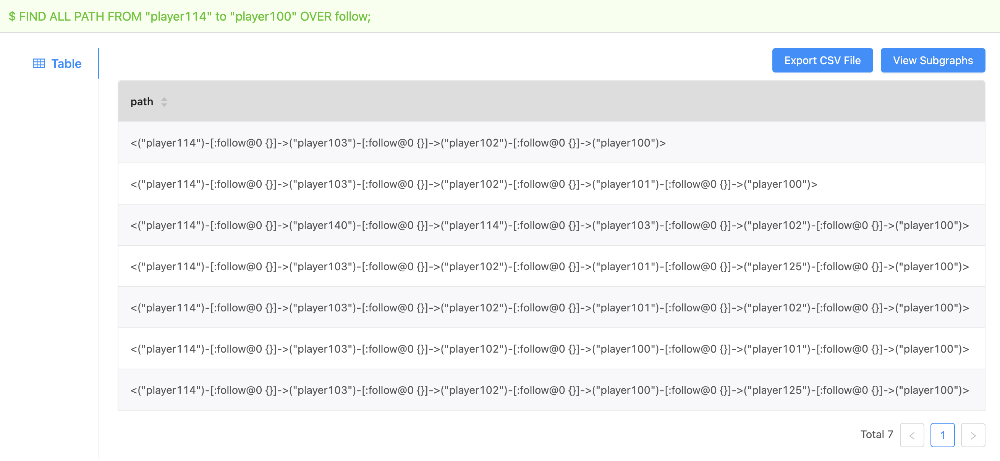
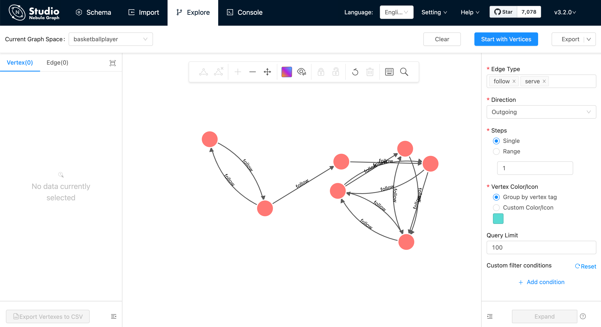

# View subgraphs

With the **View Subgraphs** function, you can run a [FIND SHORTEST | ALL PATH](../../3.ngql-guide/16.subgraph-and-path/2.find-path.md) or a [`GET SUBGRAPH`](../../3.ngql-guide/16.subgraph-and-path/1.get-subgraph.md) statement on the **Console** page and then view the result on the **Explore** page.

## Studio version

Studio of v{{studio.release}} supports this function. To update the version, see [Check updates](../about-studio/st-ug-check-updates.md).

## Prerequisites

To use the **View Subgraphs** function, you must do a check of these:

- The version of Studio is v{{studio.release}} or later.

- Studio is connected to Nebula Graph.

- A dataset exists in the database. In the example of this article, the **basketballplayer** dataset is used. For more information, see [Import data](../quick-start/st-ug-import-data.md).

!!! Note

    Users can view subgraphs online in [Studio](https://playground.nebula-graph.com.cn/explore).

## Procedure

To query the paths or subgraph on the **Console** page and then view them on the **Explore** page, follow these steps:

1. In the navigation bar, click the **Console** tab.

2. In the **Current Graph Space** dropdown list, choose a graph space name. In this example, **baskteballplayer** is chosen.

3. In the input box, enter a `FIND SHORTEST PATH`, `FIND ALL PATH`, or `GET SUBGRAPH` statement and click **Run** .

   Here is an nGQL statement example.

   ```ngql
   nebula> FIND ALL PATH FROM "player114" to "player100" OVER follow;
   ```

    Take the `FIND ALL PATH` for example, query the path information as shown in this figure.

    

4. Click the **View Subgraphs** button.

5. (Optional) If some data exists on the board of **Explore**, choose a method to insert data:

  - **Incremental Insertion**: Click this button to add the result to the existing data on the board.

  - **Insert After Clear**: Click this button to clear the existing data from the board and then add the data to the board.

When the data is inserted, you can view the visualized representation of the paths.  Operations such as expanding vertices, moving the canvas, modifying the color and icon of the vertices, and displaying the properties of the vertices and edges on the page are supported.



## Next to do

On the **Explore** page, you can expand the graph to explore and analyze graph data.
