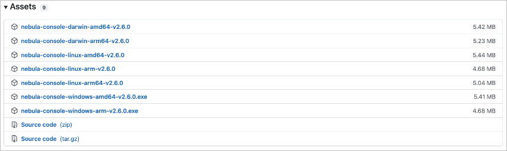

Nebula Graph supports multiple types of clients, including a CLI client, a GUI client, and clients developed in popular programming languages. This topic provides an overview of Nebula Graph clients and basic instructions on how to use the native CLI client, Nebula Console.

## Nebula Graph clients

You can use supported [clients or console](https://docs.nebula-graph.io/{{nebula.release}}/20.appendix/6.eco-tool-version/) to connect to Nebula Graph.<!--这里用外链。-->

<!-- TODO The cloud service cannot be provided together with v{{ nebula.release }}.
If you do not have a Nebula Graph database yet, we recommend that you try the cloud service. [Nebula Graph Cloud Service](https://www.nebula-cloud.io/) supports on-demand deployment and fast building with Nebula Graph Studio as its default client.
-->

## Use Nebula Console to connect to Nebula Graph

### Prerequisites

* You have started [Nebula Graph services](https://docs.nebula-graph.io/{{nebula.release}}/4.deployment-and-installation/manage-service/).<!--这里用外链。-->

* The machine you plan to run Nebula Console on has network access to Nebula Graph services.

### Steps

1. On the [nebula-console](https://github.com/vesoft-inc/nebula-console/releases "the nebula-console Releases page") page, select a Nebula Console version and click **Assets**.

  !!! note

        We recommend that you select the **latest** release.

    

2. In the **Assets** area, find the correct binary file for the machine where you want to run Nebula Console and download the file to the machine.

    

3. (Optional) Rename the binary file to `nebula-console` for convenience.

  !!! note

        For Windows, rename the file to `nebula-console.exe`.

4. On the machine to run Nebula Console, grant the execute permission of the nebula-console binary file to the user.

  !!! note

        For Windows, skip this step.

    ```bash
    $ chmod 111 nebula-console
    ```

5. In the command line interface, change the working directory to the one where the nebula-console binary file is stored.

6. Run the following command to connect to Nebula Graph.

   * For Linux or macOS:

   ```bash
   $ ./nebula-console -addr <ip> -port <port> -u <username> -p <password>
   [-t 120] [-e "nGQL_statement" | -f filename.nGQL]
   ```

   * For Windows:

   ```powershell
   > nebula-console.exe -addr <ip> -port <port> -u <username> -p <password>
   [-t 120] [-e "nGQL_statement" | -f filename.nGQL]
   ```

   Parameters and descriptions are as follows.

   | Parameter | Description |
   | - | - |
   | `-h` | Shows the help menu. |
   | `-addr` | Sets the IP address of the graphd service. The default address is 127.0.0.1. |
   | `-port` | Sets the port number of the graphd service. The default port number is 9669.<!-- If you have deployed Nebula Graph in a docker container but Nebula Console is working outside the container, check the [source port](2.deploy-nebula-graph-with-docker-compose.md/#check_the_nebula_graph_service_status_and_port) of any nebula-graphd process and use it for connection. -->|
   | `-u/-user` | Sets the username of your Nebula Graph account. Before enabling authentication, you can use any existing username. The default username is `root`. |
   | `-p/-password` | Sets the password of your Nebula Graph account. Before enabling authentication, you can use any characters as the password. |
   | `-t/-timeout`  | Sets an integer-type timeout threshold of the connection. The unit is second. The default value is 120. |
   | `-e/-eval` | Sets a string-type nGQL statement. The nGQL statement is executed once the connection succeeds. The connection stops after the result is returned. |
   | `-f/-file` | Sets the path of an nGQL file. The nGQL statements in the file are executed once the connection succeeds. The result will be returned and the connection stops then. |

You can find more details in the [Nebula Console Repository](https://github.com/vesoft-inc/nebula-console/tree/{{console.branch}}).

## Nebula Console commands

Nebula Console can export CSV file, DOT file, and import datasets.

!!! note

    The commands are case insensitive.

### Export a CSV file

CSV files save the returned result of a executed command.

!!! note

    - A CSV file will be saved in the working directory, i.e., what the linux command `pwd` shows.

    - This command only works for the next query statement.

The command to export a csv file is as follows:

```ngql
nebula> :CSV <file_name.csv>
```

### Export a DOT file

DOT files save the returned result of a executed command, and the resulted information is different from that of CSV files.

!!! Note

    - A DOT file will be saved in the working directory, i.e., what the linux command `pwd` shows.

    - You can copy the contents of the DOT file and paste them in [GraphvizOnline](https://dreampuf.github.io/GraphvizOnline/) to generate a visualized execution plan.

    - This command only works for the next query statement.

The command to export a DOT file is as follows:

```ngql
nebula> :dot <file_name.dot>
```

The example is as follows:

```ngql
nebula> :dot a.dot
nebula> PROFILE FORMAT="dot" GO FROM "player100" OVER follow;
```

### Import a testing dataset

The testing dataset is named `nba`. To view details about the schema and data, use the corresponding `SHOW` command.

The command to import a testing dataset is as follows:

```ngql
nebula> :play nba
```

### Run a command multiple times

To run a command multiple times, use the following command:

```ngql
nebula> :repeat N
```

The example is as follows:

```ngql
nebula> :repeat 3
nebula> GO FROM "player100" OVER follow YIELD dst(edge);
+-------------+
| dst(EDGE)   |
+-------------+
| "player101" |
| "player125" |
+-------------+
Got 2 rows (time spent 2602/3214 us)

Fri, 20 Aug 2021 06:36:05 UTC

+-------------+
| dst(EDGE)   |
+-------------+
| "player101" |
| "player125" |
+-------------+
Got 2 rows (time spent 583/849 us)

Fri, 20 Aug 2021 06:36:05 UTC

+-------------+
| dst(EDGE)   |
+-------------+
| "player101" |
| "player125" |
+-------------+
Got 2 rows (time spent 496/671 us)

Fri, 20 Aug 2021 06:36:05 UTC

Executed 3 times, (total time spent 3681/4734 us), (average time spent 1227/1578 us)
```

### Sleep to wait

This command will make Nebula Graph services sleep and wait for N seconds. The schema is altered in an async way and takes effect in the next heartbeat cycle. Therefore, this command is usually used when altering schema. The command is as follows:

```ngql
nebula> :sleep N
```

## Disconnect Nebula Console from Nebula Graph

You can use `:EXIT` or `:QUIT` to disconnect from Nebula Graph. For convenience, Nebula Console supports using these commands in lower case without the colon (":"), such as `quit`.

The example is as follows:

```ngql
nebula> :QUIT

Bye root!
```

## FAQ

### "How can I install Nebula Console from the source code?"

To download and compile the latest source code of Nebula Console, follow the instructions on [the nebula console GitHub page](https://github.com/vesoft-inc/nebula-console#build-nebula-graph-console).
