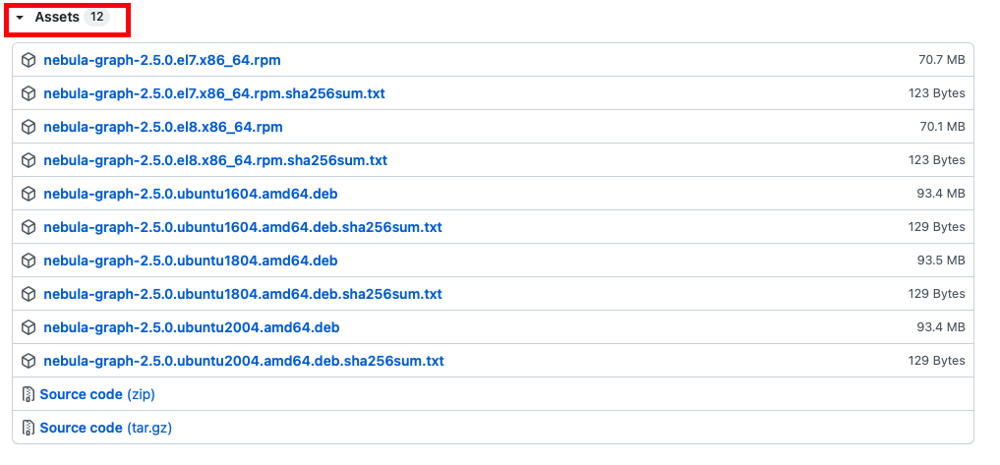

RPM and DEB are common package formats on Linux systems. This topic shows how to quickly install Nebula Graph with the RPM or DEB package.

## Prerequisites

Prepare the right [resources](https://docs.nebula-graph.io/{{nebula.release}}/4.deployment-and-installation/1.resource-preparations/).<!--这里用外链。-->

!!! note

    The console is not complied or packaged with Nebula Graph server binaries. You can install [nebula-console](https://github.com/vesoft-inc/nebula-console) by yourself.

!!! enterpriseonly

    For the Enterprise Edition, please send email to inquiry@vesoft.com.

## Download the package from cloud service

* Download the released version.

    URL:

    ```bash
    //Centos 6
    https://oss-cdn.nebula-graph.io/package/<release_version>/nebula-graph-<release_version>.el6.x86_64.rpm

    //Centos 7
    https://oss-cdn.nebula-graph.io/package/<release_version>/nebula-graph-<release_version>.el7.x86_64.rpm

    //Centos 8
    https://oss-cdn.nebula-graph.io/package/<release_version>/nebula-graph-<release_version>.el8.x86_64.rpm

    //Ubuntu 1604
    https://oss-cdn.nebula-graph.io/package/<release_version>/nebula-graph-<release_version>.ubuntu1604.amd64.deb

    //Ubuntu 1804
    https://oss-cdn.nebula-graph.io/package/<release_version>/nebula-graph-<release_version>.ubuntu1804.amd64.deb

    //Ubuntu 2004
    https://oss-cdn.nebula-graph.io/package/<release_version>/nebula-graph-<release_version>.ubuntu2004.amd64.deb
    ```

    For example, download the release package `{{ nebula.release }}` for `Centos 7.5`:

    ```bash
    wget https://oss-cdn.nebula-graph.io/package/{{ nebula.release }}/nebula-graph-{{ nebula.release }}.el7.x86_64.rpm
    wget https://oss-cdn.nebula-graph.io/package/{{ nebula.release }}/nebula-graph-{{ nebula.release }}.el7.x86_64.rpm.sha256sum.txt
    ```

    Download the release package `{{ nebula.release }}` for `Ubuntu 1804`:

    ```bash
    wget https://oss-cdn.nebula-graph.io/package/{{ nebula.release }}/nebula-graph-{{ nebula.release }}.ubuntu1804.amd64.deb
    wget https://oss-cdn.nebula-graph.io/package/{{ nebula.release }}/nebula-graph-{{ nebula.release }}.ubuntu1804.amd64.deb.sha256sum.txt
    ```

* Download the nightly version.

  !!! danger

      - Nightly versions are usually used to test new features. Do not use it in a production environment.
      - Nightly versions may not be built successfully every night. And the names may change from day to day.

    URL:

    ```bash
    //Centos 6
    https://oss-cdn.nebula-graph.io/package/nightly/<yyyy.mm.dd>/nebula-graph-<yyyy.mm.dd>-nightly.el6.x86_64.rpm

    //Centos 7
    https://oss-cdn.nebula-graph.io/package/nightly/<yyyy.mm.dd>/nebula-graph-<yyyy.mm.dd>-nightly.el7.x86_64.rpm

    //Centos 8
    https://oss-cdn.nebula-graph.io/package/nightly/<yyyy.mm.dd>/nebula-graph-<yyyy.mm.dd>-nightly.el8.x86_64.rpm

    //Ubuntu 1604
    https://oss-cdn.nebula-graph.io/package/nightly/<yyyy.mm.dd>/nebula-graph-<yyyy.mm.dd>-nightly.ubuntu1604.amd64.deb

    //Ubuntu 1804
    https://oss-cdn.nebula-graph.io/package/nightly/<yyyy.mm.dd>/nebula-graph-<yyyy.mm.dd>-nightly.ubuntu1804.amd64.deb

    //Ubuntu 2004
    https://oss-cdn.nebula-graph.io/package/nightly/<yyyy.mm.dd>/nebula-graph-<yyyy.mm.dd>-nightly.ubuntu2004.amd64.deb
    ```

    For example, download the `Centos 7.5` package developed and built in `2021.11.28`:

    ```bash
    wget https://oss-cdn.nebula-graph.io/package/nightly/2021.11.28/nebula-graph-2021.11.28-nightly.el7.x86_64.rpm
    wget https://oss-cdn.nebula-graph.io/package/nightly/2021.11.28/nebula-graph-2021.11.28-nightly.el7.x86_64.rpm.sha256sum.txt
    ```

    For example, download the `Ubuntu 1804` package developed and built in `2021.11.28`:

    ```bash
    wget https://oss-cdn.nebula-graph.io/package/nightly/2021.11.28/nebula-graph-2021.11.28-nightly.ubuntu1804.amd64.deb
    wget https://oss-cdn.nebula-graph.io/package/nightly/2021.11.28/nebula-graph-2021.11.28-nightly.ubuntu1804.amd64.deb.sha256sum.txt
    ```

<!--
## Download the package from GitHub

* Download the release version.

   + On the [Nebula Graph Releases](https://github.com/vesoft-inc/nebula-graph/releases) page, find the required version and click **Assets**.
   

   + In the **Assets** area, click the package to download it.

* Download the nightly version.

  !!! danger

        Nightly versions are usually used to test new features. Do not use it in a production environment.

   + On the [Nebula Graph package](https://github.com/vesoft-inc/nebula/actions/workflows/package.yaml) page, click the latest **package** on the top of the package list.
   
   

   + In the **Artifacts** area, click the package to download it.
-->

## Install Nebula Graph

* Use the following syntax to install with an RPM package.

  ```bash
  $ sudo rpm -ivh --prefix=<installation_path> <package_name>
  ```

  For example, to install an RPM package in the default path for the {{nebula.release}} version.

  ```bash
  sudo rpm -ivh nebula-graph-{{nebula.release}}.el7.x86_64.rpm
  ```

* Use the following syntax to install with a DEB package.

  ```bash
  $ sudo dpkg -i --instdir==<installation_path> <package_name>
  ```

  For example, to install a DEB package in the default path for the {{nebula.release}} version.

  ```bash
  sudo dpkg -i nebula-graph-{{nebula.release}}.ubuntu1804.amd64.deb
  ```

  !!! note

        The default installation path is `/usr/local/nebula/`.

## Next to do

- (Enterprise Edition)[Deploy license](https://docs.nebula-graph.com.cn/{{nebula.release}}/4.deployment-and-installation/deploy-license)

- [Start Nebula Graph](https://docs.nebula-graph.io/{{nebula.release}}/2.quick-start/5.start-stop-service/)  <!--这里用外链。-->

- [Connect to Nebula Graph](https://docs.nebula-graph.io/{{nebula.release}}/2.quick-start/3.connect-to-nebula-graph/)<!--这里用外链。-->
