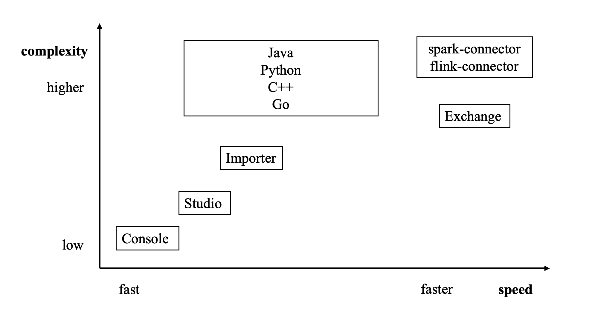

# Import tools

There are many ways to write Nebula Graph {{ nebula.release }}:

- Import with [the command -f](../2.quick-start/3.connect-to-nebula-graph.md): This method imports a small number of prepared nGQL files, which is suitable to prepare for a small amount of manual test data.
- Import with [Studio](../nebula-studio/quick-start/st-ug-import-data.md): This method uses a browser to import multiple csv files of this machine. A single file cannot exceed 100 MB, and its format is limited.
- Import with [Importer](../nebula-importer/use-importer.md): This method imports multiple csv files on a single machine with unlimited size and flexible format.
- Import with [Exchange](../nebula-exchange/about-exchange/ex-ug-what-is-exchange.md): This method imports from various distribution sources, such as Neo4j, Hive, MySQL, etc., which requires a Spark cluster.
- Import with [Spark-connector](../nebula-spark-connector.md)/[Flink-connector](../nebula-flink-connector.md): This method has corresponding components (Spark/Flink) and writes a small amount of code.
- Import with [C++/GO/Java/Python SDK](../20.appendix/6.eco-tool-version.md): This method imports in the way of writing programs, which requires certain programming and tuning skills.

The following figure shows the positions of these ways:

 
