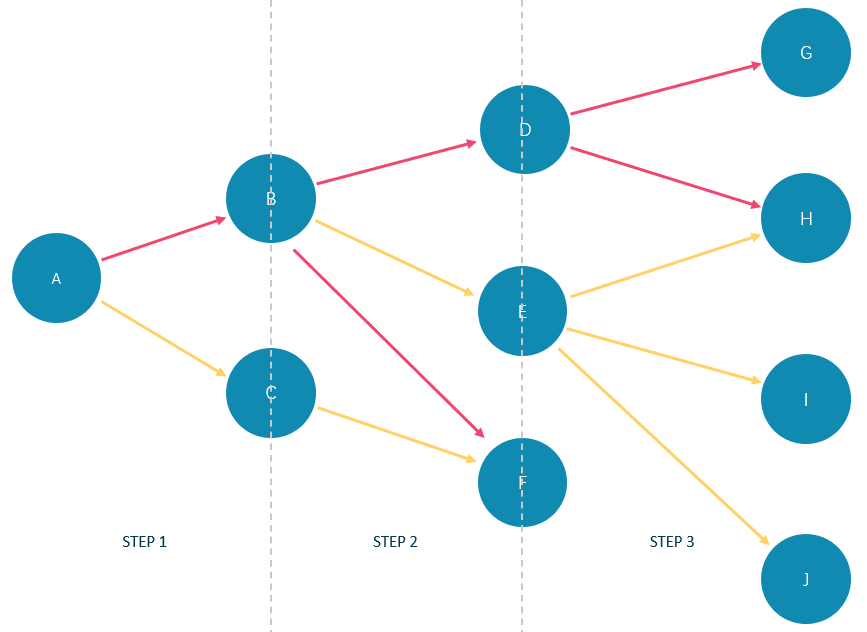

# SAMPLE

The `SAMPLE` clause takes samples evenly in the result set and returns the specified amount of data.

!!! compatibility "Legacy version compatibility"

    `SAMPLE` is a new clause added in Nebula Graph 2.6.0.

`SAMPLE` can be used in `GO` statements only. The syntax is as follows:

```ngql
<go_statement> SAMPLE <sample_list>;
```

`sample_list` is a list. Elements in the list must be natural numbers, and the number of elements must be the same as the maximum number of `STEPS` in the `GO` statement. The following takes `GO 1 TO 3 STEPS FROM "A" OVER * SAMPLE <sample_list>` as an example to introduce this usage of `SAMPLE` in detail.

* The list `sample_list` must contain 3 natural numbers, such as `GO 1 TO 3 STEPS FROM "A" OVER * SAMPLE [1,2,4]`.
* `1` in `SAMPLE [1,2,4]` means that the system automatically selects 1 edge to continue traversal in the first step. `2` means to select 2 edges to continue traversal in the second step. `4` indicates that 4 edges are selected to continue traversal in the third step. If there is no matched edge in a certain step or the number of matched edges is less than the specified number, the actual number will be returned.
* Because `GO 1 TO 3 STEPS` means to return all the traversal results from the first to third steps, all the red edges and their source and destination vertices in the figure below will be matched by this `GO` statement. And the yellow edges represent there is no path selected when the GO statement traverses. If it is not `GO 1 TO 3 STEPS` but `GO 3 STEPS`, it will only match the red edges of the third step and the vertices at both ends.



In the basketballplayer dataset, the example is as follows:

```ngql
nebula> GO 3 STEPS FROM "player100" \
        OVER * \
        YIELD properties($$).name AS NAME, properties($$).age AS Age \
        SAMPLE [1,2,3];
+-----------------+--------------+
| NAME            | Age          |
+-----------------+--------------+
| "Spurs"         | UNKNOWN_PROP |
| "Tony Parker"   | 36           |
| "Manu Ginobili" | 41           |
+-----------------+--------------+

nebula> GO 1 TO 3 STEPS FROM "player100" \
        OVER * \
        YIELD properties($$).name AS NAME, properties($$).age AS Age \
        SAMPLE [2,2,2];
+---------------------+-----+
| NAME                | Age |
+---------------------+-----+
| "Manu Ginobili"     | 41  |
| "Tony Parker"       | 36  |
| "Tim Duncan"        | 42  |
| "LaMarcus Aldridge" | 33  |
| "Tony Parker"       | 36  |
| "Tim Duncan"        | 42  |
+---------------------+-----+
```
