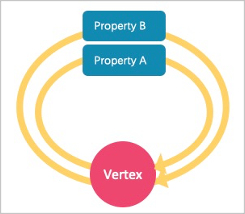
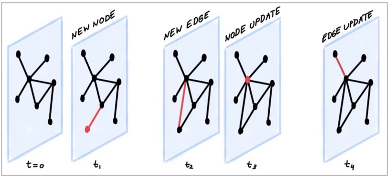

# Graph data modeling suggestions

This topic provides general suggestions for modeling data in Nebula Graph.

!!! note

    The following suggestions may not apply to some special scenarios. In these cases, find help in the [Nebula Graph community](https://discuss.nebula-graph.io/).

## Model for performance

There is no perfect method to model in Nebula Graph. Graph modeling depends on the questions that you want to know from the data. Your data drives your graph model. Graph data modeling is intuitive and convenient. Create your data model based on your business model. Test your model and gradually optimize it to fit your business. To get better performance, you can change or re-design your model multiple times.

### Design and evaluate the most important queries

Usually, various types of queries are validated in test scenarios to assess the overall capabilities of the system. However, in most production scenarios, there are not many types of frequently used queries. You can optimize the data model based on key queries selected according to the Pareto (80/20) principle.

### No predefined bonds between Tags and Edge types

Define the bonds between Tags and Edge types in the application, not Nebula Graph. There are no statements that could get the bonds between Tags and Edge types.

### Tags/Edge types predefine a set of properties

While creating Tags or Edge types, you need to define a set of properties. Properties are part of the Nebula Graph Schema.

### Control changes in the business model and the data model

Changes here refer to changes in business models and data models (meta-information), not changes in the data itself.

Some graph databases are designed to be Schema-free, so their data modeling, including the modeling of the graph topology and properties, can be very flexible. Properties can be re-modeled to graph topology, and vice versa. Such systems are often specifically optimized for graph topology access.

Nebula Graph {{ nebula.release }} is a strong-Schema (row storage) system, which means that the business model should not change frequently. For example, the property Schema should not change. It is similar to avoiding `ALTER TABLE` in MySQL.

On the contrary, vertices and their edges can be added or deleted at low costs. Thus, the easy-to-change part of the business model should be transformed to vertices or edges, rather than properties.

For example, in a business model, people have relatively fixed properties such as age, gender, and name. But their contact, place of visit, trade account, and login device are often changing. The former is suitable for modeling as properties and the latter as vertices or edges.

### Set temporary properties through self-loop edges

As a strong Schema system, Nebula Graph does not support List-type properties. And using `ALTER TAG` costs too much. If you need to add some temporary properties or List-type properties to a vertex, you can first create an edge type with the required properties, and then insert one or more edges that direct to the vertex itself. The figure is as follows.



To retrieve temporary properties of vertices, fetch from self-loop edges. For example:

```ngql
//Create the edge type and insert the loop property.
nebula> CREATE EDGE IF NOT EXISTS temp(tmp int);
nebula> INSERT EDGE temp(tmp) VALUES "player100"->"player100"@1:(1);
nebula> INSERT EDGE temp(tmp) VALUES "player100"->"player100"@2:(2);
nebula> INSERT EDGE temp(tmp) VALUES "player100"->"player100"@3:(3);

//After the data is inserted, you can query the loop property by general query statements, for example:
nebula> GO FROM "player100" OVER temp YIELD properties(edge).tmp;
+----------------------+
| properties(EDGE).tmp |
+----------------------+
| 1                    |
| 2                    |
| 3                    |
+----------------------+

//If you want the results to be returned in the form of a List, you can use a function, for example:
nebula> MATCH (v1:player)-[e:temp]->() return collect(e.tmp);
+----------------+
| collect(e.tmp) |
+----------------+
| [1, 2, 3]      |
+----------------+
```

### Breadth-first traversal over depth-first traversal

- Nebula Graph has lower performance for depth-first traversal based on the Graph topology, and better performance for breadth-first traversal and obtaining properties. For example, if model A contains properties "name", "age", and "eye color", it is recommended to create a tag `person` and add properties `name`, `age`, and `eye_color` to it. If you create a tag `eye_color` and an edge type `has`, and then create an edge to represent the eye color owned by the person, the traversal performance will not be high.

- The performance of finding an edge by an edge property is close to that of finding a vertex by a vertex property. For some databases, it is recommended to re-model edge properties as those of the intermediate vertices. For example, model the pattern `(src)-[edge {P1, P2}]->(dst)` as `(src)-[edge1]->(i_node {P1, P2})-[edge2]->(dst)`. With Nebula Graph {{ nebula.release }}, you can use `(src)-[edge {P1, P2}]->(dst)` directly to decrease the depth of the traversal and increase the performance.

### Edge directions

To query in the opposite direction of an edge, use the following syntax:

`(dst)<-[edge]-(src)` or `GO FROM dst REVERSELY`.

If you do not care about the directions or want to query against both directions, use the following syntax:

`(src)-[edge]-(dst)` or `GO FROM src BIDIRECT`.

Therefore, there is no need to insert the same edge redundantly in the reversed direction.

### Set tag properties appropriately

Put a group of properties that are on the same level into the same tag. Different groups represent different concepts.

### Use indexes correctly

Using property indexes helps find VIDs through properties, but can lead to performance reduction by 90% or even more. Only use an index when you need to find vertices or edges through their properties.

### Design VIDs appropriately

See [VID](../1.introduction/3.vid.md).

### Long texts

Do not use long texts to create edge properties. Edge properties are stored twice and long texts lead to greater write amplification. For how edges properties are stored, see [Storage architecture](../1.introduction/3.nebula-graph-architecture/4.storage-service.md). It is recommended to store long texts in HBase or Elasticsearch and store its address in Nebula Graph.

## Dynamic graphs (sequence graphs) are not supported

In some scenarios, graphs need to have the time information to describe how the structure of the entire graph changes over time.[^twitter]

The Rank field on Edges in Nebula Graph {{ nebula.release }} can be used to store time in int64, but no field on vertices can do this because if you store the time information as property values, it will be covered by new insertion. Thus Nebula Graph does not support sequence graphs.



[^twitter]: https://blog.twitter.com/engineering/en_us/topics/insights/2021/temporal-graph-networks
