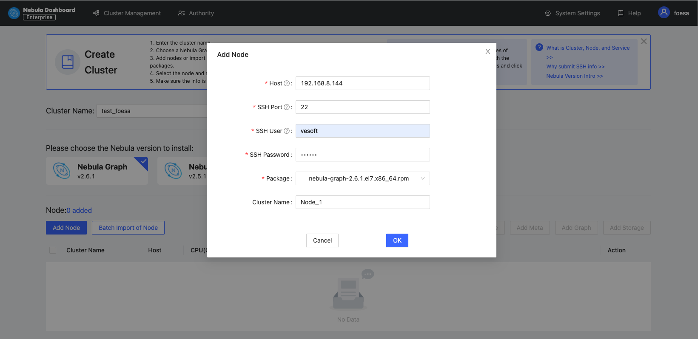
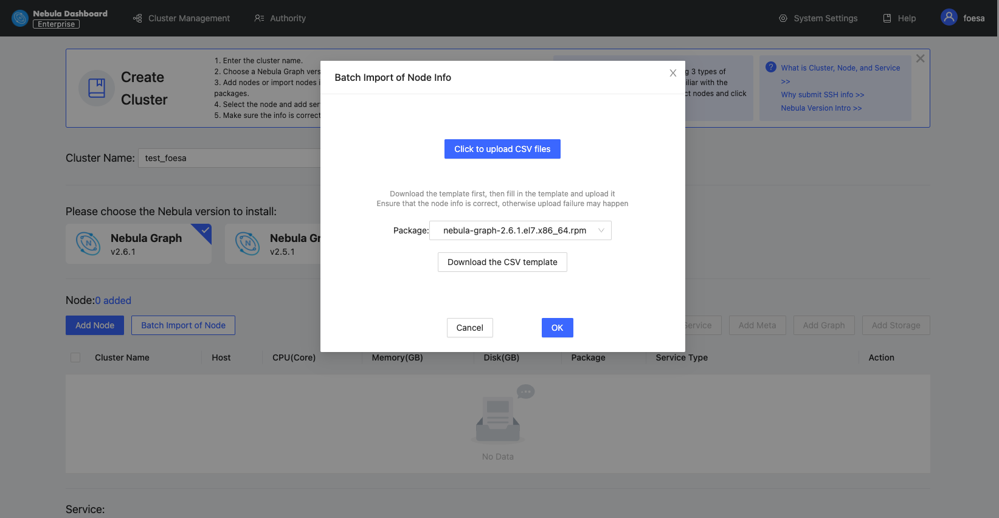
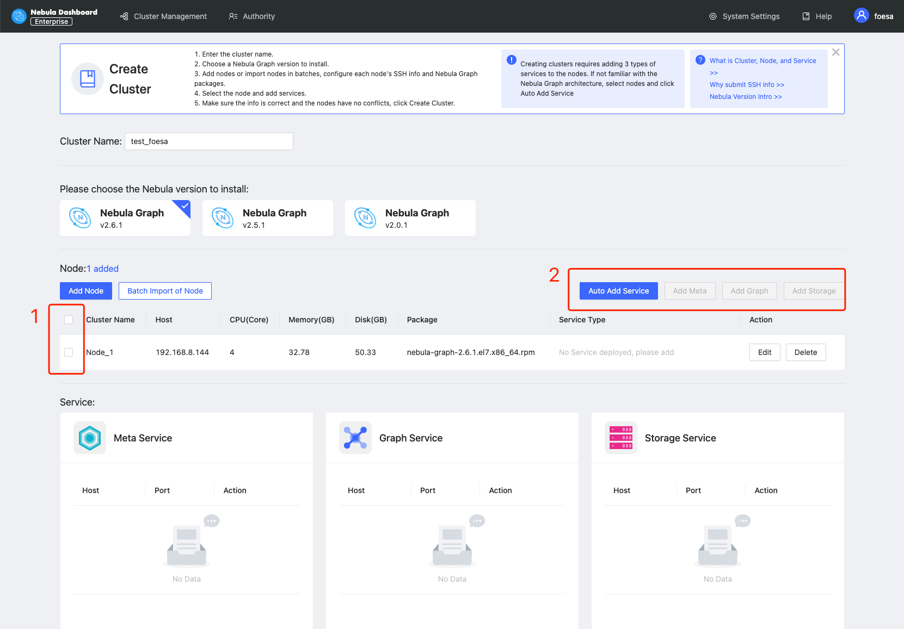
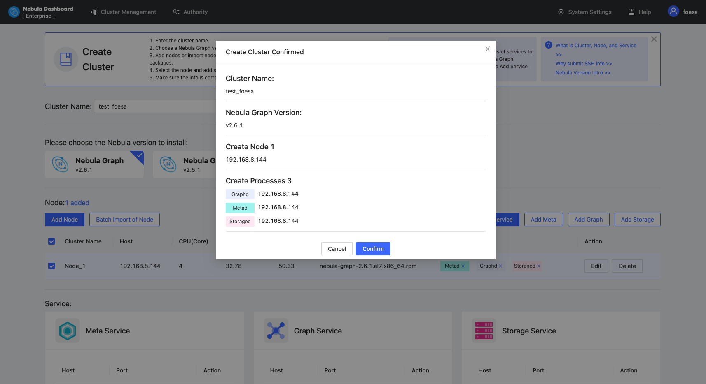
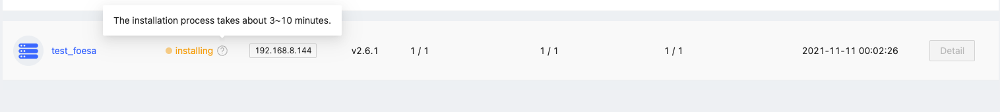

# Create clusters

This topic introduces how to create clusters using Dashboard.

## Steps

You can create a cluster following these steps:

1. In the **Cluster management** page, click **Create cluster**.
2. In the **Create cluster** page, fill in the following:
   - Enter the **Cluster name**, 15 characters at most. In this example, the cluster name is `test_foesa`.
   - Choose the Nebula Graph version to install. In this example, the version is `v2.6.1`.
   - **Add nodes**. The information of each node is required.
  
     1. Enter the IP information of each host. In this example, it is `192.168.8.144`.
     2. Enter the SSH information. In this example, the SSH port is `22`, the SSH user is `vesoft`, and the SSH password is `nebula`.
     3. Choose the Nebula Graph package. In this example, the package is `nebula-graph-2.6.1.el7.x86_64rpm`.
     4. (Optional) Enter the node name to make a note on the node. In this example, the note is `Node_1`.

     

   - **Import nodes in batches**. The information of each node is required. To import nodes in batches, you need to choose the installation package and click **download the CSV template**. Fill in the template and upload it. Ensure that the node is correct, otherwise upload failure may happen.

     

3. Select the node and add the service you need in the upper right corner. To create a cluster, you need to add 3 types of services to the node. If not familiar with the Nebula Graph architecture, click **Auto add service**.

   

4. (Optional) Edit the port of the meta service, the graph service, the storage service, HTTP, and HTTP2, and click **OK** to save.

5. Click **Create cluster**. Make sure the configuration is correct and there is no conflict between nodes, click **Confirm**.

   

6. If a cluster with the status of `installing` appears in the list on the cluster management page, you need to wait for 3 to 10 minutes until the status changes to `healthy`, that is, the cluster is created successfully. If the service status is `unhealthy`, it means that there is an abnormal service in the cluster, click **Detail** for more information.

   

## Next to do

After the cluster is successfully created, you can operate the cluster. For details, see [Overview](../4.cluster-operator/1.overview.md).
