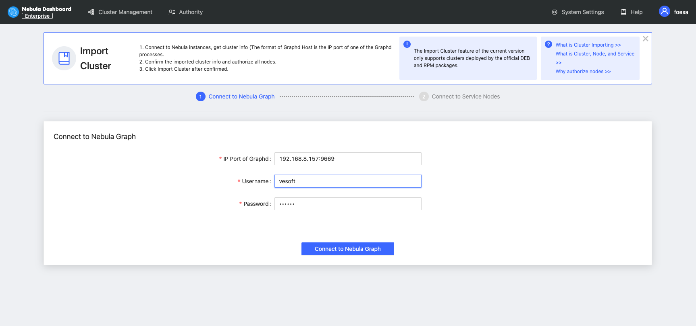
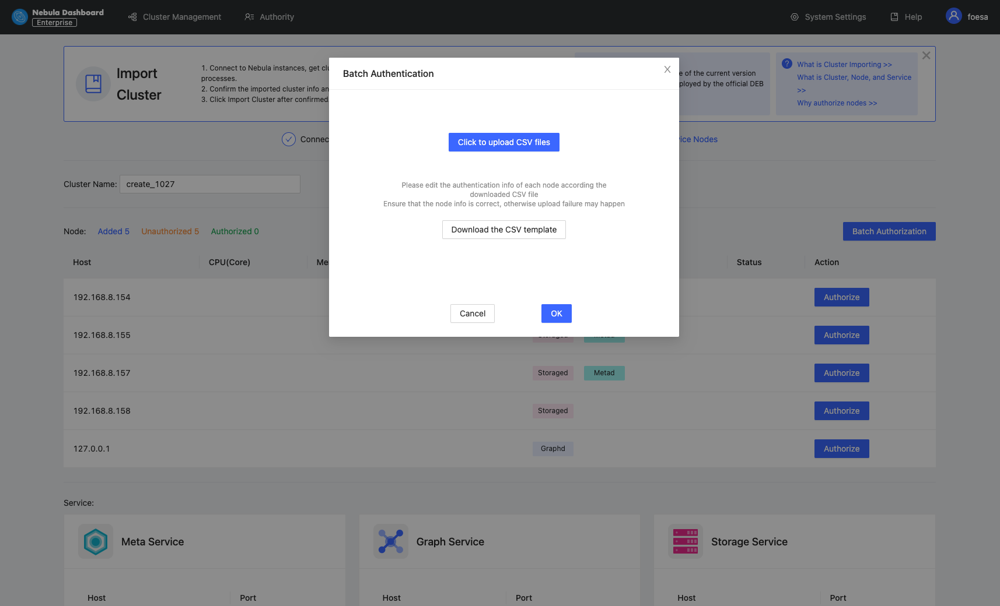
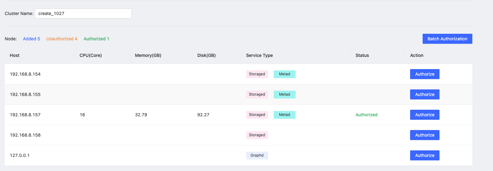

# Import clusters

This topic introduces how to import clusters using Dashboard. The current version only supports importing clusters deployed by the official DEB or RPM packages and clusters created by Dashboard. Currently, importing clusters deployed by Docker and Kubernetes is not supported.

## Steps

!!! caution

    In the same cluster, the service versions need to be unified. Importing Nebula Graph examples from different versions in the same cluster is not supported.

1. In the configuration files of each service, change the IP in `<meta|graph|storage>_server_addrs` and `local_ip` to the server's IP, and then start Nebula Graph.

  For details, see [Configurations](../../5.configurations-and-logs/1.configurations/1.configurations.md) and [Manage Nebula Graph services](../../4.deployment-and-installation/manage-service.md).

1. In the **Cluster management** page, click **Import cluster**.
2. In the **Import cluster** page, enter the information of **Connect to Nebula Graph**.
  - Graphd Host: <The format of Graphd Host is the IP port of one of the Graphd processes>:n<Port>. In this example, the IP is `192.168.8.157:9669`.
  - Username: The account to connect to Nebula Graph. In this example, the username is `vesoft`.
  - Password: The password to connect to Nebula Graph. In this example, the password is `nebula`.

  !!! note

        By default, authentication is disabled in Nebula Graph. Therefore, you can use `root` as the username and any password to connect to Nebula Graph.
        When authentication is enabled in Nebula Graph, you need to use the specified username and password to connect to Nebula Graph. For details of authentication,see [Nebula Graph manual](../../7.data-security/1.authentication/1.authentication.md "Click to go to Nebula Graph website").

   

3. In the **Connect to Nebula Graph** page, fill in the following:
   - Enter the cluster name, 15 characters at most. In this example, the cluster name is `create_1027`.
   - **Authorize** the node. The SSH username and password of each node are required.
   - **Batch authorization** requires uploading the CSV file. Edit the authentication information of each node according to the downloaded CSV file. Ensure that the node information is correct, otherwise upload failure may happen.
  
    
  
   - If the node status on the page becomes **authorized**, the node authentication is successful.
  
    

4. Ensure that all nodes are authorized successfully. Click **Import cluster**.

## Next to do

After the cluster is successfully imported, you can operate the cluster. For details, see [Overview](../4.cluster-operator/1.overview.md).
