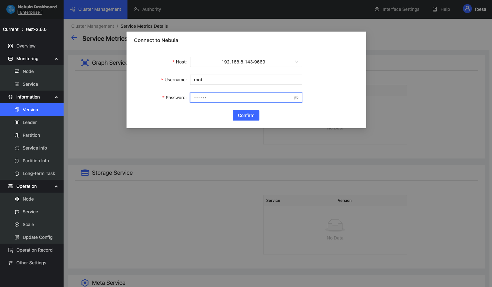
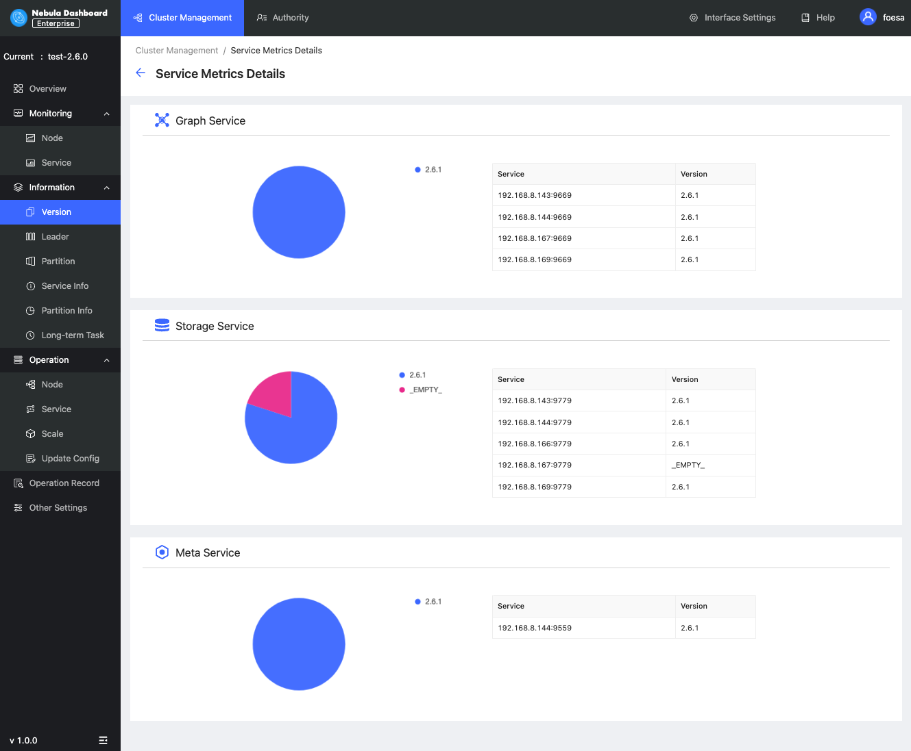
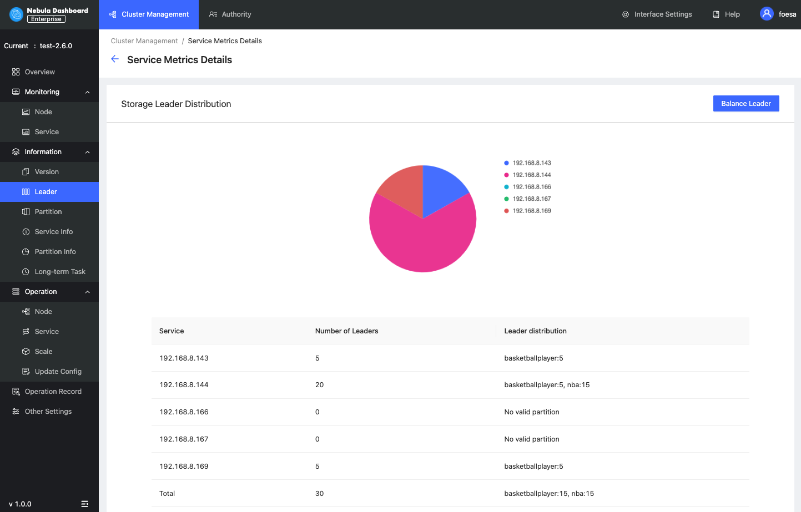
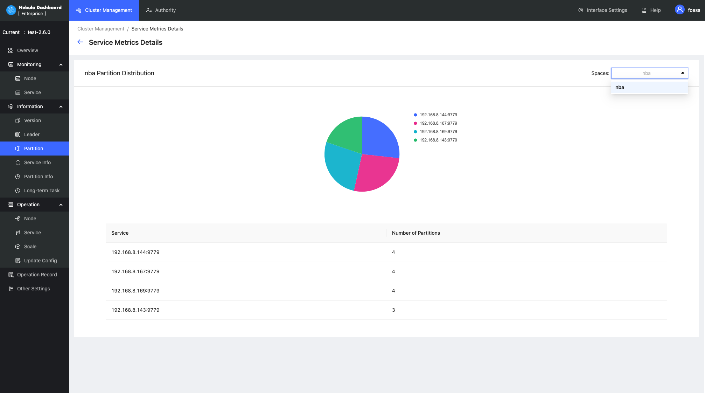
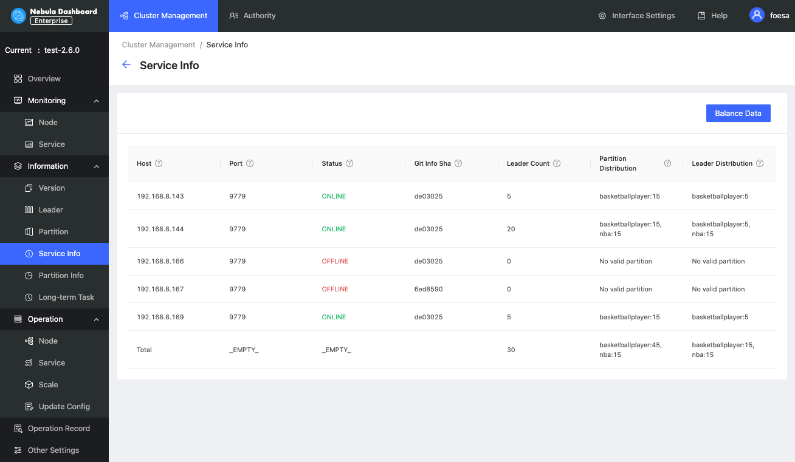
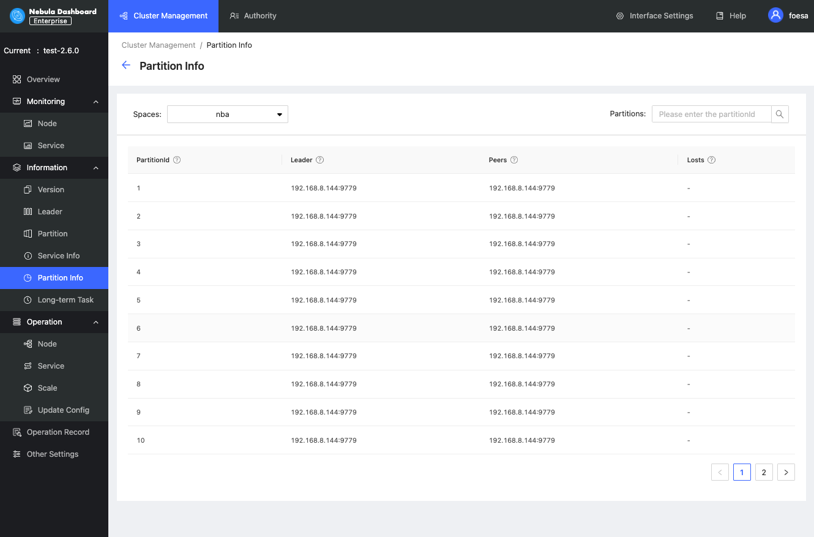
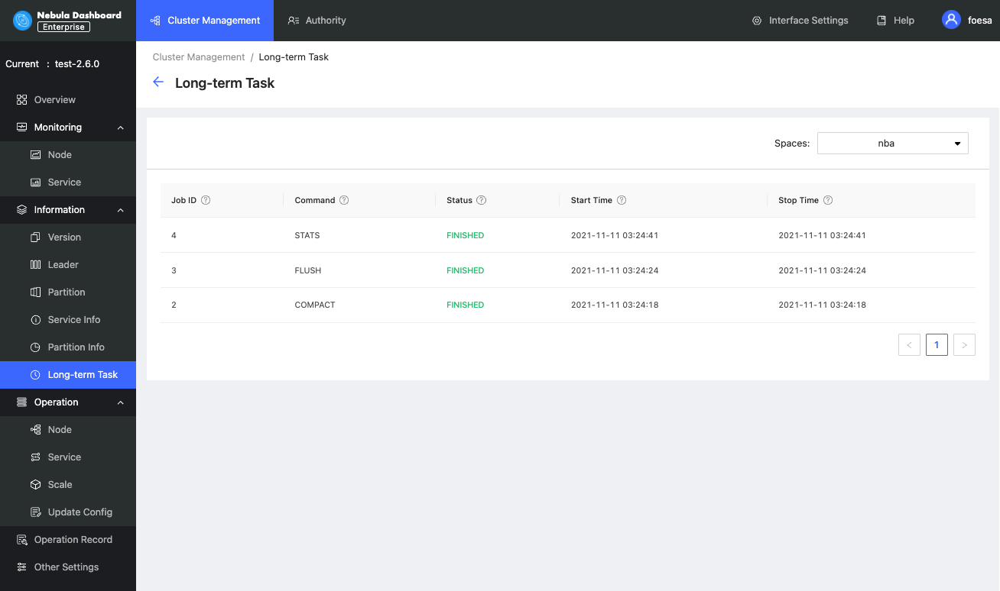

# Cluster information

This topic introduces the cluster information of Dashboard. The cluster information has the following six parts:

- Version
- Leader
- Partition
- Service information
- Partition information
- Long-term task

Before viewing the cluster information, you need to select any online Graph service address, enter the account to log in to Nebula Graph (not the Dashboard login account), and the corresponding password.

For multi-machine deployment, you can choose any online Graph service address.

!!! caution

    You need to ensure that Nebula Graph services have been deployed and started. For more information, see [Nebula Graph installation and deployment](../../4.deployment-and-installation/1.resource-preparations.md "Click to go to Nebula Graph installation and deployment").

## Version

On this page, all services and corresponding Nebula versions will be shown.

## Leader

On this page, the number of Leaders and the Leader distribution will be shown. You can click the **Balance Leader** button in the upper right corner to distribute Leaders evenly and quickly in the Nebula Graph cluster.

## Partition

On this page, you can select the specified graph space and view its distribution of Partitions.

## Service information

On this page, the information of Storage services will be shown. You can click the **Balance Date** button in the upper right corner to start the task to distribute all partitions in the cluster evenly. The parameter description is as follows:

| Parameter | Description |
| :--- | :--- |
| `Host` | The IP address of the host. |
| `Port` | The port of the host. |
| `Status` | The host status. |
| `Git Info Sha` | The commit ID of the current version. |
| `Leader Count` | The number of Leaders. |
| `Partition Distribution` | The distribution of partitions. |
| `Leader Distribution` | The distribution of Leaders. |

## Partition information

On this page, the information of partitions will be shown. Before viewing the partition information, you need to select a graph space in the upper left corner. You can also enter the partition ID into the input box in the upper right corner to filter the shown data. The parameter description is as follows:

|Parameter|Description|
|:---|:---|
|`Partition ID`|The ID of the partition.|
|`Leader`|The IP address and port of the leader.|
|`Peers`|The IP addresses and ports of all the replicas.|
|`Losts`|The IP addresses and ports of replicas at fault.|

## Long-term task

On this page, the information of all jobs will be shown. Before viewing the job information, you need to select a graph space in the upper left corner. Online managing jobs is not supported. For more information, see [Job statements](../../3.ngql-guide/18.operation-and-maintenance-statements/4.job-statements.md). The parameter description is as follows:

| Parameter | Description |
| :--- | :--- |
| `Job ID` | Shows the Job ID. |
| `Command` | Shows the command type. |
| `Status` | Shows the status of the job or task. For more information, see [Job statements](../../3.ngql-guide/18.operation-and-maintenance-statements/4.job-statements.md#_6). |
|`Start Time`| Shows a timestamp indicating the time when the job or task starts RUNNING.|
| `Stop Time` | Shows a timestamp indicating the time when the job or task gets `FINISHED`, `FAILED`, or`STOPPED`. |
